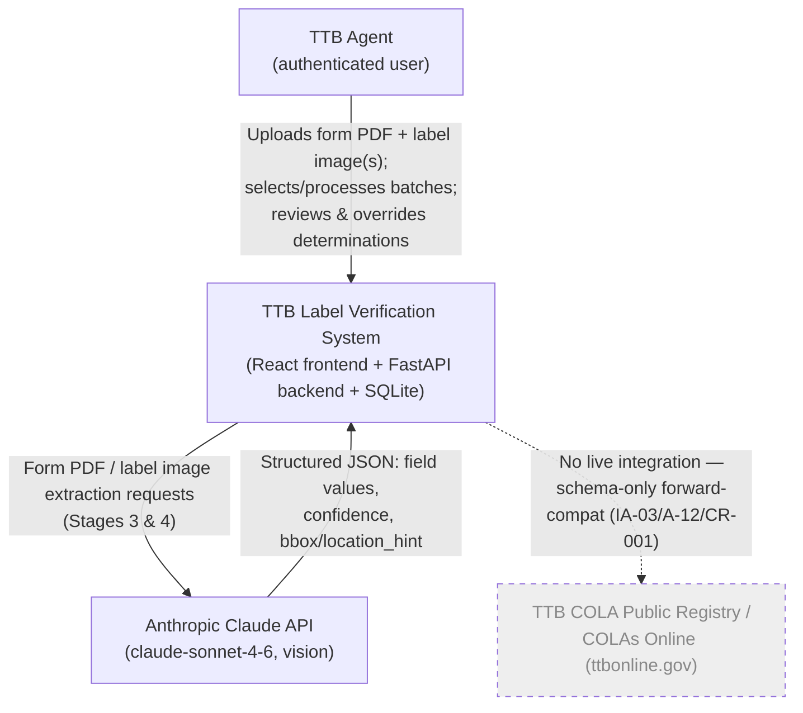
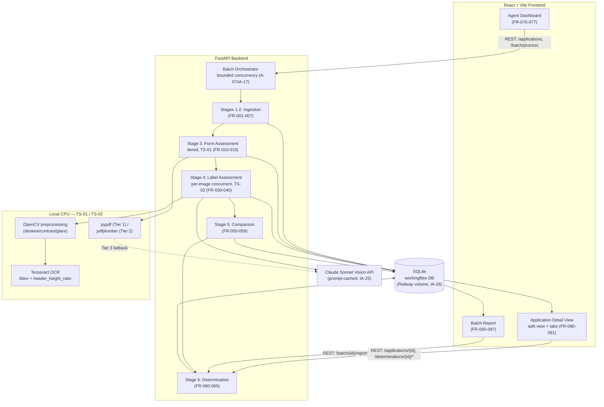
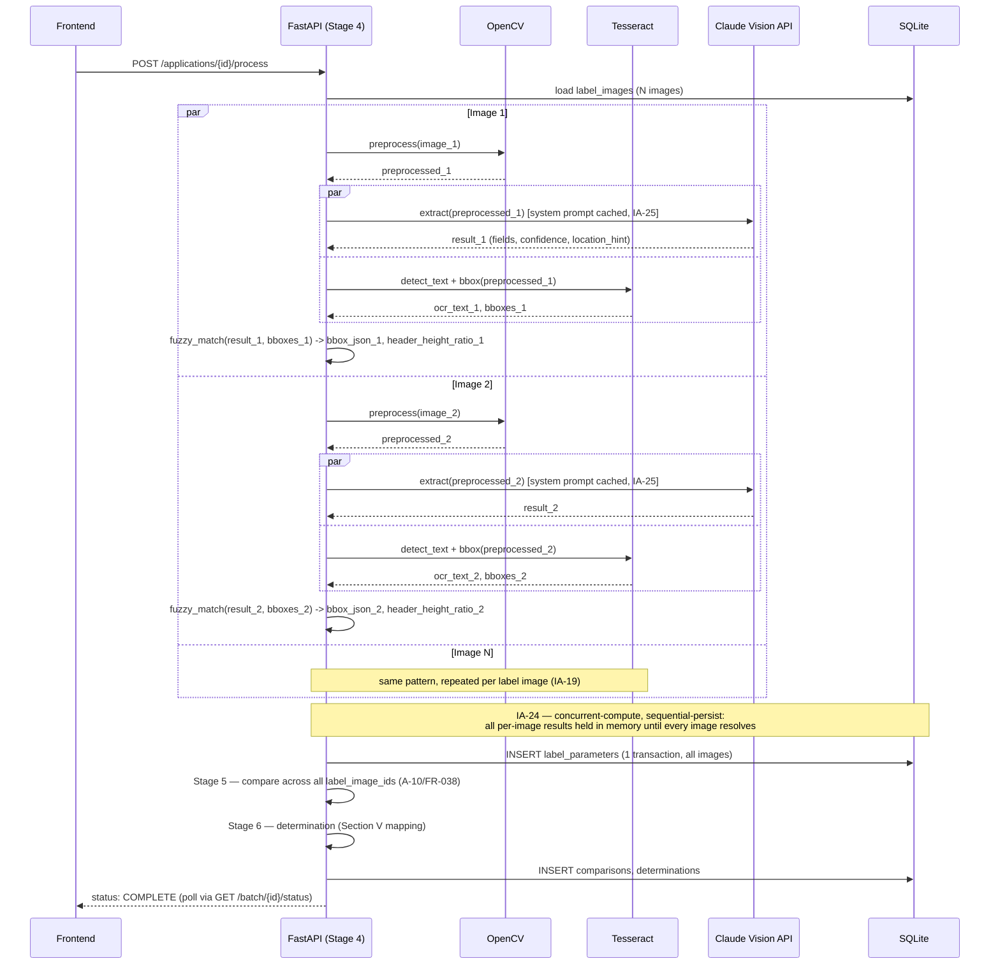

# DevLog — TTB Label Verification System (TTB-LVS)

**Assessment:** IT Specialist (AI) · 26-DO-12891471-DH  
**Candidate:** Matthew Gabriel Sizemore  
**Assessment Received:** June 9, 2026, 1458 hrs  
**Deadline:** June 16, 2026, 1458 hrs  
**Repository:** https://github.com/gratefulgabe5000/ttb-label-verifier  
**Submission Form:** https://forms.osi.office365.us/r/xWrQGduMw7  
**Related Documents:** [`PRD.md`](PRD.md) (Product Requirements Document, INCOSE-style) · [`WBS.md`](WBS.md) (Work Breakdown Structure)  
**Documentation Suite Version:** 2.0 (Session 9 — Documentation Consistency Pass, 2026-06-11)

---

## Table of Contents

1. [Assessment Overview](#1-assessment-overview)
2. [Requirements Analysis](#2-requirements-analysis)
3. [System Design & Trade Studies](#3-system-design--trade-studies)
4. [Tools & Technology Rationale](#4-tools--technology-rationale)
5. [Initial Assumptions](#5-initial-assumptions)
6. [COLA Registry & Future Integration Reference](#6-cola-registry--future-integration-reference)
7. [Engineering Log](#7-engineering-log)

---

## 1. Assessment Overview

**Organization:** US Department of the Treasury, Departmental Offices — Treasury Common Services Center, Office of the Deputy Administrator for Technology Services

**Context:** The TTB (Alcohol and Tobacco Tax and Trade Bureau) processes approximately 150,000 COLA (Certificate of Label Approval) applications per year using TTB Form F 5100.31. A team of 47 compliance agents manually reviews each application by comparing the submitted form data against affixed label artwork. This verification is largely routine data-entry matching that consumes agent capacity that could otherwise be directed at judgment-intensive cases.

**Objective:** Build a working AI-powered prototype that automates the extraction, comparison, and determination workflow for COLA applications — allowing agents to review AI recommendations rather than perform the comparisons manually. The system ingests the application form (TTB F 5100.31 as PDF) and companion label artwork (images), extracts structured parameters from both, compares them, and issues per-parameter and overall determinations (Approve / Deny / Recommend Exemption Review) which agents can override.

### Source Documents

| File | Description |
|------|-------------|
| `1.Notification - IT Specialist (AI) - 26-DO-12891471-DH.pdf` | USA Staffing Office notification — assessment delivery and deliverable requirements |
| `2.TreasuryTakeHomeTest.pdf` | Microsoft Forms submission page — confirms two required deliverables |
| `3.Assessment_README.txt` | Primary assessment brief — four stakeholder interviews + TTB technical context |
| `f510031.pdf` | Official TTB Form F 5100.31 (04/2023) — application form agents process; primary data source |

---

## 2. Requirements Analysis

### 2.1 Derived Requirements

Requirements extracted from stakeholder interviews and the assessment brief. Each requirement is tagged with its verbatim source.

| ID | Requirement | Source | Priority |
|----|-------------|--------|----------|
| Req-01 | Ingest application form (TTB F 5100.31 PDF) and log in workingfiles DB | Design session | **MUST** |
| Req-02 | Ingest companion label artwork image(s) and pair with application in DB | Design session | **MUST** |
| Req-03 | Extract all structured parameters from the application form | Design session; Sarah Chen: "checks that what's on the label matches what's in the application" | **MUST** |
| Req-04 | Extract all structured parameters from the label image(s) via AI vision | Design session; Sarah Chen: "ABV is correct? Check. Government warning is there? Check." | **MUST** |
| Req-05 | Compare form parameters vs label parameters, per field | Design session | **MUST** |
| Req-06 | Issue per-parameter determination: Match / Mismatch | Design session | **MUST** |
| Req-07 | Issue overall determination: Approve / Deny / Recommend Exemption Review | Design session | **MUST** |
| Req-08 | Verify Government Warning Statement — exact statutory text; "GOVERNMENT WARNING:" in all-caps bold | Jenny Park: "It has to be exact. Like, word-for-word, and the 'GOVERNMENT WARNING:' part has to be in all caps and bold." | **MUST** |
| Req-09 | Apply case/punctuation tolerance to brand name matching | Dave Morrison: "'STONE'S THROW' on the label but 'Stone's Throw' in the application. Technically a mismatch? Sure. But it's obviously the same thing." | **MUST** |
| Req-10 | Flag mismatches that fall within Allowable Revisions (F 5100.31 Section V) as "Recommend Exemption Review" rather than hard denial | Design session | **MUST** |
| Req-11 | Agent dashboard: list pending applications assigned to agent | Design session | **MUST** |
| Req-12 | Batch selection: checkboxes on dashboard to select multiple applications | Design session; Sarah Chen: "If there was some way to handle batch uploads, that would be huge." | **MUST** |
| Req-13 | Batch processing: process all selected applications in a single action | Design session | **MUST** |
| Req-14 | Batch summary report: header count of Approvals / Denials / Exemption Reviews, plus per-application result | Design session | **MUST** |
| Req-15 | Application detail view: split view — form PDF (left) + label image (right) | Design session | **MUST** |
| Req-16 | Visual annotations: red ellipses on mismatched elements in both form and label views | Design session | **SHOULD** |
| Req-17 | Mouse-over on annotation: highlight corresponding element on opposite document | Design session | **SHOULD** |
| Req-18 | Agent override: right-click any parameter to override AI determination with reason | Design session | **MUST** |
| Req-19 | Agent override: override overall determination | Design session | **MUST** |
| Req-20 | Support batch upload of forms and label images | Design session | **NICE-TO-HAVE** |
| Req-21 | Handle degraded label image quality (angle, glare, bad lighting) | Jenny Park: "It would be amazing if the tool could handle images that aren't perfectly shot." | **NICE-TO-HAVE** |
| Req-22 | Response time ≤ 5 seconds per label (AI extraction + comparison) | Sarah Chen: "If we can't get results back in about 5 seconds, nobody's going to use it. We learned that the hard way." | **HARD CONSTRAINT** |
| Req-23 | UI accessible to non-technical users | Sarah Chen: "We need something my mother could figure out—she's 73 and just learned to video call her grandkids last year... Half our team is over 50." | **MUST** |
| Req-24 | Clean interface — no hunting for buttons | Sarah Chen: "Clean, obvious, no hunting for buttons." Dave Morrison: prior modernization failures cited. | **MUST** |
| Req-25 | No persistent storage of sensitive data beyond prototype scope | Marcus Williams: "We're not storing anything sensitive for this exercise." | **MUST** |
| Req-26 | Standalone POC — no COLA system integration | Marcus Williams: "Think of this as a standalone proof-of-concept... that's years away, realistically." | **MUST** |
| Req-27 | Publicly accessible deployed URL | Assessment README — Deliverables; Email notification | **MUST** |

### 2.2 Government Warning Statement — Critical Detail

Per Jenny Park's interview, the Government Health Warning is a frequent rejection point. The AI validator must check for both exact text and formatting.

**Statutory text per 27 CFR § 16.21:**
```
GOVERNMENT WARNING: (1) According to the Surgeon General, women should not drink
alcoholic beverages during pregnancy because of the risk of birth defects. (2)
Consumption of alcoholic beverages impairs your ability to drive a car or operate
machinery, and may cause health problems.
```

**Mandatory formatting:**
- "GOVERNMENT WARNING:" — must be **ALL CAPS** and **BOLD**
- Wording must be exact — no paraphrasing, abbreviation, or reordering
- Must not be buried in disproportionately small font

**Common violations (per Jenny Park):**
- Title case: "Government Warning" (should be "GOVERNMENT WARNING:")
- Missing colon after "WARNING"
- Abbreviated or paraphrased text
- Undersized font

### 2.3 Form F 5100.31 — Complete Field Reference

Source: `f510031.pdf` — TTB Form F 5100.31 (04/2023)

#### Part I — Application Fields

| Item | Field Name | Required | Notes |
|------|-----------|----------|-------|
| 1 | Representative ID No. | Optional | Third-party filer ID |
| 2 | Plant Registry / Basic Permit / Brewer's Notice No. | **Required** | BW-, TPWBH-, DSP-, or permit number; multiple locations possible |
| 3 | Source of Product | **Required** | Domestic ☐ / Imported ☐ |
| 4 | Serial Number | **Required** | Format: YY-N (last 2 digits of year + sequential, max 6 chars); e.g., 26-1 |
| 5 | Type of Product | **Required** | Wine ☐ / Distilled Spirits ☐ / Malt Beverages ☐ |
| 6 | Brand Name | **Required** | Name under which product is sold; if no brand name, use bottler/packer/importer name |
| 7 | Fanciful Name | Optional | Required for some specialty products; further identifies product |
| 8 | Name and Address of Applicant | **Required** | Exactly as on plant registry/permit; include DBA/tradename if used on label |
| 8a | Mailing Address | Optional | If different from Item 8 |
| 9 | Formula | Conditional | TTB Formula ID or lab number; required when product formula approval was needed |
| 10 | Grape Varietal(s) | Wine only | List all varietals appearing on label |
| 11 | Wine Appellation | Conditional | Fill in only if appellation of origin stated on label |
| 12 | Phone Number | — | Person responsible for application |
| 13 | Email Address | — | For TTB response |
| 14 | Type of Application | **Required (a OR b)** | See Application Types below |
| 15 | Embossed/Blown Container Info | Conditional | Info on container not on labels; foreign language translations |
| 16 | Date of Application | — | Date prepared or submitted |
| 17 | Signature | — | Applicant or authorized agent |
| 18 | Print Name | — | Signer's printed name |

#### Part III — TTB Certificate (TTB Use Only)

| Item | Field Name | Notes |
|------|-----------|-------|
| 19 | Date Issued | TTB completion |
| 20 | Authorized TTB Signature | TTB completion |
| — | Qualifications | TTB notes/conditions |
| — | Expiration Date | If any |
| — | Label Affixing Area | Applicant affixes complete label set |

### 2.4 Application Types and Determination Routing

Item 14 determines the processing path:

| Type | Description | Key Constraints | Processing Impact |
|------|-------------|----------------|-------------------|
| **14a** | Certificate of Label Approval | Standard path | Full comparison; Approve or Deny |
| **14b** | Certificate of Exemption From Label Approval | Product sold ONLY within bottling state; NOT available for imports or malt beverages | If 14b checked: label MUST contain "For sale in [STATE] only"; flag if product is imported or malt |
| **14c** | Distinctive Liquor Bottle Approval | Must include bottle capacity | Additional check: bottle capacity field |
| **14d** | Resubmission After Rejection | Must include TTB ID of rejected application | Note prior rejection in report |

**Three-Outcome Determination Logic:**

| Outcome | Condition |
|---------|-----------|
| **APPROVE** | All mandatory parameters match; no hard failures |
| **DENY** | One or more hard failures (mandatory field mismatch not in Allowable Revisions) |
| **RECOMMEND EXEMPTION REVIEW** | Mismatches present, but all fall within Allowable Revisions (Section V of F 5100.31); OR application is Type 14b |

### 2.5 Parameter Comparison Matrix

The core of the verification engine. Each form field maps to a label element, with specific comparison rules. **Per FR-038, "label" below means the union of ALL of the application's label images** — every image is extracted independently (Stage 4), and a field is considered present if it appears on any one of them, with the source `label_image_id` retained for annotation placement.

| Form Field (Item #) | Label Element | Comparison Rule | Failure Type |
|--------------------|---------------|----------------|-------------|
| Brand Name (6) | Brand Name on label | Normalized: case-insensitive, punctuation-tolerant; reject only if substantive difference | Hard failure if substantive; Allowable if case/punct only |
| Fanciful Name (7) | Fanciful Name on label | If present on form, must appear on label (normalized match) | Hard failure |
| Source: Imported (3) | Country of Origin on label | If "Imported" checked, label MUST show country of origin | Hard failure |
| Product Type (5) | Class/Type Designation | Must be consistent with checked type | Hard failure |
| Applicant Name/Address (8) | Bottler/Producer name/address on label | Normalized match; must include DBA if DBA used on label | Hard failure if name wrong; Allowable if address change in-state |
| Grape Varietals (10) | Varietals on label (Wine) | All listed varietals must appear on label | Hard failure |
| Wine Appellation (11) | Appellation on label (Wine) | If listed on form, must match label | Hard failure |
| Type 14b checked | "For sale in [STATE] only" text | Must appear on label; state abbreviation must match | Hard failure |
| *(all products)* | Government Warning Statement | Exact 27 CFR § 16.21 text; "GOVERNMENT WARNING:" in ALL CAPS BOLD | Hard failure |
| *(all products)* | Alcohol by Volume (ABV) | Must be present on label; must be consistent with product type | Hard failure |
| *(all products)* | Net Contents | Must be present on label | Allowable if change complies with standards (Section V, item 10) |

### 2.6 Allowable Revisions — Exemption Criteria Reference

Section V of TTB F 5100.31 lists 41 revision types that may be made to an approved label WITHOUT resubmission. When the AI identifies a mismatch, it cross-references this list to determine if the discrepancy is a **hard failure** (requires denial) or an **allowable revision** (triggers Recommend Exemption Review).

**Key allowable revision categories that affect comparison logic:**

| Section V Item | Revision Type | Applies To |
|----------------|---------------|-----------|
| 1 | Delete any non-mandatory information | All |
| 2 | Reposition any label information | All |
| 3a | Change colors, shape, proportionate size of labels | All |
| 3b | Change type size, font, spelling/case/punctuation | All — "mandatory info must remain legible and on contrasting background" |
| 3c | Change from adhesive to etched/printed or vice versa | All |
| 3d/3e | Divide or combine approved labels | All |
| 10 | Change net contents statement | All (must comply with standards of fill) |
| 11 | Change mandatory ABV (if consistent with class/type) | All |
| 14 | Change/delete age statement | Distilled Spirits |
| 17 | Add/change Serving Facts / average analysis statement | All |
| 18 | Add/change bottling date, production date, freshness info | All |
| 19 | Change name/trade name (already approved); address change within same state | All |
| 20 | Change foreign producer/bottler/shipper name & address | All (same country) |
| 22–41 | UPC barcodes, web addresses, awards, logos, seasonal graphics, etc. | Varies |

> **Implementation note:** The AI cannot evaluate all 41 revision types from image inspection alone. The engine will flag any mismatch as one of: `HARD_FAILURE`, `POSSIBLE_ALLOWABLE` (cross-reference Section V), or `MATCH`. The determination engine upgrades `POSSIBLE_ALLOWABLE` applications to "Recommend Exemption Review" rather than "Deny."

### 2.7 Evaluation Criteria (verbatim from Assessment README)

1. Correctness and completeness of core requirements
2. Code quality and organization
3. Appropriate technical choices for the scope
4. User experience and error handling
5. **Attention to requirements**
6. Creative problem-solving

> **Note on criterion 5:** Requirements are embedded in narrative interview transcripts rather than a structured spec sheet. Extracting all requirements from the stakeholder context — including the 5-second constraint, the Government Warning formatting rules, and the case-tolerance requirement — is itself part of the evaluation. This DevLog demonstrates that all requirements have been identified and traced to their source.

### 2.8 Deliverables Checklist

| Deliverable | Status | Location |
|-------------|--------|----------|
| Source Code Repository (GitHub, public) | ✅ Created | https://github.com/gratefulgabe5000/ttb-label-verifier |
| All source code | ☐ In progress | `app/` (backend), `web/` (frontend) |
| README with setup and run instructions | ✅ | `README.md` |
| Documentation of approach, tools, assumptions | ✅ | `_DevLog/DevLog.md` (this file) |
| Deployed Application URL | ☐ Pending | TBD — Railway (API) + Netlify (web) |

---

## 3. System Design & Trade Studies

### 3.1 Trade Studies

Before finalizing the architecture, two trade studies were conducted to test whether the "AI for everything" extraction approach implied by the original design is actually the most effective use of AI — both for staying within the PR-001 5-second budget and for extraction accuracy. The guiding principle: **AI is a hard requirement and remains the system's semantic core (Stage 4 label understanding, and the comparison/determination logic built on top of it) — but AI should not be used where a deterministic method is strictly faster and more accurate.**

#### TS-01: Form Data Extraction Method (Stage 3)

**Question:** Should Stage 3 rely solely on Claude Vision for form-field extraction (original design), or can a more direct method improve speed, cost, and accuracy — given PR-001's 5-second budget is shared with Stage 4's per-image vision calls?

**Finding:** Direct inspection of `f510031.pdf` (the official TTB Form F 5100.31, 04/2023, included in this repo) shows it is a **fillable AcroForm PDF containing 44 named form fields**, mapping to Part I items 1, 2, 6, 7, 8, 8a, 9, 10, 11, 12, 13, 14a–d (including the 14b state-abbreviation field and serial number/year components), 15, 16, 18, 19, plus checkbox widgets for Domestic/Imported and application type. Applications submitted through TTB's COLAs Online system are completed digitally, so a substantial share of real-world submissions will retain these field values intact.

| Option | Method | Speed | Cost/app | Accuracy | Handles scanned PDFs? |
|--------|--------|-------|----------|----------|----------------------|
| A (original) | Claude Vision, full PDF, single pass | 1–3s | 1 API call | High, but probabilistic (OCR-style errors possible on names/numbers) | Yes |
| B | `pdfplumber` text-layer extraction only | <200ms | $0 | Medium — reading-order and checkbox-state ambiguity on a multi-column form | No |
| C | AcroForm field read (`pypdf`) | <10ms | $0 | Exact — 100% (verbatim submitted values, real checkbox booleans) | No — fields are empty/absent if the PDF was flattened or scanned |
| **D — chosen** | **Tiered: C → B → A** | <10ms typical, up to 1–3s on fallback | $0 typical; A only as fallback | Best of all — exact when possible, AI only when necessary | Yes — graceful fallback to A |

**Decision:** Adopt Option D. Each form field is resolved by the first tier that returns a usable (non-null) value: (1) AcroForm field read, (2) `pdfplumber` text-layer extraction mapped to known field regions for the F 5100.31 (04/2023) layout, (3) Claude Vision (current Stage 3 design, unchanged as the universal fallback). The extraction method used for each field is recorded alongside its confidence score (FR-016): Tier 1 → 1.0, Tier 2 → ~0.90–0.95 (typical OCR/text-layer reliability), Tier 3 → Claude's self-reported confidence.

**Impact:** Frees nearly all of the PR-001 5-second budget for Stage 4, since the common case (digitally-filled PDF) resolves Stage 3 in single-digit milliseconds. Stage 3's *output* schema (Section 3.2) is unchanged — every Part I field is still extracted, null-handled, and confidence-scored — only the extraction *method* varies per field. Adds `pypdf` as a new dependency (Section 4.1) and new assumption IA-20 (Section 5). Guarantees the system still works end-to-end on any submitted PDF, including fully scanned applications, via the Tier 3 fallback.

#### TS-02: Label Image Extraction Method (Stage 4)

**Question:** Should Stage 4 rely solely on Claude Vision (original design), or can local computer vision/OCR complement it — specifically to address degraded label images (angle, glare, lighting — formalized as **FR-039**) and the annotation-precision limitation noted in IA-13 (location hints are coarse, exact pixel coordinates deferred to "production, needs Azure Document Intelligence")?

| Option | Method | Semantic field identification | Annotation precision | Degraded-image handling | Cost/latency |
|--------|--------|-------------------------------|----------------------|--------------------------|--------------|
| A (original) | Claude Vision only | Excellent — understands layout, distinguishes brand vs. fanciful name vs. marketing copy | Coarse — qualitative `location_hint` strings only | None — raw image sent as-is | 1 API call/image |
| B | OCR/CV only, no AI | Poor — produces a bag of text with no semantic labels; fails on stylized/decorative label fonts and logos | Good — pixel bounding boxes from OCR | Possible with preprocessing | $0, but **rejected** — AI vision is a hard requirement and is genuinely better at semantic categorization |
| **C — chosen** | **Claude Vision (semantic, unchanged) + OpenCV preprocessing + OCR bounding-box assist, run concurrently** | Excellent (Claude, unchanged) | Precise — OCR-detected pixel bounding boxes fuzzy-matched to Claude's extracted field values | OpenCV deskew/perspective-correction/CLAHE contrast/glare reduction applied before the Claude call | 1 API call/image + local CPU pass (<1s, run in parallel — does not add to wall-clock time) |

**Decision:** Adopt Option C. Three additions to the existing Stage 4 design, all running locally and concurrently with the per-image Claude Vision call (so PR-001's 5-second budget, and IA-19's per-application concurrency model, are unaffected):

1. **OpenCV preprocessing** (deskew via contour/perspective correction, CLAHE contrast normalization, glare suppression) is applied to every label image *before* it is sent to Claude — directly addresses **FR-039** (degraded image handling).
2. **OCR bounding-box assist** (`pytesseract`/Tesseract) runs in parallel with the Claude Vision call, producing raw text plus pixel bounding boxes. Post-processing fuzzy-matches each of Claude's extracted field values against the OCR text to recover a real pixel-coordinate `bbox` for that element — resolving IA-13's annotation-precision gap **in the prototype**, without Azure Document Intelligence.
3. **Government Warning size/weight corroboration:** OCR-measured text height of "GOVERNMENT WARNING:" relative to surrounding body text provides an objective ratio that corroborates Claude's qualitative `header_caps_bold` assessment (FR-035) — strengthening the highest-stakes compliance check (Jenny Park's top concern), partially resolving IA-07.

**Impact:** Adds `opencv-python` and `pytesseract` (+ Tesseract OCR engine binary) as new dependencies (Section 4.1). Stage 4's per-element output schema (Section 3.2) gains an optional `bbox` field (pixel rect: `{x, y, w, h}`), populated when OCR finds a confident match; when it doesn't, the frontend falls back to the existing qualitative `location_hint`. New assumption IA-21 (Section 5). IA-07 and IA-13 are updated from "deferred to production" to "addressed in prototype, with stated limits" (Section 5).

---

### 3.2 Six-Stage Processing Pipeline

```
┌─────────────────────────────────────────────────────────────────────┐
│                    AGENT DASHBOARD                                  │
│  Application Queue → Batch Select → [Process] → Results View       │
└──────────────────┬──────────────────────────────┬───────────────────┘
                   │                              │
         ┌─────────▼──────────┐        ┌─────────▼──────────┐
         │   STAGE 1 & 2      │        │    STAGE 6         │
         │   Ingestion        │        │    Reports         │
         │  form PDF + image  │        │ Approve/Deny/Exempt │
         │  → workingfiles DB │        │  batch summary     │
         └─────────┬──────────┘        └─────────▲──────────┘
                   │                              │
         ┌─────────▼──────────┐        ┌─────────┴──────────┐
         │   STAGE 3          │        │    STAGE 5         │
         │   Form Assessment  │        │    Comparison      │
         │  Claude Text API   │        │  form params vs    │
         │  → form_parameters │        │  label params      │
         └─────────┬──────────┘        └─────────▲──────────┘
                   │                              │
         ┌─────────▼──────────────────────────────┴──────────┐
         │                    STAGE 4                         │
         │              Label Assessment                      │
         │         Claude Vision API (image)                  │
         │              → label_parameters                    │
         └────────────────────────────────────────────────────┘
```

---

#### Stage 1 — Ingest Application Form

- Accept TTB F 5100.31 PDF upload (single or batch)
- Record in `applications` table: file path, upload timestamp, status = `PENDING`
- Accept manual metadata override (serial number, applicant name) for dashboard display before extraction completes

#### Stage 2 — Ingest Label Artwork

- Accept image upload(s), associated with an application by serial number or UI pairing
- One application may have multiple label images (brand label, back label, neck label)
- Store in `label_images` table: image path, application_id, upload timestamp
- Status → `PENDING_ASSESSMENT`

#### Stage 3 — Form Assessment

**Method (per TS-01, Section 3.1):** Each of the 18 Part I fields (Items 1–18, including 8a) is resolved by the first applicable tier, not a single Claude pass:

1. **Tier 1 — AcroForm field read (`pypdf`, <10ms, $0, confidence 1.0):** `f510031.pdf` is a fillable AcroForm with 44 named fields (TS-01 finding). If the submitted PDF retains these fields with non-empty values — the case for applications completed via TTB's COLAs Online — read them directly.
2. **Tier 2 — `pdfplumber` text-layer extraction (<200ms, $0, confidence ≈0.90–0.95):** For fields not resolved in Tier 1 (flattened PDFs, or scans that retain a text layer), extract the text layer and map known regions of the F 5100.31 (04/2023) layout to fields.
3. **Tier 3 — Claude Vision (1–3s, fallback only, confidence = Claude's self-reported value):** For fields still unresolved (fully scanned/image-only PDFs, or ambiguous text-layer regions), send the form PDF to Claude, prompting for structured JSON extraction of every Part I field in a single pass (FR-010).

Fields blank on the form are extracted as `null`, never omitted (FR-011), regardless of which tier resolves them. The tier that resolved each field is recorded as its `extraction_method` (FR-017).

**Output schema (per application):**
```json
{
  "representative_id": "...",
  "plant_registry_number": "BW-...",
  "source": "domestic|imported",
  "serial_number": "26-1",
  "product_type": "wine|distilled_spirits|malt_beverages",
  "brand_name": "...",
  "fanciful_name": "...",
  "applicant_name": "...",
  "applicant_address": "...",
  "mailing_address": "...",
  "formula_id": "...",
  "grape_varietals": [...],
  "wine_appellation": "...",
  "phone_number": "...",
  "email_address": "...",
  "application_type": {
    "checked": ["14a"],
    "exemption_state": null,
    "container_capacity": null,
    "prior_ttb_id": null
  },
  "embossed_info": "...",
  "foreign_translations": "...",
  "date_of_application": "...",
  "signature_present": true,
  "applicant_printed_name": "...",
  "confidence_scores": {
    "plant_registry_number": 0.97,
    "brand_name": 0.99,
    "...": "one entry per field above (FR-016)"
  },
  "extraction_methods": {
    "plant_registry_number": "acroform",
    "brand_name": "acroform",
    "...": "one entry per field above — acroform | pdftext | ai_vision (TS-01, IA-20, FR-017)"
  }
}
```

Store in `form_parameters`, including each field's `extraction_method` (Section 3.4). Status → `FORM_ASSESSED`.

#### Stage 4 — Label Assessment

**Method (per TS-02, Section 3.1):** For **every label image** associated with the application (FR-030) — brand, back, neck, or other — three things happen per image, with the local CV/OCR work running concurrently with the Claude call so neither adds wall-clock time:

1. **OpenCV preprocessing** (deskew/perspective correction, CLAHE contrast normalization, glare suppression) is applied to the raw image first — addresses FR-039's degraded-image scenarios (angle, glare, lighting).
2. The preprocessed image is sent to **Claude Vision API** independently, prompted for structured JSON extraction of **everything visible on that image** in a single pass — all TTB-required mandatory elements (FR-031), all comparison-relevant secondary elements (FR-032), and any remaining text as a generic catch-all (FR-033) — not just the fields used in comparison.
3. **In parallel**, OCR (`pytesseract`/Tesseract, FR-040) runs against the preprocessed image, producing raw text plus pixel bounding boxes. Each of Claude's extracted field values is fuzzy-matched against the OCR text to recover a pixel `bbox` for that element, and the OCR-measured text height of "GOVERNMENT WARNING:" relative to surrounding body text is recorded as `header_height_ratio`, corroborating Claude's `header_caps_bold` assessment (FR-035, IA-07).

Per A-11/IA-19, the per-image Claude Vision calls for one application are issued concurrently to stay within the PR-001 5-second budget; the OpenCV/OCR pass for each image runs locally and concurrently with that image's Claude call.

**Per-image output schema:**
```json
{
  "label_image_id": 42,
  "label_type": "brand|back|neck|other",
  "brand_name": {"value": "...", "confidence": 0.98, "location_hint": "top-center", "bbox": {"x": 120, "y": 40, "w": 300, "h": 60}},
  "fanciful_name": {"value": "...", "confidence": 0.95, "location_hint": "...", "bbox": null},
  "class_type_designation": {"value": "...", "confidence": 0.97, "location_hint": "...", "bbox": {"x": 80, "y": 200, "w": 250, "h": 30}},
  "alcohol_content": {"value": "...", "confidence": 0.99, "location_hint": "...", "bbox": {"x": 80, "y": 240, "w": 100, "h": 24}},
  "net_contents": {"value": "...", "confidence": 0.99, "location_hint": "...", "bbox": {"x": 300, "y": 240, "w": 90, "h": 24}},
  "bottler_name": {"value": "...", "confidence": 0.96, "location_hint": "...", "bbox": {"x": 60, "y": 420, "w": 280, "h": 22}},
  "bottler_address": {"value": "...", "confidence": 0.94, "location_hint": "...", "bbox": {"x": 60, "y": 444, "w": 280, "h": 22}},
  "country_of_origin": {"value": "...", "confidence": 0.97, "location_hint": "...", "bbox": null},
  "government_warning": {
    "text_present": true,
    "header_caps_bold": true,
    "header_height_ratio": 1.05,
    "text_exact_match": true,
    "text_found": "GOVERNMENT WARNING: ...",
    "confidence": 0.99,
    "location_hint": "bottom",
    "bbox": {"x": 30, "y": 480, "w": 440, "h": 90}
  },
  "grape_varietals": {"value": [...], "confidence": 0.95, "location_hint": "...", "bbox": null},
  "wine_appellation": {"value": "...", "confidence": 0.94, "location_hint": "...", "bbox": null},
  "vintage_date": {"value": "...", "confidence": 0.93, "location_hint": "...", "bbox": null},
  "age_statement": {"value": "...", "confidence": 0.92, "location_hint": "...", "bbox": null},
  "for_sale_in_state": {"value": "...", "confidence": 0.98, "location_hint": "...", "bbox": null},
  "other_text": [
    {"value": "UPC: 012345678905", "confidence": 0.90, "location_hint": "bottom", "bbox": {"x": 200, "y": 510, "w": 120, "h": 18}},
    {"value": "Drink Responsibly", "confidence": 0.92, "location_hint": "center", "bbox": null}
  ]
}
```

`bbox` is populated when OCR finds a confident fuzzy-match for that element's extracted text on the preprocessed image; when it doesn't (e.g., logos or stylized brand marks with no OCR-readable text), `bbox` is `null` and the frontend falls back to the qualitative `location_hint` for annotation placement (IA-13). `header_height_ratio` is only meaningful on `government_warning` and is `null` if OCR could not isolate the header text.

Fields with no corresponding element on this image are returned with `"value": null` rather than omitted, mirroring FR-011 on the form side. `other_text` may be an empty array. Every field is written to `label_parameters` as one row per `(label_image_id, field_name)`, so the same field may have multiple rows across images (FR-038).

**Aggregation:** once all of an application's images have been extracted, Stage 5 queries `label_parameters` across all `label_image_id`s for the application — there is no separate merge step or table; "does the label set contain X" is simply "does any row for this application have `field_name = X` and a non-null value."

Store in `label_parameters`. Status → `LABEL_ASSESSED` once all images for the application have been processed.

#### Stage 5 — Comparison

Apply comparison matrix (Section 2.5) to each field pair. For each form field, search `label_parameters` across **all** of the application's `label_image_id`s (FR-038) — a field is "on the label" if any image reports a non-null value for it.

Per-field result:
```
MATCH            — a value agreeing with the form (within tolerance) is found on at least one label image
HARD_FAILURE     — mandatory mismatch not in Allowable Revisions, on every image where the field appears (or absent from all)
POSSIBLE_ALLOWABLE — mismatch present but falls within Section V revision types
MISSING_FROM_LABEL — field required but not found on ANY of the application's label images
MISSING_FROM_FORM  — field not present on form (N/A or optional)
```

**Multi-image resolution (A-10):** if any image's value matches the form → `MATCH`, with `label_image_id` set to that image (used for annotation placement). If the field appears on one or more images but none match → classify the mismatch (`HARD_FAILURE`/`POSSIBLE_ALLOWABLE`) using the highest-confidence non-null candidate, with `label_image_id` set accordingly. If no image reports the field at all → `MISSING_FROM_LABEL`.

Government Warning check:
1. Is the warning present on any label image? → if not: HARD_FAILURE
2. On the image where it is found, is "GOVERNMENT WARNING:" in ALL CAPS and BOLD? → if not: HARD_FAILURE
3. Does its text match statutory 27 CFR § 16.21 text? → if not: HARD_FAILURE

Brand name check:
1. Normalize: strip whitespace, lowercase, collapse punctuation
2. If any image's normalized value matches the form → MATCH
3. If no image matches → evaluate the closest candidate: is it a case/punctuation-only difference → POSSIBLE_ALLOWABLE; otherwise HARD_FAILURE

Type 14b check:
- If 14b checked and product_type is "malt_beverages" → HARD_FAILURE (exemptions not issued for malt)
- If 14b checked and source is "imported" → HARD_FAILURE (exemptions not issued for imports)
- If 14b checked → at least one label image must contain "For sale in [STATE] only"

Store all results in `comparisons`. Status → `COMPARED`.

#### Stage 6 — Determination Report

**Logic:**
```
if any HARD_FAILURE → recommendation = DENY
  → list all hard failures with field names and values
else if any POSSIBLE_ALLOWABLE → recommendation = RECOMMEND_EXEMPTION_REVIEW
  → list allowable-revision candidates with applicable Section V item numbers
else → recommendation = APPROVE
```

**Report structure per application:**
```json
{
  "application_id": "...",
  "serial_number": "...",
  "brand_name": "...",
  "recommendation": "APPROVE|DENY|RECOMMEND_EXEMPTION_REVIEW",
  "parameter_results": [
    {
      "field": "brand_name",
      "form_value": "OLD TOM DISTILLERY",
      "label_value": "Old Tom Distillery",
      "result": "POSSIBLE_ALLOWABLE",
      "section_v_reference": "3b",
      "note": "Case difference only — Allowable Revision per F 5100.31 Section V item 3b"
    },
    ...
  ],
  "hard_failures": [...],
  "allowable_revisions_flagged": [...],
  "overall_confidence": 0.97,
  "processed_at": "2026-06-09T14:58:00Z"
}
```

**Batch summary report:**
- Total processed, Approved count, Denied count, Exemption Review count
- Sorted list of applications with individual results
- Common failure types across batch (for pattern detection)

Store in `determinations`. Status → `COMPLETE`.

---

### 3.3 UI Architecture

#### Agent Dashboard

```
┌──────────────────────────────────────────────────────────────────┐
│  TTB Label Verification System           [Agent: Sarah Chen ▾]   │
├──────────────────────────────────────────────────────────────────┤
│  Pending Applications (47)                        [Upload New +] │
├──────────────────────────────────────────────────────────────────┤
│  ☐  Filter by applicant: [________________]  Sort: [Date ▾]     │
├─────┬──────────────────┬──────────┬──────────┬──────────────────┤
│  ☑  │ Old Tom Distillery│ 26-1    │ Spirits  │ ● Pending        │
│  ☑  │ Old Tom Distillery│ 26-2    │ Spirits  │ ● Pending        │
│  ☐  │ Blue Ridge Winery │ 26-14   │ Wine     │ ● Pending        │
│  ☐  │ Blue Ridge Winery │ 26-15   │ Wine     │ ● Pending        │
│  ☐  │ Metro Brewing Co  │ 26-8    │ Malt     │ ✅ Approved      │
├─────┴──────────────────┴──────────┴──────────┴──────────────────┤
│  [☑ Process Selected (2)]                                        │
└──────────────────────────────────────────────────────────────────┘
```

#### Batch Processing State

While processing, a progress panel replaces the button:
- Progress bar: "Processing 2 of 2..."
- Individual application spinners
- On completion: dashboard refreshes with result badges

#### Application Detail View (Post-Processing)

```
┌──────────────────────────────────────────────────────────────────┐
│  App 26-1 · Old Tom Distillery · Spirits   [ ❌ DENY ]  [< Back]│
├────────────────────────────────┬─────────────────────────────────┤
│  TTB FORM F 5100.31            │  LABEL ARTWORK                  │
│                                 │  ┌─────┬─────┬─────┐            │
│                                 │  │[🏷️ ]│[🏷️ ]│[🏷️ ]│ ← tabs w/  │
│                                 │  │Brand│ Back│ Neck│  thumbnails│
│  ┌──────────────────────────┐  │  └─────┴─────┴─────┘            │
│  │  Brand: OLD TOM DIST...  │  │  ┌───────────────────────────┐  │
│  │  [red ellipse on field]  │  │  │                           │  │
│  │  Type: Distilled Spirits │  │  │   [image with red ellipse │  │
│  │  ABV: 45% Alc./Vol.      │  │  │    on brand name area]    │  │
│  │  ...                     │  │  │                           │  │
│  └──────────────────────────┘  │  └───────────────────────────┘  │
├────────────────────────────────┴─────────────────────────────────┤
│  PARAMETER RESULTS                                               │
│  ✅ Brand Name      MATCH       "Old Tom Distillery" (case ok)   │
│  ✅ Product Type    MATCH       Distilled Spirits                │
│  ✅ ABV             MATCH       45% Alc./Vol.                    │
│  ❌ Govt Warning    HARD FAIL   Header not in ALL CAPS BOLD      │
│  ✅ Net Contents    MATCH       750 mL                           │
│  ✅ Bottler Address MATCH       123 Main St, Louisville KY       │
├──────────────────────────────────────────────────────────────────┤
│  SUMMARY: 1 hard failure · Recommendation: DENY                  │
│  [Override Recommendation ▾]   [Finalize]                       │
└──────────────────────────────────────────────────────────────────┘
```

**Annotation behavior:**
- Red ellipses rendered as SVG overlays on both the PDF renderer and the image viewer
- SVG overlay coordinates derived from `bbox_json` when available — on the form panel via `form_parameters.bbox_json` (AcroForm `/Rect` or pdfplumber word bbox, FR-019) and on the label panel via `label_parameters.bbox_json` (OCR fuzzy-match, FR-036/FR-040) — falling back to each table's `location_hint` (relative: top/bottom/left/center/etc.) when no bbox was resolved (IA-13, Section 3.6.2)
- **Multi-image tab selector** (shadcn/ui `Tabs`, FR-091): each of the application's label images is a tab with a small thumbnail preview; when a comparison annotation references a specific `label_image_id` (A-10/FR-038), clicking it auto-switches the right panel to that image's tab before drawing the ellipse (Section 3.6.1 step 8)
- Mouse-over on a red ellipse: corresponding ellipse on opposite panel glows yellow (cross-document highlight)
- Right-click on any parameter row: context menu → "Override this determination" → modal with reason field

#### Batch Report View

```
┌──────────────────────────────────────────────────────────────────┐
│  Batch Report · Processed 2026-06-09 14:58                       │
│  ✅ Approved: 0  ❌ Denied: 2  ⚠️ Exemption Review: 0            │
├──────────────────────────────────────────────────────────────────┤
│  App 26-1 · Old Tom Distillery    ❌ DENY   [View Details]       │
│  App 26-2 · Old Tom Distillery    ❌ DENY   [View Details]       │
├──────────────────────────────────────────────────────────────────┤
│  Common failures: Government Warning format (2 apps)             │
│  [Export CSV]  [Export PDF Report]                               │
└──────────────────────────────────────────────────────────────────┘
```

---

### 3.4 Database Schema (SQLite — workingfiles DB)

```sql
-- Agents (simple auth for prototype)
CREATE TABLE agents (
    id          INTEGER PRIMARY KEY,
    username    TEXT UNIQUE NOT NULL,
    display_name TEXT NOT NULL,
    password_hash TEXT NOT NULL,
    created_at  DATETIME DEFAULT CURRENT_TIMESTAMP
);

-- Applications (one per TTB F 5100.31 form)
CREATE TABLE applications (
    id              INTEGER PRIMARY KEY,
    serial_number   TEXT,
    year            TEXT,
    form_path       TEXT,
    product_type    TEXT,   -- wine|distilled_spirits|malt_beverages
    source          TEXT,   -- domestic|imported
    brand_name      TEXT,
    applicant_name  TEXT,
    application_type TEXT,  -- 14a|14b|14c|14d
    assigned_agent_id INTEGER REFERENCES agents(id),
    status          TEXT DEFAULT 'PENDING',  -- PENDING|FORM_ASSESSED|LABEL_ASSESSED|COMPARED|COMPLETE
    created_at      DATETIME DEFAULT CURRENT_TIMESTAMP,
    processed_at    DATETIME,
    -- COLA Public Registry forward-compat fields (Section 6, IA-22) — populated from the
    -- form/label extraction where derivable; not validated against any live registry
    ttb_id              TEXT,   -- 14-digit TTB ID (Section 6.2)
    vendor_code         TEXT,   -- portion of TTB ID identifying the submitting vendor
    class_type_code     TEXT,   -- COLA Class/Type Code (Section 6.2)
    origin_code         TEXT,   -- COLA Origin Code (Section 6.2)
    registry_status     TEXT,   -- approved|expired|surrendered|revoked (Section 6.2) — N/A for a not-yet-submitted application
    total_bottle_capacity TEXT, -- COLA "Total Bottle Capacity" field
    for_sale_in_state   TEXT,   -- registry-level "For Sale In" state, distinct from the per-image label_parameters.for_sale_in_state used in Stage 5 comparison
    qualifications      TEXT    -- COLA "Qualifications" free text (distinct from the AcroForm "FOR TTB USE ONLY - QUALIFICATIONS" field, which is captured via form_parameters)
);

-- Label images (multiple per application)
CREATE TABLE label_images (
    id              INTEGER PRIMARY KEY,
    application_id  INTEGER REFERENCES applications(id),
    image_path      TEXT,
    label_type      TEXT,   -- brand|back|neck|other
    uploaded_at     DATETIME DEFAULT CURRENT_TIMESTAMP
);

-- Extracted form parameters
CREATE TABLE form_parameters (
    id              INTEGER PRIMARY KEY,
    application_id  INTEGER REFERENCES applications(id),
    field_name      TEXT,
    field_value     TEXT,
    confidence      REAL,
    extraction_method TEXT,  -- acroform|pdftext|ai_vision (TS-01, IA-20) — which tier resolved this field
    location_hint   TEXT,  -- relative position for annotation placement (fallback, IA-13/IA-23)
    bbox_json       TEXT,  -- {"x":.., "y":.., "w":.., "h":..} from AcroForm /Rect (Tier 1) or pdfplumber word bbox (Tier 2) (FR-019, IA-23); NULL for Tier 3-resolved fields
    extracted_at    DATETIME DEFAULT CURRENT_TIMESTAMP
);

-- Extracted label parameters
CREATE TABLE label_parameters (
    id              INTEGER PRIMARY KEY,
    application_id  INTEGER REFERENCES applications(id),
    label_image_id  INTEGER REFERENCES label_images(id),
    field_name      TEXT,
    field_value     TEXT,
    confidence      REAL,
    location_hint   TEXT,  -- relative position for annotation placement (fallback, IA-13)
    bbox_json       TEXT,  -- {"x":.., "y":.., "w":.., "h":..} from OCR fuzzy-match (TS-02, IA-13/IA-21); NULL if no confident match
    header_height_ratio REAL, -- government_warning only: OCR text-height ratio corroborating header_caps_bold (TS-02 #3, IA-07); NULL otherwise
    extracted_at    DATETIME DEFAULT CURRENT_TIMESTAMP
);

-- Per-field comparison results
CREATE TABLE comparisons (
    id              INTEGER PRIMARY KEY,
    application_id  INTEGER REFERENCES applications(id),
    field_name      TEXT,
    form_value      TEXT,
    label_value     TEXT,
    result          TEXT,  -- MATCH|HARD_FAILURE|POSSIBLE_ALLOWABLE|MISSING_FROM_LABEL|MISSING_FROM_FORM
    section_v_ref   TEXT,  -- e.g., "3b" if allowable revision applies
    note            TEXT,
    created_at      DATETIME DEFAULT CURRENT_TIMESTAMP
);

-- Overall determinations (one per application)
CREATE TABLE determinations (
    id                  INTEGER PRIMARY KEY,
    application_id      INTEGER REFERENCES applications(id),
    recommendation      TEXT,  -- APPROVE|DENY|RECOMMEND_EXEMPTION_REVIEW
    hard_failures_json  TEXT,
    allowable_json      TEXT,
    agent_override      TEXT,  -- null|APPROVE|DENY|RECOMMEND_EXEMPTION_REVIEW
    override_by         INTEGER REFERENCES agents(id),
    override_reason     TEXT,
    override_at         DATETIME,
    finalized_at        DATETIME,
    created_at          DATETIME DEFAULT CURRENT_TIMESTAMP
);

-- Batch processing runs
CREATE TABLE batches (
    id              INTEGER PRIMARY KEY,
    name            TEXT,
    application_ids TEXT,  -- JSON array
    approved_count  INTEGER DEFAULT 0,
    denied_count    INTEGER DEFAULT 0,
    exemption_count INTEGER DEFAULT 0,
    summary_json    TEXT,
    created_by      INTEGER REFERENCES agents(id),
    created_at      DATETIME DEFAULT CURRENT_TIMESTAMP,
    completed_at    DATETIME
);
```

---

### 3.5 API Surface (FastAPI)

```
POST   /auth/login                          → JWT token
GET    /applications                         → paginated list (filtered by agent)
POST   /applications/upload                  → upload form PDF + label images
GET    /applications/{id}                    → full application detail
GET    /applications/{id}/comparisons        → per-field results
POST   /applications/{id}/process            → trigger single-app pipeline
POST   /batch/process                        → { application_ids: [...] }
GET    /batch/{id}/status                    → processing status + results
GET    /batch/{id}/report                    → batch summary report
POST   /determinations/{id}/override         → { field, override_value, reason }
POST   /determinations/{id}/finalize         → save final agent determination
```

---

### 3.6 Architecture Evaluation

**Question:** With TS-01 and TS-02 (Section 3.1) adopted, does the React + Vite / FastAPI / SQLite / Claude architecture (Sections 3.2–3.5) still hold end-to-end — and is each component the most appropriate choice for the role it plays in the pipeline, given the comprehensive single-pass extraction and multi-image revisions made in Session 3?

**Method:** Walk an ideal-scenario application through the entire system — agent login through batch report — mapping each step to the architectural component(s) that handle it (Section 3.6.1), then evaluate each component against its role, the alternatives, and the trade-offs of switching.

#### Executive Summary

| # | Component | Current Choice | Recommendation | Rationale |
|---|-----------|-----------------|-----------------|-----------|
| 1 | Frontend stack | React + Vite + TS + Tailwind | **ACCEPT** | Only realistic fit for split-view + SVG overlays + cross-highlighting (Decision 1 holds) |
| 2 | PDF rendering | react-pdf | **ACCEPT** | Mature PDF.js wrapper; renders AcroForm-filled PDFs for display |
| 3 | Annotation overlay | Custom SVG | **ACCEPT** | TS-02's `bbox` data makes this *stronger* than when first chosen (Decision 4) |
| 4 | UI primitives | Tailwind only | **ACCEPT + ADD** shadcn/ui | Accessible tabs/modal/context-menu primitives directly serve UR-001–006 (50+, non-technical users) |
| 5 | Multi-image selector (open question, Section 3.3 / Engineering Log 2026-06-09 Session 3) | Undecided | **RESOLVED → tabs with thumbnail previews** | See Section 3.6.2; new PRD FR-091 |
| 6 | Form-panel (left) annotation data | Not addressed | **ADD** `form_parameters.bbox_json` / `location_hint` | New finding — near-zero cost given TS-01's tiers (Section 3.4; new PRD FR-019) |
| 7 | API state management | React Query (polling) | **ACCEPT** | Batches finish in seconds; polling is simpler than WebSockets/SSE at this scale |
| 8 | Backend framework | FastAPI | **ACCEPT** | Async I/O is exactly what IA-19's concurrent per-image Claude calls need |
| 9 | DB + file persistence | SQLAlchemy + SQLite + local file paths | **ACCEPT + REFINE** | Concurrent-compute/sequential-persist write pattern (Decision 8); mount a Railway volume for the DB file (SR-003-scoped for raw uploads) |
| 10 | Stage 3 extraction | pypdf → pdfplumber → Claude Vision (TS-01) | **ACCEPT** | Already trade-studied (Section 3.1) — fits cleanly into the pipeline |
| 11 | Stage 4 extraction | OpenCV + pytesseract/Tesseract + Claude Vision (TS-02) | **ACCEPT** | Already trade-studied (Section 3.1) — one deployment watch-item (Tesseract binary on Railway, Decision 8) |
| 12 | AI call structure | Claude Sonnet 4.6, N separate concurrent per-image calls | **ACCEPT + ADD** prompt caching | Keep calls separate (provenance, failure isolation per IA-19); cache the repeated extraction-schema system prompt |
| 13 | Comparison/determination | Pure Python, deterministic (Stages 5–6) | **ACCEPT** | Auditable, testable, free — AI's role stays "extraction," not "judgment" |
| 14 | Concurrency model | Per-image async (IA-19); cross-application batch sequential (IA-17) | **REFINE + CHANGE** | Run OpenCV/Tesseract via thread pool so they don't block the event loop; change IA-17 to bounded-concurrency batch processing |
| 15 | Agent authentication | JWT (python-jose + passlib) | **ACCEPT** | Matches IA-11/CR-001 — standalone POC, no SSO needed |

#### 3.6.1 Ideal-Scenario User Path

This walkthrough maps the Section 3.2 pipeline diagram to the components that implement each step, in the order an agent experiences them.

1. **Login** — Agent authenticates via `POST /auth/login`; FastAPI + python-jose/passlib issue a JWT (#15, accept).
2. **Dashboard load** — `GET /applications` → SQLAlchemy query joins `applications`/`determinations`/`batches` → React renders the queue with status badges (#7/#8, accept).
3. **Ingest (Stages 1–2)** — Agent uploads form PDF + N label images via `POST /applications/upload`; FastAPI writes files to disk and inserts `applications`/`label_images` rows, status `PENDING` (#9). **Persistence note:** on Railway, the container filesystem is ephemeral across redeploys unless a volume is mounted. The `workingfiles` SQLite DB (CR-003's persistent record) needs a mounted volume regardless. Per SR-003, raw uploaded PDFs/images are scoped to "the active processing session" — interpreted as lasting through agent finalization (`determinations.finalized_at`), since FR-080/FR-081 render the original files in the Detail View; the same volume covers this bounded lifetime. No new dependency — a Railway configuration item (Decision 8, IA-26).
4. **Batch select & process** — Checkbox selection → `POST /batch/process { application_ids }` → new `batches` row.
5. **Pipeline execution per application:**
   - **Stage 3 (#10)** — Tiered pypdf → pdfplumber → Claude (TS-01). Already settled. New: Tier 1/2 also capture each field's `bbox` (AcroForm `/Rect`, pdfplumber word bbox) for the form-panel annotation gap (#6, Decision 8 item 1).
   - **Stage 4 (#11)** — Per label image: OpenCV preprocess → {Claude Vision call ‖ pytesseract OCR} concurrently (TS-02). Already settled. **Watch-item:** Railway's Nixpacks builder needs an `Aptfile`/`nixpacks.toml` entry for `tesseract-ocr`, confirmed at deploy time (Decision 8 item 2).
   - **Persist pattern (#9/#14, refine)** — Rather than each of the N concurrent per-image tasks writing to `label_parameters` as it completes, `asyncio.gather()` all per-image (Claude + OpenCV/OCR) tasks, collect results in memory, then write all rows in a single transaction once everything resolves. Avoids SQLite single-writer contention without WAL-mode configuration, and is the natural shape for "wait for all images before Stage 5" (Decision 8 item 3, new IA-24).
   - **Stage 5 (#13)** — Pure-Python comparison across all `label_image_id`s (A-10/FR-038) → `comparisons` rows. Accept — the right boundary for deterministic logic.
   - **Stage 6 (#13)** — Rule-based determination (Section V mapping) → `determinations` row.
6. **Cross-application batch concurrency (#14, change)** — IA-17 currently specifies sequential processing. Stage 4 is I/O-bound (~3–5s waiting on Claude per application) and FastAPI is already async, so processing a batch fully sequentially wastes wall-clock time for no benefit. Process applications within a batch concurrently, bounded by a semaphore (e.g., 3–5 in flight) to respect Anthropic per-minute rate limits while cutting batch time roughly proportionally. Orchestration change only — no new dependency (Decision 8 item 2, IA-17 revised, PRD A-07 revised).
7. **Results polling** — React Query polls `GET /batch/{id}/status` until `COMPLETE`; dashboard refreshes badges (#7, accept). Per-application completion order may now differ from selection order (item 6) — each row updates independently, consistent with UR-004's "X of N" framing.
8. **Application Detail View / multi-image resolution (#5, resolved)** — `GET /applications/{id}` returns form parameters (now including `bbox_json`/`location_hint`, item #6), all `label_images`, and per-image `label_parameters`. **Multi-image selector resolution:** tabs with small thumbnail previews above the label panel. When a `comparisons` row references a specific `label_image_id` (A-10) and the agent interacts with its annotation, the UI switches to that tab and draws the SVG ellipse — directly answering "which image does this annotation belong to" (new PRD FR-091, Decision 8 item 5). No new endpoint required — `GET /applications/{id}` already returns the full `label_images[]`/`label_parameters[]` set.
9. **Override & finalize** — Right-click → modal → `POST /determinations/{id}/override`; `POST /determinations/{id}/finalize` (#1/#8, accept; IA-14 unchanged — override does not re-run the AI pipeline).
10. **Batch report** — `GET /batch/{id}/report`; CSV export is trivial (stdlib `csv`); PDF export library remains an open implementation decision (e.g., `weasyprint` server-side or `jsPDF` client-side) — not an architecture issue.

#### 3.6.2 Resolved Items

**Form-panel annotation gap (new finding, item #6).** Walking the *left* (form) panel through the same lens TS-02 applied to the *right* (label) panel surfaced an asymmetry: `form_parameters` (Section 3.4) has no `bbox_json` or `location_hint` column, so FR-082 ("red elliptical annotation over each field on the form PDF") had no defined positional source — Decision 4's "location hints" framing predates TS-01 and was really aimed at the label side. TS-01's tiers already carry positional data for free: Tier 1 (pypdf/AcroForm) reads each field widget's `/Rect`; Tier 2 (pdfplumber) returns word/character bounding boxes; Tier 3 falls back to `location_hint` like the label side. **Decision:** add `form_parameters.bbox_json` and `location_hint` (Section 3.4), populated per-tier as above — symmetric with TS-02's label-side solution, at essentially no additional extraction cost (Decision 8 item 1; new PRD FR-019).

**Multi-image selector (open design question, resolved, item #5).** Tabs with thumbnail previews above the label panel — see Section 3.6.1 step 8. Chosen over a thumbnail strip (extra click + state to manage) and stacked panels (loses side-by-side comparison, requires scrolling). New PRD FR-091 (Decision 8 item 5).

**Combined vs. separate extraction calls (considered, rejected).** Collapsing Stage 3 plus all of an application's Stage 4 calls into a single multi-image Claude prompt was considered and rejected:
- Breaks per-image `label_image_id` provenance (A-10/FR-038's multi-image resolution depends on knowing *which* image each value came from); Claude self-tagging N images' worth of fields in one response is error-prone.
- Loses failure isolation — one bad/ambiguous image degrades the whole response instead of just that image's row.
- A larger combined prompt grows with image count, working against PR-001 (current design holds wall-clock flat under per-image concurrency).

The "fewer API calls" benefit is captured instead by prompt caching (item #12) without sacrificing per-image independence (IA-19). No change to IA-19/FR-030 needed — this confirms the existing design.

**Impact:** DB schema additions to Section 3.4 (`form_parameters.bbox_json`/`location_hint`); Decision 8 (Section 4.2) records the five refinements above; Section 5 — IA-17 revised, new IA-23–IA-26; PRD changes — new FR-019 (form bbox) and FR-091 (multi-image selector), revised A-07 and FR-074 verification method, traceability matrix and glossary updated accordingly.

---

### 3.7 System Diagrams

These diagrams formalize the architecture confirmed in Section 3.6, reflecting the bounded-concurrency batch model (A-07/IA-17), the per-image concurrent extraction model (IA-19/IA-24), and the TS-01/TS-02 tiered/local-CV additions.

#### 3.7.1 System Context Diagram



**Notes:** The only live external dependency is the Claude API (A-08). The COLA Registry is shown dashed/greyed to make explicit that it is *not* called — its data model only informs the forward-compatible schema fields (Section 6, IA-22).

#### 3.7.2 System Block Diagram (Stages 1–6)



**Notes:** "Batch Orchestrator" is the new A-07/IA-17 bounded-concurrency layer (Decision 8 item 2) — it runs Stages 1–6 for each selected application, capping concurrent applications via a semaphore. Within Stage 4, the per-image fan-out (IA-19/IA-24) is detailed in Section 3.7.3.

#### 3.7.3 Sequence Diagram — Concurrent Per-Image Label Extraction (IA-19/IA-24)



**Notes:** The two `par` blocks per image are nested deliberately: the outer `par` is IA-19's per-image concurrency (N images at once); the inner `par` is TS-02's Claude-vs-OCR concurrency *within* one image. Total wall-clock for Stage 4 is therefore bounded by the slowest single image's `max(Claude, OpenCV+OCR)` — not the sum across images or across Claude/OCR — preserving PR-001's 5-second budget regardless of image count.

---

## 4. Tools & Technology Rationale

### 4.1 Technology Stack

| Layer | Tool / Library | Version | Purpose | Rationale |
|-------|----------------|---------|---------|-----------|
| **Backend** | Python | 3.11+ | Primary language | Mature AI/data ecosystem; fast to prototype |
| **Backend** | FastAPI | latest | REST API server | Async, fast, auto-generates OpenAPI docs |
| **Backend** | SQLAlchemy | 2.x | ORM | Clean DB access; easy migration to PostgreSQL |
| **Backend** | SQLite | built-in | Database | Zero-setup for prototype; file-based persistence |
| **Backend** | Anthropic Python SDK | latest | Claude API client | Official SDK |
| **Backend** | Claude Sonnet (claude-sonnet-4-6) | claude-sonnet-4-6 | Form + label AI extraction | Sub-3s response; handles degraded images; structured JSON output via tool use |
| **Backend** | pypdf | latest | AcroForm field extraction | Tier 1 of TS-01's tiered Stage 3 extraction — reads the F 5100.31's 44 named form fields directly when populated |
| **Backend** | pdfplumber | latest | PDF text extraction | Tier 2 of TS-01's tiered Stage 3 extraction — text-layer fallback for flattened PDFs |
| **Backend** | Pillow | latest | Image preprocessing | Format normalization before API submission |
| **Backend** | opencv-python | latest | Label image preprocessing | TS-02 — deskew/perspective correction, CLAHE contrast normalization, glare suppression before Stage 4's Claude Vision call (FR-039) |
| **Backend** | pytesseract + Tesseract OCR | latest | Label OCR bounding-box assist | TS-02 — produces text + pixel bboxes, fuzzy-matched to Claude's extracted fields for annotation placement (FR-040) and Government Warning size corroboration |
| **Backend** | python-jose + passlib | latest | JWT auth | Simple agent authentication |
| **Backend** | pytest | latest | Unit tests | Comparator and validator logic |
| **Frontend** | React + Vite | 18+ / 5+ | UI framework | Component model handles split-view, annotations, state; TypeScript support |
| **Frontend** | TypeScript | 5+ | Type safety | Prevents runtime errors in complex UI state |
| **Frontend** | Tailwind CSS | 4.x | Styling | Utility-first; fast to build clean government-appropriate UI |
| **Frontend** | shadcn/ui | latest | Accessible UI primitives | Radix-based `Tabs` (multi-image selector, FR-091), modal/dialog (override reason), context menu (right-click override) — accessible out of the box, serving UR-001–006's 50+ non-technical users (Section 3.6 #4, Decision 8) |
| **Frontend** | react-pdf | latest | PDF rendering | Render F 5100.31 form in-browser for split view |
| **Frontend** | React Query | latest | API state management | Handles polling for batch job completion |
| **Frontend** | SVG overlay | (custom) | Visual annotations | Red ellipses over PDF and image; cross-document hover highlighting |
| **Frontend** | Vitest | latest | Frontend unit tests | Component and logic testing |
| **Deployment** | Railway | — | Backend hosting | Free tier; FastAPI + SQLite file; auto-deploy from GitHub |
| **Deployment** | Netlify | — | Frontend hosting | Free tier; static React SPA; auto-deploy from GitHub |

### 4.2 Key Design Decisions

**Decision 1: React + FastAPI over Streamlit**
- *Original choice:* Streamlit (rapid prototype)
- *Revised to:* React + FastAPI
- *Rationale:* The required UI — split-view PDF/image rendering, SVG annotation overlays, mouse-over cross-document highlighting, right-click context menus — is not achievable in Streamlit. React's component model makes these features straightforward. FastAPI provides the async processing needed for batch operations.
- *Trade-off:* More initial setup; mitigated by Vite scaffolding.

**Decision 2: Claude Vision for both form and label extraction**
- *Rationale:* F 5100.31 forms submitted as scanned PDFs may not have reliable machine-readable text. Claude Vision handles both digitally-generated and scanned PDFs as images, extracting structured data reliably. Label artwork requires vision regardless. Using one model for both simplifies the pipeline and keeps latency predictable.
- *Fallback:* pdfplumber extracts text from digitally-generated PDFs as a faster, cheaper first pass; Claude is the fallback for scanned/unclear forms.
- *Performance:* Claude typically returns in 1–3 seconds per document. Form + label extraction for one application: ~3–5 seconds total — within the hard constraint.

**Decision 3: SQLite for prototype database**
- *Rationale:* Zero setup, file-based, fully capable for prototype scale. SQLAlchemy ORM means migrating to PostgreSQL for production is a single config change.
- *Trade-off:* Not suitable for concurrent write-heavy production use.

**Decision 4: Location hints rather than pixel coordinates for annotations**
- *Rationale:* Claude Vision returns semantic location descriptions ("top-center", "bottom-left", "center") rather than exact pixel coordinates. The frontend maps these to SVG overlay regions. Exact pixel mapping would require a secondary computer-vision pass and is out of scope for prototype.
- *Production path:* Integrate a dedicated OCR engine (e.g., Azure Document Intelligence) to return exact bounding boxes.

**Decision 5: Three-tier determination (Approve / Deny / Recommend Exemption Review)**
- *Rationale:* The F 5100.31 form's Section V lists 41 types of allowable revisions. A binary Approve/Deny would over-deny legitimate applications with cosmetic differences. Mapping mismatches to Section V items enables the system to flag applications that might qualify for approval without resubmission, routing them to agent judgment rather than blanket denial.

**Decision 6: Tiered form extraction (AcroForm → pdfplumber → Claude Vision)**
- *Origin:* TS-01 (Section 3.1)
- *Rationale:* `f510031.pdf` is a 44-field fillable AcroForm, and applications submitted via TTB's COLAs Online retain those field values. Reading them directly (`pypdf`) is exact, free, and effectively instant — far better than asking a vision model to re-read values that are already present as structured data in the file. `pdfplumber` text-layer extraction covers flattened PDFs that lost their form fields but kept selectable text. Claude Vision remains the universal fallback for fully scanned, image-only submissions.
- *Trade-off:* Three extraction code paths to maintain instead of one, and the `pdfplumber`/AcroForm field-name mappings are tied to the F 5100.31 (04/2023) layout (IA-20) — a future form revision would require remapping. Mitigated by Claude Vision always being available as a correctness backstop.

**Decision 7: OpenCV preprocessing + OCR bounding-box assist for label images**
- *Origin:* TS-02 (Section 3.1)
- *Rationale:* Claude Vision remains the sole source of *semantic* label understanding (brand vs. fanciful name vs. marketing copy) — OCR alone cannot do this reliably on stylized label fonts and logos. But OCR run alongside Claude, on an OpenCV-preprocessed image, gives the system two things it lacked: (1) a concrete handling of degraded images (deskew, glare, contrast) required by **FR-039**, and (2) real pixel bounding boxes for SVG annotations, fuzzy-matched to Claude's field values, instead of the coarse `location_hint` strings.
- *Trade-off:* Adds two new dependencies (`opencv-python`, `pytesseract` + the Tesseract binary) and a fuzzy-matching step that can fail to find a `bbox` for some elements (logos, decorative text) — handled by falling back to `location_hint` (IA-13) rather than blocking on a match.

**Decision 8: Architecture evaluation refinements**
- *Origin:* Section 3.6 Architecture Evaluation
- *Rationale:* The evaluation reconfirmed the core React + Vite / FastAPI / SQLite / Claude architecture end-to-end, and surfaced five refinements that close gaps or reduce cost without changing any major component:
  1. **Form-panel bounding boxes (FR-019, IA-23)** — `form_parameters` gains `bbox_json`/`location_hint` (Section 3.4), populated from TS-01's Tier 1 (AcroForm `/Rect`) and Tier 2 (pdfplumber word bbox) results — symmetric with the label side's TS-02 solution (Decision 7), at no additional extraction cost.
  2. **Bounded batch concurrency (IA-17 revised)** — Cross-application batch processing changes from fully sequential to semaphore-bounded concurrent (3–5 applications in flight), since Stage 4 is I/O-bound and FastAPI is already async. Per-application completion order may now differ from selection order; UR-004's "X of N" progress indicator remains compatible.
  3. **Concurrent-compute, sequential-persist (IA-24)** — Within one application, all per-image Stage 4 tasks (`asyncio.gather()`) compute in memory first; `label_parameters` rows are written in a single transaction afterward, avoiding SQLite single-writer contention without WAL-mode configuration.
  4. **Prompt caching (IA-25)** — The repeated extraction-schema system prompts for Stage 3 Tier-3 and Stage 4 Claude calls are marked for Anthropic prompt caching, reducing token cost/latency at the ~150,000-application/year production scale cited in the README's problem statement.
  5. **Multi-image tab selector + shadcn/ui (FR-091)** — Resolves the open Application Detail View design question (Sessions 3–4, Section 3.3): label images are presented as tabs with thumbnail previews, auto-switching when a comparison annotation references a specific `label_image_id` (A-10/FR-038). shadcn/ui's Radix-based `Tabs`, dialog, and context-menu primitives are added to the frontend stack (Section 4.1) to implement this accessibly (UR-001–006).
- *Considered and rejected:* Combining Stage 3 plus all of an application's Stage 4 calls into a single multi-image Claude prompt (fewer API calls). Rejected — breaks per-image `label_image_id` provenance (A-10/FR-038), loses per-image failure isolation, and grows the prompt with image count (working against PR-001). Prompt caching (item 4) captures the cost benefit without these downsides; IA-19/FR-030's per-image concurrent calls are unchanged.
- *Deployment watch-items:* TS-02's Tesseract OCR binary requires an `Aptfile`/`nixpacks.toml` entry on Railway, to be confirmed at deploy time; a Railway persistent volume is needed for the SQLite `workingfiles` DB (IA-26), scoped per SR-003 for raw uploads.

---

## 5. Initial Assumptions

| ID | Assumption | Basis |
|----|-----------|-------|
| IA-01 | Internet access available for the deployed prototype | Marcus Williams: firewall concern is for production; prototype is standalone |
| IA-02 | Anthropic API key provisioned for deployment | Required for Claude Vision; cost negligible at prototype usage |
| IA-03 | No COLA system integration | Marcus Williams: explicitly out of scope for prototype |
| IA-04 | Label images are JPEG, PNG, or WebP | Standard format for digital label submissions |
| IA-05 | Government Warning text is 27 CFR § 16.21 statutory statement | TTB regulation; confirmed by Jenny Park |
| IA-06 | Case/punctuation brand name differences are POSSIBLE_ALLOWABLE, not hard failures | Dave Morrison's "STONE'S THROW" example; Section V item 3b |
| IA-07 | Font size/weight of "GOVERNMENT WARNING:" is assessed primarily by Claude's qualitative `header_caps_bold` judgment, corroborated (not replaced) by an OCR-measured `header_height_ratio` (TS-02 #3) — a definitive px measurement still requires a known physical-to-pixel scale, which the prototype does not have | Vision models describe relative appearance reliably; OCR adds an objective height-ratio signal for the highest-stakes check (Jenny Park's top concern) without claiming exact px measurement |
| IA-08 | Application forms are submitted as PDF files in TTB F 5100.31 format | f510031.pdf provided as the source form |
| IA-09 | Label images are paired with application forms by manual association in the upload UI | No automatic barcode-based pairing in prototype |
| IA-10 | One application may have multiple label images (brand/back/neck) | Common in practice; per FR-030/FR-038, ALL images are extracted independently and a required field is satisfied if found on ANY image — there is no single "primary" comparison image |
| IA-11 | Agent authentication is username/password (no SSO/LDAP for prototype) | Marcus Williams: standalone POC; complex auth is production concern |
| IA-12 | Exemption logic is based on Section V Allowable Revisions and Type 14b applications | F 5100.31 form instructions |
| IA-13 | SVG annotation locations use an OCR-derived pixel `bbox` (TS-02 #2) when a confident fuzzy-match exists between Claude's extracted field value and the OCR text; otherwise they fall back to AI `location_hint` strings (approximate region only) | OCR bounding-box assist resolves the precision gap for most printed text in the prototype; logos, decorative fonts, and stylized brand marks have no OCR-readable text and still rely on `location_hint`. A production system handling 100% of cases would still benefit from a dedicated service like Azure Document Intelligence |
| IA-14 | Agent override is recorded with reason but does not re-run the AI pipeline | Override is a manual correction layer on top of AI output. Promoted to PRD §8 as **A-15**. |
| IA-15 | Country of origin check applies only when Item 3 is checked "Imported" | Domestic products not required to show country of origin. Promoted to PRD §8 as **A-17**, with new comparison requirement **FR-066**. |
| IA-16 | The prototype handles Type 14a and 14b applications; 14c (distinctive bottle) and 14d (resubmission) are noted but not fully validated | Time-constraint prioritization; 14c/14d are edge cases |
| IA-17 | Batch processing uses bounded concurrency — a semaphore allows 3–5 applications to process in flight at once, rather than fully sequential or fully unbounded parallel | Section 3.6 architecture evaluation (revised from "sequential" — Stage 4 is I/O-bound and FastAPI is already async, so sequential processing wastes wall-clock time; bounding avoids exceeding Anthropic per-minute rate limits across concurrent applications × concurrent images). UR-004's "X of N" progress indicator remains compatible regardless of completion order |
| IA-18 | When a required field's value is found on multiple label images with differing values, any image whose value matches the form satisfies the requirement (MATCH); only when no image matches is a discrepancy reported, using the highest-confidence non-null candidate for the failure report and annotation | Real labels legitimately repeat (or vary) text across front/back/neck panels — penalizing an application because one panel differs while another matches would be a false failure |
| IA-19 | Within a single application, the per-image Stage 4 vision calls are issued concurrently (not sequentially) so total label-extraction time stays within the PR-001 5-second budget regardless of image count | Sequential per-image calls would multiply latency linearly with the number of label images submitted |
| IA-20 | The AcroForm field-name mapping (TS-01 Tier 1) and the `pdfplumber` region mapping (TS-01 Tier 2) are maintained for the F 5100.31 (04/2023) revision specifically; a future form revision with renamed/relocated fields would require updating both mappings, with Claude Vision (Tier 3) covering the gap until they're updated | `f510031.pdf` (04/2023) is the only form revision provided for this assessment |
| IA-21 | The OpenCV preprocessing and OCR bounding-box pass (TS-02) run locally on the backend, concurrently with each image's Claude Vision call, and do not themselves call any external API | Keeps PR-001's 5-second budget and IA-19's concurrency model unaffected — these are additive local CPU passes, not additional network round-trips |
| IA-22 | The `applications` table carries TTB COLA Public Registry fields (TTB ID, Vendor Code, Class/Type Code, Origin Code, registry status, etc., Section 6) so that data extracted in this prototype is structurally compatible with a future COLAs Online integration, but no live connection to `ttbonline.gov` exists or is attempted | Per IA-03/CR-001 (no COLA integration in prototype); forward-compatible schema reduces future integration effort without expanding current scope |
| IA-23 | `form_parameters.bbox_json`/`location_hint` (Section 3.4, FR-019) are populated using the same tiers as TS-01's extraction: Tier 1 (AcroForm `/Rect`) and Tier 2 (pdfplumber word/character bbox) provide pixel boxes; Tier 3 (Claude Vision)-resolved fields fall back to `location_hint` only | Section 3.6 architecture evaluation — symmetric with the label side's IA-13/TS-02 bbox solution; no new extraction pass required since TS-01's tiers already read this positional data |
| IA-24 | Within one application, all per-image Stage 4 results (Claude Vision + OpenCV/OCR) are computed concurrently via `asyncio.gather()` and held in memory; `label_parameters` rows for that application are written in a single transaction once all images resolve | Section 3.6 architecture evaluation — avoids SQLite single-writer contention under IA-19's per-image concurrency and IA-17's bounded batch concurrency, without requiring WAL-mode configuration |
| IA-25 | The system prompt(s) describing the Stage 3 Tier-3 and Stage 4 extraction JSON schemas are marked for Anthropic prompt caching | Section 3.6 architecture evaluation — these prompts are large and repeated identically across every Tier-3/Stage 4 call; caching reduces token cost/latency at the README's cited ~150,000-application/year production scale, with no change to extraction output |
| IA-26 | A Railway persistent volume is mounted for the SQLite `workingfiles` DB file; per SR-003, raw uploaded form PDFs and label images remain scoped to "the active processing session," interpreted as lasting through `determinations.finalized_at` (needed for FR-080/FR-081 rendering in the Detail View) | Section 3.6 architecture evaluation — without a mounted volume, Railway's ephemeral container filesystem would lose the DB (and CR-003's persistent record) on every redeploy; this does not introduce new data-retention requirements beyond what FR-080/FR-081 and CR-003 already imply. Promoted to PRD §8 as **A-16**. |

---

## 6. COLA Registry & Future Integration Reference

**Per IA-03/CR-001, this prototype does NOT connect to the TTB COLA Public Registry or COLAs Online — no network calls to `ttbonline.gov` are made anywhere in this system.** This section exists purely as a forward-compatibility reference: applicants complete F 5100.31 submissions through COLAs Online, and a production version of TTB-LVS would plausibly *receive* applications from, or *query*, that system. Documenting its data model now lets the prototype's database schema (Section 3.4) capture the same fields without loss, so a future integration is a matter of wiring a connection — not redesigning the schema.

**Sources** (publicly accessible, no login required):
- TTB COLA Public Registry overview — https://www.ttb.gov/regulated-commodities/labeling/cola-public-registry
- Public COLA Search (basic) — https://www.ttbonline.gov/colasonline/publicSearchColasBasic.do
- Example COLA record (Budweiser, TTB ID 25211001000227) — https://ttbonline.gov/colasonline/viewColaDetails.do?action=publicDisplaySearchBasic&ttbid=25211001000227

### 6.1 COLA Record Data Model

Fields observed on a COLA registry detail record (`viewColaDetails.do`):

| Field | Example value | Description |
|-------|---------------|-------------|
| TTB ID | `25211001000227` | 14-digit unique identifier assigned by TTB on submission. Encodes submission year/date and a sequence number. |
| Status | `APPROVED` | Registry lifecycle state. Observed values include `APPROVED`, `EXPIRED`, `SURRENDERED`, `REVOKED`. |
| Vendor Code | `17931` | Numeric code identifying the submitting vendor/permittee in COLAs Online. |
| Serial # | `25B003` | Applicant-assigned serial number — same value as F 5100.31 Item 2. |
| Class/Type Code | `BEER` | TTB class/type classification (numeric code + description in the full registry; the public detail view shows the description). |
| Origin Code | `MISSOURI` | State of production for domestic products, or country of origin for imports. |
| Brand Name | `BUDWEISER` | Same as F 5100.31 Item 6. |
| Fanciful Name | *(blank in example)* | Same as F 5100.31 Item 7. |
| Type of Application | `LABEL APPROVAL` | Descriptive form of F 5100.31's 14a–d application type checkboxes. |
| For Sale In | *(blank in example)* | State restriction, populated when Item 14b ("for sale in [STATE] only") applies. |
| Total Bottle Capacity | *(blank in example)* | Container size declared on the application. |
| Formula | *(blank in example)* | Formula ID — same concept as F 5100.31 Item 9 (`formula_id`). |
| Approval Date | `07/31/2025` | Date TTB approved the COLA. |
| Qualifications | `EACH CONTAINER MUST BE CODED TO INDICATE ACTUAL PLACE OF BOTTLING.` | Free-text conditions attached to the approval. |
| Plant Registry/Basic Permit/Brewer's No. (Principal Place of Business) | `BR-MO-20000`, Anheuser-Busch LLC, 1 Busch Pl, Saint Louis, MO 63118 | Permit number + name + address for the primary production location — same concept as F 5100.31 Item 8. |
| Plant Registry/Basic Permit/Brewer's No. (Other) | 11 additional `BR-XX-#####` entries with name + address, in the example record | **Repeating** group of additional production/bottling locations covered by the same approval. |
| Contact Information | Name + `(314) 577-2693` | Contact person and phone number for the application — same concept as F 5100.31 Items 12/13. |

### 6.2 Public Search Interface

Fields available on the public basic search (`publicSearchColasBasic.do`), useful as a model for a future "look up related COLA" feature:

| Field | Type |
|-------|------|
| Date Completed (From / To) | Date range |
| Product or Fanciful Name | Text, with radio: Brand Name / Fanciful Name / Either |
| Class/Type (From / To) | Range, with a "Lookup Class Type" code picker |
| Origin Code | Text, with a "Lookup Origin" code picker |

(TTB ID and Serial Number lookups exist as separate basic-search modes on `ttbonline.gov` but were not captured in this reference pass — out of scope since no integration is planned.)

### 6.3 Forward-Compatibility Mapping (TTB-LVS Schema ↔ COLA Registry)

| COLA Registry Field | TTB-LVS Location | Status |
|---|---|---|
| TTB ID | `applications.ttb_id` | **New** (Section 3.4) |
| Status | `applications.registry_status` | **New** — not populated by this prototype (no live registry to query); reserved for future integration |
| Vendor Code | `applications.vendor_code` | **New** |
| Serial # | `applications.serial_number` | Already existed — F 5100.31 Item 2 |
| Class/Type Code | `applications.class_type_code` | **New** |
| Origin Code | `applications.origin_code` | **New** |
| Brand Name | `applications.brand_name`, `form_parameters('brand_name')` | Already existed — Item 6 |
| Fanciful Name | `form_parameters('fanciful_name')` | Already existed — Item 7 (EAV) |
| Type of Application | `applications.application_type` | Already existed — 14a–d |
| For Sale In | `applications.for_sale_in_state` (registry-level), `label_parameters('for_sale_in_state')` (per-image, used in Stage 5 comparison) | **New** column added for the registry-level value; per-image value already existed |
| Total Bottle Capacity | `applications.total_bottle_capacity` | **New** |
| Formula | `form_parameters('formula_id')` | Already existed — Item 9 (EAV) |
| Approval Date | *not mapped* | The prototype has no "TTB approval" concept; `determinations.finalized_at` is the agent's review timestamp, a different fact |
| Qualifications | `applications.qualifications` | **New** |
| Plant Registry/Permit (Principal) | `form_parameters('plant_registry_number')`, `form_parameters('applicant_address')` | Already existed — Item 8 (EAV) |
| Plant Registry/Permit (Other, repeating) | Additional `form_parameters` rows (e.g., `plant_registry_number_2`, `plant_registry_address_2`, ...) | Captured **without a schema change** if present on the form/label — `form_parameters` is an EAV table, so repeating groups need only additional `field_name` values, not new columns |
| Contact Name + Phone | `applicant_name`, `form_parameters('phone_number')`/`form_parameters('email_address')` | Already existed — Items 12/13 |

The EAV design of `form_parameters`/`label_parameters` (Section 3.4) is what makes "without loss" practical here: most COLA registry fields already have a home as a `field_name`/`field_value` pair, and repeating groups (multiple plant locations) extend naturally as additional rows. The eight new `applications` columns (Section 3.4) cover only the registry "headline" fields — TTB ID, status, codes — that a future integration would index/search/display directly, rather than every field needing its own column.

### 6.4 Future Integration Path (Out of Scope for Prototype)

A production TTB-LVS would plausibly:
1. Accept F 5100.31 submissions directly from COLAs Online (the applicant-facing system), receiving `ttb_id` and `vendor_code` at ingestion rather than deriving them.
2. Query the COLA Registry by `ttb_id` to pre-populate `registry_status`/`approval_date`/`qualifications`, and to cross-check the submitted form against the registry's record of the same application.
3. Offer a "find related COLAs" lookup using the Section 6.2 search fields (date range, brand/fanciful name, class/type code, origin code) — e.g., to surface a prior approval being revised under Section V.

None of this is implemented, called, or stubbed in the prototype — IA-03/IA-22 hold. This section exists solely so the schema additions in Section 3.4 are traceable to a real data model.

---

## 7. Engineering Log

### 2026-06-09 — Session 1: Assessment Intake & Initial Setup

**Completed:**
- Analyzed all three initial source documents (notification email, submission form, assessment README)
- Extracted and prioritized requirements from four stakeholder interview transcripts
- Decided initial tech stack: Python + Streamlit + Claude Vision (later revised)
- Initialized git repository: `projects/1.Active/Treasury_Assessment/`
- Created public GitHub repo: `gratefulgabe5000/ttb-label-verifier`
- Authored initial `README.md` and `_DevLog/DevLog.md`

---

### 2026-06-09 — Session 2: Form Analysis & Full Architecture Design

**New source analyzed:**
- `f510031.pdf` — TTB Form F 5100.31 (04/2023): complete field reference, application types, conditions, instructions, and Allowable Revisions table (Section V, 41 items)

**Architecture decisions made:**
- Revised tech stack from Streamlit → React + Vite + FastAPI + SQLite
  - Reason: split-view UI, SVG annotations, right-click overrides require full React frontend
- Defined 6-stage processing pipeline (Ingest Form → Ingest Label → Form Assessment → Label Assessment → Compare → Determine)
- Defined three-outcome determination logic (Approve / Deny / Recommend Exemption Review)
- Mapped all Form F 5100.31 fields to label elements (comparison matrix)
- Mapped Section V Allowable Revisions to `POSSIBLE_ALLOWABLE` classification
- Designed database schema (8 tables)
- Designed REST API surface (11 endpoints)
- Designed all three UI views (Dashboard, Detail, Batch Report)
- Updated DevLog and README to reflect revised design

**Open items for next session:**
- Scaffold React + Vite frontend project (`web/`)
- Scaffold FastAPI backend project (`app/`)
- Implement Stage 3: form assessment (Claude prompt + parser)
- Implement Stage 4: label assessment (Claude vision prompt + parser)
- Implement Stage 5: comparison engine
- Create synthetic test data: sample F 5100.31 PDFs + label images
- Write unit tests for comparison logic and government warning validator

---

### 2026-06-09 — Session 3: INCOSE PRD & Comprehensive Extraction Revision

**Completed:**
- Authored `_DevLog/PRD.md`, an INCOSE-style Product Requirements Document (Document ID `TTB-LVS-PRD-001`), covering product description, operational concept, stakeholder needs and user stories (US-001–003), system boundary, 68 SHALL requirements (FR/PR/IR/UR/SR/CR), traceability matrix, assumptions, and glossary
- **Design correction (extraction scope):** initial draft of FR-010–020 (Form Assessment) and FR-030–040 (Label Assessment) only specified extraction of the subset of fields used directly in comparison — Items 12 (Phone) and 13 (Email) were absent entirely, and several other Part I items (1, 4, 8a, 9, 15–18) were not covered
- Replaced FR-010–020 with FR-010–016: a single comprehensive-extraction requirement covering all 18 Part I items (FR-010), explicit null-handling for blank fields (FR-011), normalization/parsing requirements for fields needing structured handling (FR-012–015), and confidence scoring (FR-016)
- Replaced FR-030–040 with FR-030–036 on the same principle: one extraction pass covering all mandatory label elements (FR-030), comparison-relevant secondary elements (FR-031), and a generic `other_text` catch-all for anything else visible on the label (FR-032), plus the existing government-warning formatting checks, location hints, and confidence scoring
- Updated traceability matrix entries to `FR-010–016` and `FR-030–036`
- Updated Stage 3 and Stage 4 output schemas (Section 3.1 above) to match: Stage 3 now lists all 18 Part I fields plus a `confidence_scores` map; Stage 4 adds `grape_varietals`, `wine_appellation`, `vintage_date`, `age_statement`, and `other_text`

**Rationale:** a single comprehensive extraction pass per document — rather than re-querying for additional fields later — is both more efficient (fewer AI calls against the 5-second budget) and produces a complete digital record of each application for audit purposes, independent of which fields happen to be used in today's comparison logic.

**Design correction (multi-image label processing):** the original design treated one label image as the "primary" comparison source per application (IA-10, prior wording). Corrected so that:
- FR-030–038 (Label Assessment) now require Stage 4 extraction to run independently for **every** label image associated with an application, with each extracted element tagged by its source `label_image_id`
- A required form field is satisfied if a matching value is found on **any** of the application's label images — the other images exist precisely to satisfy requirements the primary/front label doesn't carry (e.g., Government Warning and bottler address are commonly back-label content)
- FR-050, FR-053–056 (Comparison) reworded to search across the full image set rather than "the label" (singular)
- Added IA-18 (multi-image value-conflict resolution: any matching image satisfies the requirement) and IA-19 (per-image Stage 4 calls run concurrently to preserve the PR-001 5-second budget)
- Updated Stage 4/5 pipeline description (Section 3.1): Stage 4 now produces one extraction result per label image; Stage 5 queries across all of an application's `label_image_id`s rather than a single label dataset
- Traceability matrix updated to `FR-030–038`

**Open design question carried to Session 4 (systems engineering pass):** the Application Detail View (FR-080–090) was designed around a single form-panel/label-panel split view. With multiple label images per application, the UI needs a way to display/select among them (tabs, thumbnail strip, or stacked panels) so the agent can see which image a given annotation refers to. To be resolved during tomorrow's architecture review.

---

### 2026-06-10 — Session 4: Trade Studies & COLA Registry Reference

**Context:** Before proceeding to the planned systems-engineering pass (architecture evaluation, Mermaid diagrams, WBS), conducted two trade studies to test whether "Claude Vision for everything" — the original Stage 3/4 design — is the most effective use of AI given PR-001's 5-second budget, or whether parts of the extraction pipeline are better served by deterministic local methods. **AI remains a hard requirement and the system's semantic core; the question was whether AI is the *best* tool for every sub-task, not whether to remove it.**

**Completed:**
- **TS-01 (Stage 3 — Form Data Extraction):** Inspected `f510031.pdf` directly and found it is a **44-field fillable AcroForm**. Adopted a tiered extraction strategy — (1) AcroForm field read via `pypdf`, (2) `pdfplumber` text-layer extraction, (3) Claude Vision as universal fallback — each field resolved by the first tier that returns a usable value, with the resolving tier recorded as `extraction_method` (FR-017). Frees nearly all of the 5-second budget for Stage 4 in the common case (digitally-completed COLAs Online submissions).
- **TS-02 (Stage 4 — Label Image Extraction):** Adopted OpenCV preprocessing (deskew, CLAHE contrast, glare suppression) before every Claude Vision call — fulfilling **FR-039**'s degraded-image handling — plus a parallel OCR (`pytesseract`/Tesseract) pass that fuzzy-matches Claude's extracted field values to recover pixel `bbox`es for SVG annotations, and computes a `header_height_ratio` for "GOVERNMENT WARNING:" as an objective corroboration of Claude's `header_caps_bold` judgment. Both additions run locally and concurrently with the per-image Claude call — IA-19's concurrency model and PR-001's budget are unaffected.
- Restructured DevLog Section 3 into "System Design & Trade Studies" with both trade studies written up in full (options tables, decisions, impacts) in new **Section 3.1**; renumbered the former 3.1–3.4 to 3.2–3.5.
- Updated the Stage 3 and Stage 4 descriptions and output schemas (Section 3.2) to reflect the tiered extraction (`extraction_methods` map) and OpenCV/OCR augmentation (`bbox` and `header_height_ratio` fields).
- Updated the tech stack table (4.1) with `pypdf`, `opencv-python`, and `pytesseract` + Tesseract, and added **Decision 6** (tiered form extraction) and **Decision 7** (OpenCV/OCR label augmentation) to 4.2.
- Resolved **IA-07** (Government Warning size assessment now corroborated by OCR `header_height_ratio`, not purely qualitative) and **IA-13** (SVG annotations now use OCR-derived `bbox` when a confident match exists, falling back to `location_hint`); added **IA-20** (form mapping is specific to F 5100.31 04/2023), **IA-21** (OpenCV/OCR run locally/concurrently, no PR-001 impact), and **IA-22** (COLA registry forward-compat schema, no live integration).
- Updated the `applications`, `form_parameters`, and `label_parameters` table definitions (Section 3.4) with the new columns above plus eight COLA-registry forward-compatibility columns on `applications` (`ttb_id`, `vendor_code`, `class_type_code`, `origin_code`, `registry_status`, `total_bottle_capacity`, `for_sale_in_state`, `qualifications`).

**COLA Registry research (new Section 6):** At the user's request, researched the TTB COLA Public Registry / COLAs Online data model (via the public search page and an example record, TTB ID `25211001000227`) to ensure the database schema captures registry fields — TTB ID, Vendor Code, Serial #, Class/Type Code, Origin Code, registry Status, Type of Application, For Sale In, Total Bottle Capacity, Formula, Approval Date, Qualifications, repeating Plant Registry/Permit locations, and Contact info — **without loss**, for forward-compatibility only. **No live connection to `ttbonline.gov` exists or is planned for this prototype** (IA-03/CR-001 unchanged) — Section 6 is a reference document plus a field-mapping table showing each registry field's home in the TTB-LVS schema (new `applications` columns, or existing/new EAV rows in `form_parameters`/`label_parameters`).

**Open items for next session:** Apply the corresponding updates to `_DevLog/PRD.md` (revision history, REF-07–09 for the COLA registry sources, new FR-017/018/039/040, traceability matrix, assumptions A-12–14, glossary terms), update `README.md`'s tech stack list, then proceed with the original Session 4 plan: architecture evaluation, Mermaid diagrams (system context, block diagram, concurrency sequence diagram), alternatives brainstorm, and WBS.

---

### 2026-06-10 — Session 5: Architecture Evaluation

**Context:** With TS-01/TS-02 (Session 4) complete, conducted the architecture-evaluation portion of the systems-engineering pass: walked an ideal-scenario application end-to-end through the React + Vite / FastAPI / SQLite / Claude architecture (Sections 3.2–3.5), confirming each component's role against alternatives and surfacing refinements — and resolving the open multi-image selector question carried from Sessions 3–4.

**Completed:**
- Added new **Section 3.6 Architecture Evaluation**: a 15-row Executive Summary table (Accept/Change/Refine recommendations spanning the frontend stack, PDF rendering, annotation overlay, UI primitives, multi-image selector, form-panel bbox, API state management, backend framework, DB + persistence, Stage 3/4 extraction, AI call structure, comparison/determination logic, concurrency model, auth, and deployment); §3.6.1 Ideal-Scenario User Path (Steps 0–10, agent login through batch report, mapped to architecture components); and §3.6.2 Resolved Items.
- **Resolved the open multi-image selector design question** (carried from Sessions 3–4): tabs with thumbnail previews above the label panel, auto-switching to the relevant tab when a comparison annotation references a specific `label_image_id` (A-10/FR-038). New PRD **FR-091**. Updated §3.3's Application Detail View mockup and annotation-behavior bullets accordingly.
- **New finding — form-panel annotation gap:** `form_parameters` lacked `bbox_json`/`location_hint` (unlike `label_parameters`, added via TS-02). Added both columns (§3.4), populated for free via TS-01's Tier 1 (AcroForm `/Rect`) and Tier 2 (pdfplumber word bbox), with Tier 3 falling back to `location_hint` — symmetric with the label-side solution. New PRD **FR-019**, new **IA-23**.
- **Considered and rejected:** combining Stage 3 plus all of an application's Stage 4 calls into a single multi-image Claude prompt — breaks per-image `label_image_id` provenance (A-10/FR-038), loses per-image failure isolation, and grows the prompt with image count (against PR-001). Confirms IA-19/FR-030 as-is; Anthropic prompt caching (new **IA-25**) captures the "fewer calls" cost benefit without these downsides.
- Added **Decision 8** (§4.2): five refinements — (1) form-panel bbox via TS-01 tiers, (2) bounded batch concurrency, (3) concurrent-compute/sequential-persist write pattern, (4) prompt caching, (5) multi-image tabs + shadcn/ui — plus the rejected combined-call alternative and Tesseract/Railway-volume deployment watch-items.
- Added **shadcn/ui** to the frontend stack (§4.1) for accessible `Tabs`, dialog, and context-menu primitives (UR-001–006).
- **Revised IA-17** (batch processing: sequential → bounded concurrency, semaphore of 3–5 applications in flight) and added **IA-23–IA-26** (form bbox via TS-01 tiers; concurrent-compute/sequential-persist; prompt caching; Railway volume for the SQLite DB, scoped per SR-003).
- Updated `_DevLog/PRD.md` to **v1.2**: revision history; new FR-019 (form bbox) and FR-091 (multi-image selector); revised A-07 (bounded concurrency, parallels DevLog IA-17) and FR-074's verification method; traceability matrix (new "AE" source code = DevLog §3.6 Architecture Evaluation); glossary `bbox` entry broadened to cover form fields (FR-019) as well as label elements (FR-040); footer.
- Updated `README.md` (stack list: shadcn/ui; Application Detail View description: tabbed multi-image selector with thumbnails) and `TODO.md` (status table, Session 5 daily summary, trimmed next-session plan).

**Open items for next session:** Mermaid diagrams (system context, system block diagram for Stages 1–6, sequence diagram for concurrent per-image label extraction per IA-19) and Work Breakdown Structure (WBS) with estimates against the June 16, 2026 deadline.

### 2026-06-10 — Session 6: Diagrams & Work Breakdown Structure

**Context:** With the architecture evaluation (Session 5) complete, this session closed out the remaining Systems Engineering Pass items — visualizing the evaluated architecture as Mermaid diagrams and converting the "Remaining Implementation Work" list into a sequenced, estimated WBS against the June 16, 2026 deadline.

**Completed:**
- New **DevLog §3.7 System Diagrams** (3 Mermaid diagrams):
  - **§3.7.1 System Context Diagram** — Agent ↔ LVS ↔ Claude, with the TTB COLA Registry shown dashed/greyed to reinforce IA-03/A-12/CR-001 (no live integration).
  - **§3.7.2 System Block Diagram** — Stages 1–6 data flow across frontend (Dashboard, Detail View, Batch Report), backend (Ingest, Stages 3–6, plus a new **Batch Orchestrator** node embodying A-07/IA-17's bounded concurrency), local CV/OCR (TS-02), SQLite (Railway volume, IA-26), and Claude (prompt-cached, IA-25).
  - **§3.7.3 Sequence Diagram** — single-application processing showing nested concurrency: an outer `par` over per-image Stage 4 calls (IA-19), each containing an inner `par` for Claude Vision vs. OpenCV/OCR (TS-02), followed by a `Note` on the concurrent-compute/sequential-persist write pattern (IA-24) before Stage 5/6 and the final status reply.
- New standalone **`_DevLog/WBS.md`** (Document ID `TTB-LVS-WBS-001`, v1.0): 13 top-level WBS items (1.0–13.0, several with sub-items) covering backend/frontend scaffolding, Stages 1–6, Agent Dashboard, Application Detail View, Batch Report, synthetic test data, testing, and deployment — each traced to governing FR/A/Decision IDs from the architecture evaluation. Estimated **~75 hours across 6 days** (2026-06-11 → 2026-06-16), with a critical-path diagram (§3) and risk/contingency notes (§4) — including a fallback for TS-02's OCR bbox work (degrade to Claude + `location_hint` per IA-13) and a recommendation to smoke-test the Railway/Tesseract deployment path early (2026-06-11) rather than on the deadline day. (Originally drafted as DevLog §9, then transplanted to its own versioned document alongside `PRD.md`.)
- Added a "Related Documents" line to the DevLog header linking `PRD.md` and `WBS.md`.

**Open items for next session:** Begin implementation per WBS items 1.0–2.0 (backend + frontend scaffolding) and 11.0 (synthetic test data), per the critical path in `WBS.md` §3. The Systems Engineering Pass (TODO.md) is now fully complete.

### 2026-06-10 — Session 7: Documentation Consistency & Requirements Completeness Pass
  - Before starting implementation, audited cross-document ID references and requirements coverage.
  - Renamed `_DevLog/DevLog.md` §5 "Assumptions" to **"Initial Assumptions"** (IDs **IA-01–IA-26**) to deconflict with PRD §8's **A-01–A-14**, then re-audited every `A-\d+` reference across `DevLog.md`, `PRD.md`, `WBS.md`, and this `TODO.md` against a PRD↔DevLog concordance table, repointing references to the correct namespace (e.g., several "A-03"/"A-07"/"A-10"/"A-11"/"A-13"/"A-14" references actually meant DevLog's IA-03/IA-07/IA-10/IA-11/IA-13/IA-14) and fixing three broken PRD self-references (§5.3, A-12, Glossary).
  - Audited DevLog §5 (IA-01–IA-26) against PRD §8 (A-01–A-14) for assumption coverage. 23 of 26 IA items were already covered (directly or promoted to binding FR/SR requirements). Updated `_DevLog/PRD.md` to **v1.3**: added **A-15** (overrides don't re-run the AI pipeline, IA-14), **A-16** (SR-003 "active processing session" interpretation + persistent-storage dependency, IA-26), **A-17** (country-of-origin comparison scope, IA-15), and new **FR-066** (country-of-origin comparison, conditional on Item 3 = "imported").
  - While tracing IA-15, found DevLog §2.5's Parameter Comparison Matrix had 8 rows with no corresponding FR in §6.1.4 (only Brand Name, Government Warning, and "For sale in [STATE]" had been formalized). Updated `_DevLog/PRD.md` to **v1.4**: added **FR-100–107** for Fanciful Name (Item 7), Product Type/class-type consistency (Item 5), Applicant Name (Item 8), Applicant Address (Item 8/8a, with in-state Allowable Revision per Section V), Grape Varietals (Item 10, Wine), Wine Appellation (Item 11, Wine, conditional), ABV (presence + product-type consistency), and Net Contents (presence).
  - Updated traceability matrix and `_DevLog/DevLog.md` §5 IA table cross-references (IA-14→A-15, IA-15→A-17/FR-066, IA-26→A-16).
  - **Open item flagged for next session:** WBS 6.0/6.1 (Comparison engine, currently 6/4 hrs, traced to "A-10, IA-18, FR-038, FR-050–056") does not yet account for the new FR-066/FR-100–107 — re-estimate before starting WBS 6.0.

---

### 2026-06-11 — Session 8: WBS Re-Baseline (v2.0)
  - Re-examined and rewrote `_DevLog/WBS.md` per Gabe's request for a verbose, fully-sequenced work plan.
  - Added **Phase 0** (items 0.1–0.12): every project-definition / systems-engineering activity completed to date (Project Setup, Problem Identification, Resource Collection, Requirement Extraction, Design Brainstorming, Tech Approach Planning, PRD Development, Trade Studies, Architecture Evaluation, WBS Development, Systems Engineering Review, Documentation Review), each mapped to its Engineering Log session and artifact, for completeness.
  - Rewrote **Phase 1** as a single dependency-ordered sequence, items **1.0–21.0**, expanding the old 13-item plan into ~140 X.Y sub-items spanning backend coding, backend unit testing, frontend coding, frontend unit testing, integration, integration testing, synthetic test data, localhost testing, deployment, post-deployment end-to-end testing, and submission material review/collation/submission. Each backend/frontend coding group ends with its own paired unit-test sub-item.
  - **Resolved the Session 7 open item**: re-scoped the Stage 5 Comparison Engine (now WBS **7.0**) from 2 sub-items to 16, adding dedicated rules for FR-066 (country of origin) and FR-100–107 (fanciful name, product/class-type, applicant name/address, grape varietals, wine appellation, ABV, net contents), all sharing a single multi-image resolution helper (7.1).
  - **Re-sequenced synthetic test data** (now WBS **2.0**, was 11.0) to immediately follow backend scaffolding, since it is a hard prerequisite for nearly every unit/integration test in the new sequence.
  - Added new explicit phases not previously broken out: Auth (3.0), Pipeline Orchestration & Batch (9.0), Overrides/Finalize/Batch Report (10.0), FE↔BE Integration wiring (15.0), Localhost E2E (17.0), Post-Deployment E2E (19.0), Submission Material Collation (20.0), Submission (21.0).
  - **Per Gabe's direction, removed all hour estimates and target dates** — `WBS.md` v2.0 tracks sequence and dependencies only (§4 Dependency Flow diagram, §5 Sequencing & Technical Risk Notes replace the old hour-based Critical Path / Risk register).
  - Updated this `TODO.md`: status table (WBS → v2.0, corrected WBS-number cross-references for backend/frontend/synthetic-data/deployment rows), "Next Session" section (now points to WBS 1.0/11.0/2.0 per the new numbering), and "Remaining Implementation Work" checklist (rewritten as 21 items matching `WBS.md` §3 1:1).

---

### 2026-06-11 — Session 9: Documentation Consistency Pass (v2.0 Baseline)

**Context:** Following the WBS v2.0 re-baseline (Session 8), conducted a full cross-document documentation review of `README.md`, `PRD.md`, `DevLog.md`, `WBS.md`, and `TODO.md` — re-reading each document fresh and cross-checking version numbers, dates, section references, anchors, IDs, and naming against the "all references must be accurate" standard set in Session 7.

**Completed:**
- Corrected `PRD.md`'s footer version (v1.2 → v1.4, matching its header) and this DevLog's §5 TOC anchor (`#5-assumptions` → `#5-initial-assumptions`, matching the Session 7 rename to "Initial Assumptions").
- Corrected `TODO.md`'s WBS section cross-references (`WBS.md §3`/`§4` → `§2`/`§3`, matching `WBS.md` v2.0's actual section numbering).
- Added Sessions 7 and 8 to this Engineering Log (previously only Sessions 1–6 were recorded).
- Corrected the `README.md` `Project Structure` tree: relocated the `f510031.pdf` reference into `_ProblemStatement/` (it does not exist at repo root) and added `PRD.md`/`WBS.md` to the `_DevLog/` listing.
- Fixed `WBS.md` item **0.13** (left as an incomplete placeholder during the Session 8 re-baseline) and added new item **0.14** documenting this pass.
- Bumped `PRD.md` to **v2.0** (revision history entry added; no functional requirement changes — FR/PR/IR/UR/SR/CR sets unchanged from v1.4).
- Added a **Documentation Suite Version: 2.0** marker to this header, `README.md`, and `TODO.md`, indicating README, PRD (v2.0), DevLog, WBS (v2.0), and TODO are mutually consistent as of this session.

**Outcome:** The documentation suite (README, PRD, DevLog, WBS, TODO) is internally consistent and synchronized at **v2.0** — implementation (WBS Phase 1, items 1.0/2.0/11.0) may now begin per the Session 8 plan.

---

### 2026-06-11 — Session 10: Implementation Start — Backend Scaffolding (1.0), Frontend Scaffolding (11.0), Test-Data Inventory (2.1)

**Context:** First implementation session per the Session 8/9 plan — WBS 1.0, 11.0, and 2.0 run in parallel, in that order, with synthetic test-data *building* (2.2–2.7) deferred to a later session. Gabe also introduced a new cross-cutting requirement: the `ANTHROPIC_API_KEY` is no longer provisioned by the developer — each logged-in agent supplies their own key via a Settings panel, which sets it in the backend process's environment only (never persisted to disk/DB). WBS 1.4 was scoped to deliver this; Anthropic API *usage* (the Claude calls themselves) remains deferred to WBS 5.0+.

**Completed — WBS 1.0 (Backend Scaffolding & Infrastructure), `app/`:**
- Initialized FastAPI app structure: `main.py`, `routers/`, `services/`, `models/`, `schemas/`, dependency injection, error handling, OpenAPI docs (1.1).
- Configured SQLAlchemy + SQLite (`db.py`: engine, session factory, `Base`, `create_all()` bootstrap) (1.2).
- Defined ORM models for all 8 tables — `agents`, `applications` (incl. 8 COLA forward-compat columns), `label_images`, `form_parameters` (incl. `bbox_json`/`location_hint`), `label_parameters` (incl. `bbox_json`/`header_height_ratio`), `comparisons`, `determinations`, `batches` (1.3).
- **New Settings/API-key model (1.4):** `GET/PUT/DELETE /settings/api-key` reads/writes `os.environ["ANTHROPIC_API_KEY"]` for the running process only — never written to `.env`, disk, or the database. `GET`/successful `PUT` return a masked key (`sk-ant********XXXX`) plus a live connection-test result (`Anthropic(api_key=key).models.list(limit=1)`). JWT secret, DB path, and upload volume path also configured via env vars.
- Configured CORS middleware via `CORS_ORIGINS` env var matching the frontend origin (1.5).
- Set up the backend venv, installed dependencies, and ran the test suite — **4/4 pytest passing**, all 8 SQLite tables created on `create_all()`.
- **Railway deploy config (1.6):** added `nixpacks.toml` (apt package `tesseract-ocr`, per Decision 8's deployment watch-item) and `railway.json` (NIXPACKS builder, `healthcheckPath: /health`, `ON_FAILURE` restart policy, max 3 retries). Updated `.gitignore` (`app/data/`, frontend `node_modules/`/`dist`/`build`). Updated `README.md` with venv setup steps, a new **Settings & API Key** section, and a new **Deployment** section (Railway for `app/` with a persistent volume at `/data`, explicitly noting `ANTHROPIC_API_KEY` is *not* a deploy-time env var; Netlify for `web/`). Did not attempt a live `railway up` — no Railway CLI/account in this environment, so deployment is documented rather than executed.

**Completed — WBS 11.0 (Frontend Scaffolding & Infrastructure) + Settings UI, `web/`:**
- Scaffolded Vite + React 19 + TypeScript via `npm create vite@latest web -- --template react-ts`, with Tailwind CSS 4 via `@tailwindcss/vite` (11.1–11.2).
- Installed and configured shadcn/ui ("base-nova" style, built on `@base-ui/react`, not Radix): `button`, `input`, `label`, `card`, `table`, `badge`, `tabs`, `context-menu`, `checkbox`, `dropdown-menu`, `separator`, `sonner`, `avatar`, `dialog` (11.3).
- Installed `react-pdf`, `@tanstack/react-query` 5, and `react-router-dom` 7 (11.4).
- Established project structure: `pages/`, `components/{layout,settings,ui}`, `contexts/`, `hooks/`, `lib/`, with the `@/*` path alias wired in both `tsconfig` and `vite.config.ts` (11.5).
- Built JWT-based auth scaffolding: `AuthContext`/`useAuth` (token in `localStorage` under `ttb_lvs_token`, claims decoded client-side via `atob()`), `ProtectedRoute`, and `LoginPage` (11.6). No backend `/auth/login` exists yet (WBS 3.0) — login will fail until then.
- Built a typed API client (`lib/api-client.ts`): generic `apiFetch<T>()`, `ApiError`, and a clear split between **implemented** endpoints (`health`, `settings`) and **forward-declared** endpoints (`auth`, `applications`, `batch`, `determinations`) that mirror the documented API surface for routes WBS 3.0+ will build (11.7).
- **New Settings UI (per Gabe's API-key requirement):** added a gear icon to `AppShell`'s header opening a `SettingsDialog`. It shows the masked key (`sk-ant********XXXX`) with a green check / red X for "key configured" and "connection verified," a password-style input for entering a new key, and Save/Remove buttons wired via React Query mutations to `/settings/api-key`.
- Fixed build/lint issues: removed deprecated `baseUrl` from both `tsconfig.json`/`tsconfig.app.json` (TS5101, keeping `paths: {"@/*": ["./src/*"]}`); changed `toQueryString`'s parameter type from `Record<string, unknown>` to `object` (TS2345); resolved `react-refresh/only-export-components` lint errors by disabling that rule for `src/components/ui/**` (shadcn co-exports variant helpers) and by splitting `AuthContext.tsx` into a non-JSX `contexts/auth-context.ts` (context object + types) and a JSX-only `AuthContext.tsx` (provider component).
- `npm run lint` and `npm run build` both pass cleanly. End-to-end smoke test: ran the dev server against the live backend and exercised the Settings GET/PUT/DELETE flow exactly as `SettingsDialog` does, confirming masking, connection-test results, and CORS all work for `http://localhost:5173` → `http://localhost:8000`.

**Completed — WBS 2.1 (Test Data Inventory):**
- `testdata/` originally held 88 label-image `.jpg` files split across 6 subfolders (`good spirits`, `good wine+beer`, `bad spirits label/photo/warning`, `bad wine+beer`) with no application forms.
- **Mid-session redirection from Gabe:** the subfolders themselves were "meaningless" and have been removed — the good/bad categorization no longer represents an expected pass/fail outcome. Every image is now just a raw label image awaiting assessment, and there are no applications to pair with them; those must be generated (WBS 2.2).
- Built `testdata/build_manifest.py` and the `testdata/manifest.json` it generates: groups the 88 flat files into **45 product-level label sets** (front/`brand`, `back`, `other` views of the same bottle/can per the `LabelType` enum), each tagged with a `brand_name` and `product_type` (`distilled_spirits`: 39 products / 78 images, `wine`: 4 / 7, `malt_beverages`: 2 / 3). The script asserts ROWS and the directory listing match exactly, so it fails loudly if files are added/removed without updating the manifest.
- Flagged one notable anomaly for WBS 2.4: `Forte Masso beer front/back.jpg` is named "beer" but the label artwork reads "Barbera D'Alba — Denominazione di Origine Controllata" (an Italian wine appellation/class) — a likely ready-made product/class-type mismatch fixture for FR-100 (product/class-type) and FR-107 (wine appellation).
- The manifest intentionally does **not** assign per-set pass/fail outcomes — `WBS.md` item 2.1's original wording ("...into a manifest mapping each set to its expected pass/fail outcome") describes the now-removed folder-based framing. Expected outcomes will instead fall out of WBS 2.2 (synthetic F 5100.31 forms) and 2.3–2.5 (pairing each product's label set with a matching, hard-failure, or allowable-revision form). **Open item:** reconcile `WBS.md` 2.1's wording with this delivered scope in a future documentation pass — out of scope for this session (DevLog/TODO only, per Gabe's instruction).

**Outcome:** Backend (`app/`) and frontend (`web/`) scaffolds are both built, tested, and verified end-to-end against each other, including the new runtime-only API-key Settings architecture. `testdata/manifest.json` provides the per-product label-image inventory that WBS 2.2 (synthetic forms) and 2.3–2.7 (paired good/hard-failure/allowable/degraded/14b sets) will build on next.

---

### 2026-06-11 — Session 11: Synthetic Test Data — TS-01 Tier Sample Forms (2.2), "Good" Comparison Sets (2.3), "Hard Failure" Sets (2.4), "Possible Allowable Revision" Sets (2.5) & Degraded Images (2.6)

**Context:** With WBS 1.0/11.0/2.1 complete (Session 10), began executing the remaining synthetic-test-data items (2.2–2.7) per Gabe's direction to proceed sequentially through the WBS, stopping after each item for approval. WBS 2.2 produces sample F 5100.31 PDFs across all three TS-01 extraction tiers (FR-017) — the fixtures WBS 5.7's tiered-extraction unit tests will exercise. Before starting, fixed a documentation loose end Gabe identified: `WBS.md` items 0.14 and 20.4 still referenced a "Chat Artifact Index (§8)" that was removed from `DevLog.md` in an earlier (uncommitted) edit — actual chat transcripts will not be provided as part of the submission, so both references were corrected/removed.

**Completed (2.2):**
- Reverse-engineered `_ProblemStatement/f510031.pdf`'s AcroForm: 5-page, AES-encrypted (decrypts with empty password via `pypdf` + `cryptography`), 74 field entries on page 1, of which ~25 carry `/TU` tooltips matching PRD Items 1–19, plus two radio-button groups (Item 3 Source of Product: Domestic/Imported; Item 5 Type of Product: Wine/Distilled Spirits/Malt Beverages) and four Item-14 checkboxes (Item 14d's "on" export state is `/yse` — a typo in the government's own PDF).
- Built `testdata/build_sample_forms.py`, generating one fictional "Sample Creek Distillery" domestic straight-bourbon COLA application (`SAMPLE_VALUES`: all populated Items, Domestic/Distilled Spirits/14a checked) as three PDF variants in `testdata/forms/`:
  - `sample_creek_acroform.pdf` (Tier 1) — `fill_form()` via `pypdf.PdfWriter.update_page_form_field_values()`. Verified: AcroForm intact, 74 fields, `/V` values (incl. radio-group `/Spirits`/`/Domes` and checkbox `/yes`) re-readable via `pypdf`.
  - `sample_creek_flattened.pdf` (Tier 2) — `flatten_form()` via PyMuPDF's `Document.bake(annots=False, widgets=True)`, which converts filled widget appearances into permanent page content and removes `/AcroForm`. Verified: no `/AcroForm`, 0 widgets, full 2,985-character text layer (matching the original page's character count) including all sample values and the checked-box marks.
  - `sample_creek_scanned.pdf` (Tier 3) — `rasterize_to_image_pdf()` rasterizes each flattened page to a 150 DPI PNG and rebuilds a same-size, image-only PDF. Verified: 0 extractable characters, 1 image per page.
- **Debugging note:** an earlier hand-rolled flatten approach (`page.insert_textbox()` per widget value/checkmark, then `page.delete_widget()`, then `xref_set_key(catalog, "AcroForm", "null")`) silently discarded both the newly-drawn marks and ~425 characters of the form's own static content — reproducible regardless of draw/delete ordering (draw-then-delete, delete-then-draw, or delete+save+reopen+draw all failed identically). Root cause not fully isolated beyond "`delete_widget()` invalidates page content added via `insert_textbox()`'s shape-commit." PyMuPDF 1.27's `Document.bake()` (added in 1.24) replaced the entire hand-rolled approach with one call and preserves the full text layer — adopted as the permanent `flatten_form()` implementation.

**Outcome (2.2):** `testdata/forms/` contains the three TS-01 tier fixtures, each independently verified to exercise its intended extraction path (Tier 1 AcroForm field read, Tier 2 `pdfplumber`-style text-layer extraction, Tier 3 Claude Vision fallback). Approved by Gabe; proceeded to WBS 2.3.

**Completed (2.3):** WBS 2.3 builds one "good" (all-fields-match) application + label set per product type (wine, distilled spirits, malt beverages), traceable to the Sec. 2.5 Parameter Comparison Matrix.
- Refactored `fill_form`/`flatten_form`/`rasterize_to_image_pdf` out of `build_sample_forms.py` into a shared `testdata/formlib.py` (both 2.2's and 2.3's scripts now import from it; 2.2's output re-verified unchanged after the refactor).
- For each product type, selected an existing real label image group from `manifest.json` (2.1), read its label images, and wrote a `SAMPLE_VALUES` dict in `testdata/build_good_sets.py` whose form field values match what's printed on the labels:
  - **`good_spirits_woodford.pdf`** — Woodford Reserve "Double Oaked" bourbon (domestic). Item 2 = `DSP-KY-1`, Item 3 = Domestic, Item 5 = Distilled Spirits, Item 6 = "Woodford Reserve", Item 8 = the distillery's Versailles, KY address (matches the back label's "PRODUCED BY THE WOODFORD RESERVE DISTILLERY, VERSAILLES, KENTUCKY"). Item 7 (Fanciful Name) deliberately left **blank**: "Double Oaked" is part of the real product's full label but doesn't appear in the cropped label photos on file (`front.jpg`/`front2.jpg`/`back.jpg`), so claiming it would risk an unintended Item 7 mismatch in what's supposed to be an all-match fixture.
  - **`good_wine_lenzmoser.pdf`** — Lenz Moser "Fete Rose" rose wine (imported, Austria). Item 3 = Imported, Item 5 = Wine, Item 6 = "Lenz Moser", Item 7 = "Fete Rose" (matches the label's stylized "Fête Rosé"), Item 8 = "Niche Import Co., Cedar Knolls, NJ" (the US importer named on the back label's "IMPORTED BY" block — for imported product, Item 8 is the importer's basic-permit name/address, not the foreign producer's). Item 11 (Wine Appellation) = "Niederosterreich" — spelled with the standard German diacritic, against the label's ASCII transliteration "Niederoesterreich" — deliberately exercises the comparator's diacritic-normalized match (FR-059/FR-107) within an otherwise all-MATCH set. Item 10 (Grape Varietals) left blank since the label states no specific varietal names.
  - **`good_malt_barrilito.pdf`** — Cerveza Barrilito (imported, Mexico). Item 3 = Imported, Item 5 = Malt Beverages, Item 6 = "Barrilito", Item 8 = "RR Importaciones Inc., Passaic, NJ" (exact match to the label's "IMPORTED BY" block). Item 14a (not 14b) per the Item 14 reference table, which excludes 14b for malt beverages and imports.
- Verified all three PDFs by reading back `/V` values via `pypdf` (radio-group and checkbox states correct: `/Domes`+`/Spirits`, `/Import`+`/Wine`, `/Import`+`/Malt`) and by rendering page 1 to PNG (no overflow/clipping, multi-line Item 8 addresses and the Item 11 appellation render cleanly).
- Wrote `testdata/test_sets.json` (`wbs_ref: "2.3"`): for each set, records the label image filenames/types, `application_type` (14a), `expected_outcome` (APPROVE), and an 11-row `comparison_expectations` array — one row per Sec. 2.5 Comparison Matrix rule — each marked `MATCH` (with the form value and the corresponding label text/element) or `NOT_APPLICABLE` (with a rationale, e.g. wine-only fields on non-wine products). This gives WBS 7.16/8.5/9.7/10.4's unit tests a structured, traceable fixture index to load directly.

**Outcome (2.3):** WBS 2.3 complete — `testdata/forms/good_*.pdf` (3 files) and `testdata/test_sets.json` provide one fully-specified "good"/APPROVE comparison-engine fixture per product type, each paired with real label images already in `testdata/` and cross-referenced against every Sec. 2.5 comparison rule. Approved by Gabe; proceeded to WBS 2.4.

**Completed (2.4):** WBS 2.4 builds one "hard failure" application + label set per Sec. 2.5 Parameter Comparison Matrix rule (12 named rules), each producing exactly one `HARD_FAILURE` comparison and an `expected_outcome` of DENY.
- Built `testdata/build_hard_failure_sets.py` on top of `formlib.py`, importing `_COMMON` and `SPIRITS_WOODFORD` from `build_good_sets.py`.
- **8 Woodford Reserve variants** — single-field departures from `SPIRITS_WOODFORD` / `good_spirits_woodford.pdf`'s label images (`Woodford Reserve burbon front.jpg`/`front2.jpg`/`back.jpg`); every other field continues to MATCH:
  - `hf_brandname_woodford.pdf` — Item 6 = "Old Forester" (a real Brown-Forman brand) vs. the label's "Woodford Reserve" -> Brand Name HARD_FAILURE (FR-050).
  - `hf_fancifulname_woodford.pdf` — Item 7 = "Double Oaked", which appears nowhere on the cropped label images on file -> Fanciful Name HARD_FAILURE (FR-051).
  - `hf_countryoforigin_woodford.pdf` — Check Box34 = `/Import`, but the back label affirmatively states domestic production ("PRODUCED BY THE WOODFORD RESERVE DISTILLERY, VERSAILLES, KENTUCKY") with no country-of-origin marking -> Country of Origin HARD_FAILURE (FR-052/FR-100).
  - `hf_14b_woodford.pdf` — Item 14b checked ("OH"), but no "FOR SALE IN OHIO ONLY" (or any state) statement appears on any of the three label images -> Type 14b HARD_FAILURE (FR-056).
  - `hf_applicantname_woodford.pdf` — Item 8 = "Old Forester Distillery" at the label's correct Versailles, KY address -> Applicant Name HARD_FAILURE (address half matches; name half doesn't) (FR-053/FR-101).
  - `hf_applicantaddress_woodford.pdf` — Item 8 = "The Woodford Reserve Distillery ... Versailles, IN 47042" (a real town, wrong state) -> Applicant Address HARD_FAILURE (name half matches; an out-of-state address change is not the Sec. 2.6 in-state-only allowable revision) (FR-053/FR-101).
  - `hf_netcontents_woodford.pdf` — Item 15 declares "NET CONTENTS 1 LITER BLOWN INTO BASE OF BOTTLE" vs. the label's printed "750 mL" -> Net Contents HARD_FAILURE (27 CFR 5.203/4.37/7.43, FR-058).
  - `hf_abv_woodford.pdf` — Item 9 (FORMULA) references "TTB Formula #2019-KY-00341 (approved at 40.0% ALC/VOL)" vs. the label's "45.2% ALC/VOL (90.4 PROOF)" -> ABV HARD_FAILURE per 27 CFR 5.65 (FR-066). F 5100.31 has no dedicated ABV field, so Item 9/the approved formula is the only viable mechanism for an ABV-rule fixture.
- **2 new "Duo"/Rosso Veneto (Italy) wine variants**, built from a new `WINE_ROSSOVENETO` baseline. Label images: `Rosso Veneto wine front.jpg` (brand "DUO", winemakers Mirko Sella/Enrico Marcato, "ROSSO VENETO INDICAZIONE GEOGRAFICA TIPICA", "Roncà - Italia", vintage 2016) and `...wine back.jpg` ('"DUO" APPASSIMENTO PROJECT', blend "Corvina 50% and Cabernet Franc 50%", "Imported by: MARCATO DIRECT, Addison, IL 60108", "Alc. 14,5% by Vol. - Net Cont. 750 mL", full Government Warning):
  - `hf_grapevarietals_rossoveneto.pdf` — Item 10 = "Sangiovese" vs. the label's stated blend (Corvina/Cabernet Franc, no Sangiovese at all) -> Grape Varietals HARD_FAILURE (FR-054/FR-103).
  - `hf_wineappellation_rossoveneto.pdf` — Item 11 = "Chianti Classico" (a Tuscany DOCG) vs. the label's "Rosso Veneto Indicazione Geografica Tipica" (a Veneto IGT) -> Wine Appellation HARD_FAILURE (FR-055/FR-104).
  - **Note:** `manifest.json`'s `brand_name` for `rosso_veneto` ("Rosso Veneto") is itself the wine's IGT appellation as printed on the label, not its brand ("Duo") — Item 6 = "Duo" mirrors the 2.3 Lenz Moser/Fete Rose brand-name-vs-fanciful-name precedent.
- **1 Forte Masso variant** operationalizing the WBS 2.1-flagged anomaly: `hf_producttype_fortemasso.pdf` — Check Box22 = `/Malt` (carrying forward `manifest.json`'s "malt_beverages" classification for `forte_masso`), but the back label unambiguously reads "FORTEMASSO 2013 BARBERA D'ALBA DENOMINAZIONE DI ORIGINE CONTROLLATA RED WINE ... PRODOTTO IN ITALIA / PRODUCT OF ITALY ... 13,5% vol ... 750 ML." -> Product Type/Class-Type HARD_FAILURE (FR-100/FR-107). All other fields (Item 3 Imported, Item 8 importer "Due Fratelli Imports, LLC, Portland, ME", ABV "13,5% vol", Net Contents "750 ML.", full Government Warning) match the label, isolating the Item 5 conflict.
- **1 Twelv3 "Velvet Berry" liqueur variant** for the Government Warning rule: `hf_govtwarning_twelv31.pdf` — `manifest.json`'s `twelv_31` product has only one label image (`Twelv 31 liqeur front.jpg`: stylized brand "TWELV3", fanciful name "Velvet Berry Liqueur", "20% ALC./VOL. 40 PROOF 750 ML"), which contains no Government Warning statement and no producer/bottler name or address at all. The form is otherwise complete and internally consistent (asserts a real producer/address, brand, fanciful name, and an ABV-consistent product type), but neither the Government Warning nor Applicant Name/Address can be located on the submitted image -> two `HARD_FAILURE` rows: Government Warning (the rule this fixture targets, 27 CFR 16.21) and Applicant Name/Address (an unavoidable secondary co-failure caused by the incomplete image submission, documented as realistic rather than a fixture flaw — Rule 6's isolated, single-failure coverage of an out-of-state Applicant Address mismatch is `hf_applicantaddress_woodford.pdf` above).
- All 12 PDFs verified via `pypdf` field readback (`/V` values incl. checkbox/radio states `/Domes`/`/Import`, `/Wine`/`/Spirits`/`/Malt`, `/yes`/`/Off` for 14a/14b, multi-line Item 8 addresses, and Item 9/Item 15 free text) and spot-checked via 150dpi PNG renders (no overflow/clipping).
- Updated `testdata/test_sets.json`: top-level `wbs_ref` -> `"2.3-2.4"`, `source_note` rewritten to describe both the 2.3 "good" methodology and the 2.4 "hard failure" methodology (single-field departure from a 2.3 baseline -> exactly one `HARD_FAILURE` row, `expected_outcome: "DENY"`). Appended 12 new entries (`hf_*`, `wbs_ref: "2.4"`), each with the same 11-row Sec. 2.5 Comparison Matrix structure as the 2.3 entries — the targeted rule's row set to `HARD_FAILURE` (two rows for `hf_govtwarning_twelv31`) and every other row mirroring the corresponding 2.3 baseline's `MATCH`/`NOT_APPLICABLE` values.

**Outcome (2.4):** WBS 2.4 complete — `testdata/forms/hf_*.pdf` (12 files) and `testdata/test_sets.json` (now 15 total sets) provide one fully-specified "hard failure"/DENY comparison-engine fixture per Sec. 2.5 comparison rule, each isolating a single rule violation (with one documented, realistic two-rule co-failure) against real label images already in `testdata/`. Approved by Gabe; proceeded to WBS 2.5.

**Completed (2.5):** WBS 2.5 builds "possible allowable revision" application + label sets per Sec. 2.6 Allowable Revisions (Section V of F 5100.31), traceable to FR-057/FR-059/FR-103, each producing exactly one `POSSIBLE_ALLOWABLE` comparison (with a populated `section_v_ref`) and an `expected_outcome` of RECOMMEND_EXEMPTION_REVIEW (FR-062).
- Built `testdata/build_allowable_revision_sets.py` on top of `formlib.py`, importing `_COMMON` and `MALT_BARRILITO` from `build_good_sets.py`.
- **Scoping research before building:** the WBS 2.5 row names three example discrepancy types — "case/punctuation brand differences, in-state address change, color/font differences." Reviewed PRD.md FR-051/052/057/059/062/103 in full and the back label images for `Woodford Reserve burbon front.jpg`/`front2.jpg`/`back.jpg` and `Sailor Jerry rum.jpg` to ground-truth real label brand-name styling before committing to a fixture design.
  - **Brand Name case-only differences (FR-051's literal "STONE'S THROW"/"Stone's Throw" test) vs. the existing 2.3 `good_spirits_woodford` Brand Name MATCH:** `test_sets.json`'s 2.3 entry already records the 2.3 Brand Name `label_value` as the *normalized* extracted value ("Woodford Reserve", Title Case) rather than the raw all-caps label text ("...THE WOODFORD RESERVE DISTILLERY..."), and classifies the form-vs-normalized-label comparison as `MATCH`. Treating this established, already-approved precedent as the baseline, **pure case differences (ALL CAPS label vs. Title Case form) normalize to MATCH** in this test suite; `POSSIBLE_ALLOWABLE`/Sec. V 3b is reserved for fixtures where a difference *survives* case normalization (spacing/word-division, punctuation, etc.) — consistent with FR-052's "not a substantive difference" standard. No changes were made to the 2.3 fixture; this is a documented design decision for future fixtures, not a retroactive correction.
  - This led to choosing **Forte Masso** ("Forte Masso" on the form, two words/Title Case, vs. the front label wordmark "FORTEMASSO," one word/all caps with decorative star-in-O glyphs) for the case/punctuation/spacing fixture — a difference that survives case normalization (word spacing) and falls under Sec. V item 3b.
- **`ar_brandname_fortemasso.pdf`** (Forte Masso imported wine, Italy) — built from a corrected Forte Masso baseline with Check Box22 = `/Wine` (the WBS 2.4 `hf_producttype_fortemasso.pdf` fixture's deliberate `/Malt` Item-5 conflict is fixed here, so this set isolates only the Brand Name row). Item 6 = "Forte Masso" vs. front label wordmark "FORTEMASSO" -> Brand Name `POSSIBLE_ALLOWABLE`, `section_v_ref: "3b"` ("change ... type size, font, spelling, case, or punctuation"). Item 11 Wine Appellation = "Barbera d'Alba" matches the back label's "BARBERA D'ALBA / DENOMINAZIONE DI ORIGINE CONTROLLATA"; Item 3 Imported, Item 8 importer "Due Fratelli Imports, LLC, Portland, ME", ABV "13,5% vol", Net Contents "750 ML.", and the full Government Warning all MATCH as in the 2.4 baseline.
- **`ar_address_barrilito.pdf`** (Cerveza Barrilito imported malt beverage, Mexico) — built from the 2.3 `MALT_BARRILITO` baseline with Item 8 changed to "RR Importaciones Inc., 200 Brook Avenue, Passaic, NJ 07055" — same importer name and city/state/ZIP as the label's "IMPORTED BY: RR IMPORTACIONES INC. 141 3RD ST, UNIT #143 PASSAIC, N.J. 07055-0000", but a different street -> Applicant Name/Address `POSSIBLE_ALLOWABLE`, `section_v_ref: "19"` ("Change ... address within same state"), per FR-103's "street differs but state unchanged -> POSSIBLE_ALLOWABLE" test. All other rows mirror `good_malt_barrilito`'s MATCH/NOT_APPLICABLE values.
- Both PDFs verified via `pypdf`/JSON field readback (correct `/V` values incl. `Check Box22 = /Wine`, multi-line Item 8 addresses).
- Updated `testdata/test_sets.json`: top-level `wbs_ref` -> `"2.3-2.5"`, `source_note` extended to describe the 2.5 "possible allowable revision" methodology (single-field departure from a 2.3 baseline -> exactly one `POSSIBLE_ALLOWABLE` row with `section_v_ref` populated, `expected_outcome: "RECOMMEND_EXEMPTION_REVIEW"`). Appended 2 new entries (`ar_*`, `wbs_ref: "2.5"`), each with the same 11-row Sec. 2.5 Comparison Matrix structure as the 2.3/2.4 entries.
- **Scoped out:** the WBS row's third named example, "color/font differences" (Sec. V items 3a/3b — also FR-057's literal test case, "process application where only label colors differ (Section V item 3a); confirm POSSIBLE_ALLOWABLE"). This describes a label-APPEARANCE attribute (color, typeface) with no corresponding field on Form F 5100.31, so it cannot be expressed as a form-value-vs-label-value comparison row in the `comparison_expectations` schema used by 2.3/2.4/2.5. No third fixture was built; this scoping decision is recorded in `test_sets.json`'s `source_note` for visibility. If the eventual AI pipeline implements a label-appearance/visual-design consistency check (e.g., comparing a label image against a previously-approved reference image), a dedicated fixture using two visually-different-but-text-identical images of the same product would be the right vehicle — no such image pair currently exists in `testdata/`.

**Outcome (2.5):** WBS 2.5 complete — `testdata/forms/ar_*.pdf` (2 files) and `testdata/test_sets.json` (now 17 total sets) provide one fully-specified "possible allowable revision"/RECOMMEND_EXEMPTION_REVIEW comparison-engine fixture for 2 of the WBS row's 3 named examples (case/punctuation/spacing brand difference -> Sec. V 3b; in-state address change -> Sec. V 19), with the third ("color/font differences" -> Sec. V 3a/3b) documented as out of scope for the form-vs-label comparison schema. Approved by Gabe; proceeded to WBS 2.6.

**Open item flagged for Gabe (not yet addressed):** while researching FR-051/052 for this session's case/punctuation fixture, found that several `comparison_expectations` notes in the already-approved WBS 2.4 entries (`hf_fancifulname_woodford`, `hf_countryoforigin_woodford`, `hf_applicantname_woodford`, `hf_applicantaddress_woodford`, `hf_grapevarietals_rossoveneto`, `hf_wineappellation_rossoveneto`) cite FR-051–055 as their primary references (e.g., "Fanciful Name HARD_FAILURE (FR-051)"), but PRD.md's actual FR-051/052 are specifically about Brand Name case/punctuation normalization, not these other fields (Fanciful Name, Country of Origin, Applicant Name/Address, Grape Varietals, Wine Appellation are covered by FR-100–104, FR-066, and FR-053–056 instead). The HARD_FAILURE classifications themselves are correct; only the cited FR numbers in some notes appear mismatched. This is a documentation-accuracy cleanup, not a fixture-correctness issue — flagging for a possible follow-up pass rather than changing already-approved 2.4 content unprompted.

**Completed (2.6):** WBS 2.6 builds a small set of degraded-quality label images (angle, glare, low light) for OpenCV preprocessing tests, traceable to FR-039 ("apply image preprocessing — deskew/perspective correction, contrast normalization, glare suppression — to each label image before AI vision extraction... confirm the preprocessed image is deskewed and glare-suppressed prior to the AI vision call, and that extraction still succeeds for elements visible in the original").
- **Tooling decision:** confirmed `testdata/.venv` has `pillow` and `PyMuPDF` but not `opencv-python`/`numpy`/`scipy`. Per A-14, OpenCV is the `app/` backend's *runtime* dependency for the FR-039 preprocessing pipeline (WBS 6.1) — it is not required to *generate* degraded test images. Built `testdata/build_degraded_images.py` using Pillow only, avoiding a new dependency in the test-data tooling venv.
- **Source image:** `Woodford Reserve burbon front.jpg` — selected as the most-reused label image across 2.3-2.5 (the `good_spirits_woodford` brand image, also reused unchanged across 8 WBS 2.4 `hf_*` sets), so a degraded variant could later stand in for it in an existing fixture for an end-to-end pipeline test without needing new comparison_expectations.
- **Four variants generated in `testdata/degraded/`**, one isolating each preprocessing concern plus one combined (matching FR-039's literal test wording):
  - `woodford_front_angle.jpg` — `Image.rotate(8, expand=True, fillcolor=white)`. Simulates a label photographed slightly crooked; all text fully legible but no longer horizontal — isolates the deskew/perspective-correction step.
  - `woodford_front_glare.jpg` — a blurred-edge white ellipse composited over the upper-right quadrant. **Tuning note:** the first attempt used a fully opaque (alpha 255) overlay, which blew the affected region out to pure white and destroyed the underlying pixel data entirely (visually verified via the Read tool) — too strong to test "glare *suppression*" since there'd be nothing left to recover. Reduced peak alpha to 175/255 (~69%) and the ellipse radii from (0.35w, 0.45h) to (0.28w, 0.4h); re-rendered and visually confirmed the affected text ("...GHT BOURBON WHISKEY", "APPROVED BY MASTER DISTILLER", the "Chris Morris" signature) is now a faded but present "ghost" — isolates the glare-suppression step.
  - `woodford_front_lowlight.jpg` — `ImageEnhance.Brightness(0.35)` + `ImageEnhance.Contrast(0.75)`. Simulates an underexposed photo; all text present but very low contrast — isolates the contrast-normalization (CLAHE) step.
  - `woodford_front_combined.jpg` — glare applied first (sized against the original frame, so proportions aren't distorted by the later expand=True canvas), then the glared image rotated 8°. Combines angle + glare per FR-039's literal test phrasing ("a label image photographed at an angle with glare") — the FR-039 acceptance-test fixture.
- Wrote `testdata/degraded_images.json` (`wbs_ref: "2.6"`) — a lighter, separate manifest from `test_sets.json` since 2.6 traces to FR-039 image-quality preprocessing rather than form-vs-label comparison outcomes. For each of the 4 images it records: source filename, degradation type(s), exact transformation parameters, the targeted preprocessing step, and a `preprocessing_expectation` describing what the FR-039 OpenCV pipeline (WBS 6.1) should do with it and what WBS 6.8/16.6/17.4's tests should check. Also documents the source image's reuse across 2.3-2.5 sets and the substitution approach for end-to-end degraded-pipeline tests.
- Validated `degraded_images.json` as well-formed JSON (4 entries, correct filenames/degradation_types) via a quick Python script.

**Outcome (2.6):** WBS 2.6 complete — `testdata/degraded/*.jpg` (4 files) and `testdata/degraded_images.json` provide one degraded variant per FR-039 preprocessing concern (deskew/perspective correction, glare suppression, contrast normalization) plus one combined angle+glare fixture matching FR-039's literal acceptance test, all derived from a label image already woven through the 2.3-2.5 comparison fixtures. Pending Gabe's approval before proceeding to WBS 2.7 (Type 14b application + matching/non-matching label set).

---

*Maintained by Matthew Gabriel Sizemore — gratefulgabe5000@gmail.com*  
*Assessment: IT Specialist (AI) · 26-DO-12891471-DH · US Department of the Treasury*
