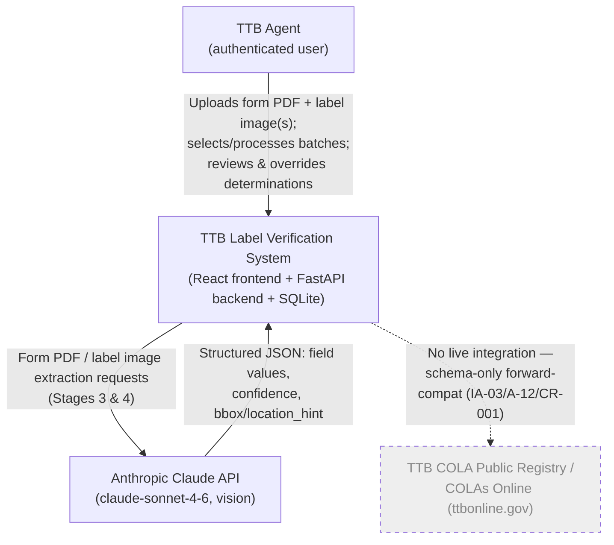
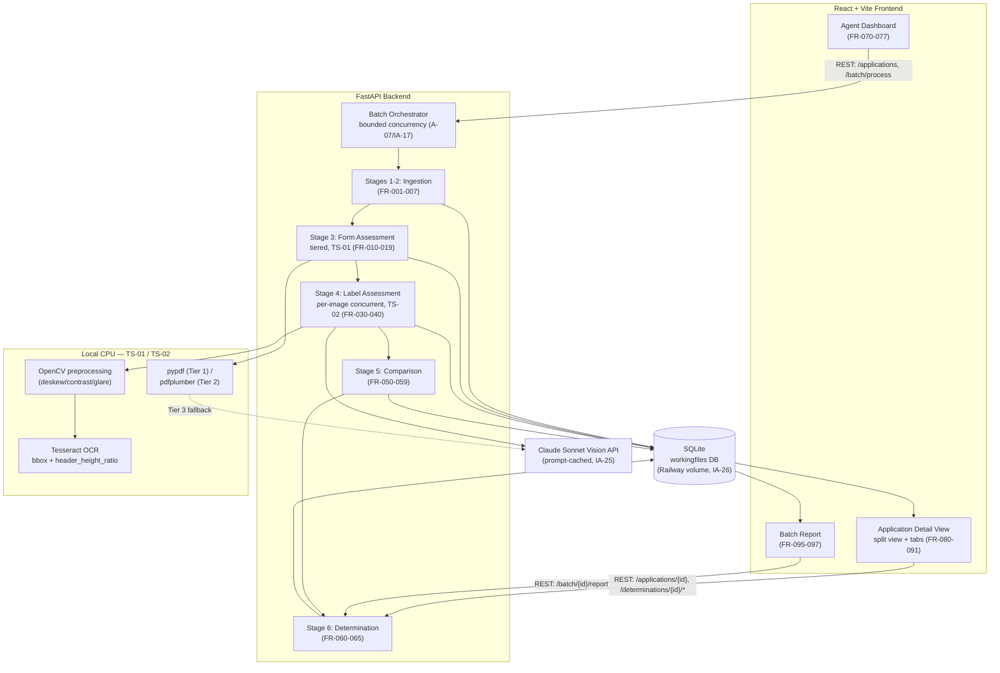
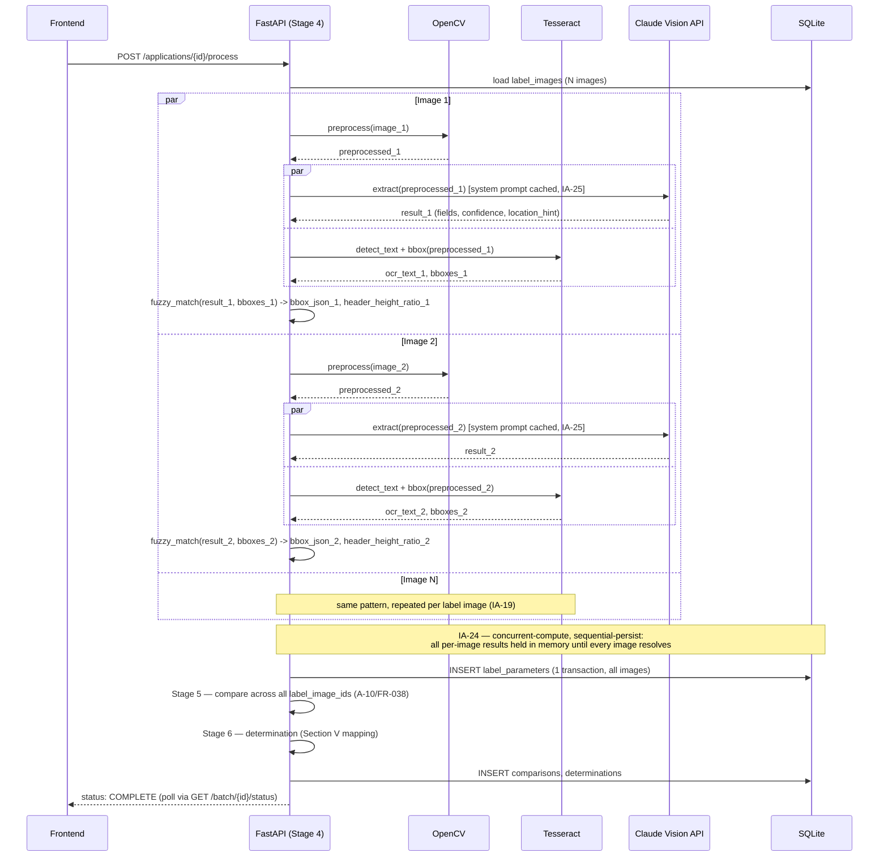

# Product Requirements Document
## TTB Label Verification System (TTB-LVS)

---

| Field | Value |
|-------|-------|
| Document ID | TTB-LVS-PRD-001 |
| Version | 2.0 |
| Status | Draft |
| Date | 2026-06-11 |
| Prepared By | Matthew Gabriel Sizemore |
| Prepared For | US Department of the Treasury, TTB |
| Assessment Reference | IT Specialist (AI) · 26-DO-12891471-DH |

### Revision History

| Version | Date | Author | Description |
|---------|------|--------|-------------|
| 1.0 | 2026-06-09 | M.G. Sizemore | Initial release — based on stakeholder interviews, TTB Form F 5100.31, and assessment brief |
| 1.1 | 2026-06-10 | M.G. Sizemore | Systems engineering pass: added trade studies (DevLog §3.1) for tiered form-data extraction (FR-017) and OpenCV/OCR-assisted label extraction (FR-039, FR-040); added COLA Public Registry references (REF-07–09) and forward-compatible schema fields (FR-018) for future integration; resolved DevLog IA-07/IA-13 |
| 1.2 | 2026-06-10 | M.G. Sizemore | Architecture evaluation (DevLog §3.6): added FR-019 (form-field bounding boxes) and FR-091 (multi-image tabbed selector, resolving the open Application Detail View design question); revised A-07 (bounded batch concurrency) and FR-074's verification method; updated traceability matrix (new "AE" source code) and glossary |
| 1.3 | 2026-06-10 | M.G. Sizemore | Assumptions completeness review (cross-checked DevLog §5 Initial Assumptions IA-01–IA-26 against §8): added FR-066 (country-of-origin comparison, conditional on Item 3 = "imported", closing a gap in the DevLog §2.5 comparison matrix / IA-15) and new §8 entries A-15 (overrides do not re-run the AI pipeline, IA-14), A-16 (SR-003 "active processing session" interpretation and persistent-storage dependency, IA-26), and A-17 (country-of-origin comparison scope, IA-15); updated traceability matrix |
| 1.4 | 2026-06-10 | M.G. Sizemore | Comparison-matrix completeness pass (DevLog §2.5): added FR-100–107, formalizing the remaining DevLog §2.5 comparison-matrix rows that lacked corresponding FRs — Fanciful Name (Item 7), Product Type/class-type consistency (Item 5), Applicant Name (Item 8), Applicant Address (Item 8/8a, with in-state Allowable Revision per Section V), Grape Varietals (Item 10, Wine), Wine Appellation (Item 11, Wine, conditional), ABV (presence + product-type consistency), and Net Contents (presence); updated traceability matrix |
| 2.0 | 2026-06-11 | M.G. Sizemore | Documentation consistency pass (Session 9): version/date/footer synchronized with the `WBS.md` v2.0 baseline as part of a cross-document consistency review (README/PRD/DevLog/WBS/TODO); no functional requirement changes — FR/PR/IR/UR/SR/CR sets unchanged from v1.4 |

---

## Table of Contents

1. [Introduction](#1-introduction)
2. [Product Description](#2-product-description)
3. [Operational Concept](#3-operational-concept)
4. [Stakeholder Needs and User Stories](#4-stakeholder-needs-and-user-stories)
5. [System Boundary and Context](#5-system-boundary-and-context)
6. [Requirements](#6-requirements)
   - 6.1 Functional Requirements
   - 6.2 Performance Requirements
   - 6.3 External Interface Requirements
   - 6.4 Usability Requirements
   - 6.5 Security and Data Requirements
   - 6.6 Design Constraints
7. [Requirements Traceability Matrix](#7-requirements-traceability-matrix)
8. [Assumptions and Dependencies](#8-assumptions-and-dependencies)
9. [Glossary](#9-glossary)

---

## 1. Introduction

### 1.1 Purpose

This document defines the product requirements for the TTB Label Verification System (TTB-LVS). It specifies what the system is, what it does, the conditions under which it operates, and the standards to which it shall be built and verified. This document is the authoritative basis for design, development, and evaluation of the prototype.

### 1.2 Scope

This document covers the TTB-LVS prototype submitted as a take-home assessment for the position of IT Specialist (AI), Departmental Offices — Treasury Common Services Center, Office of the Deputy Administrator for Technology Services. The system is a standalone proof-of-concept. It does not integrate with the TTB COLA production system.

### 1.3 Document Conventions

- **SHALL** — mandatory requirement; the system must satisfy this requirement to be compliant.
- **SHOULD** — desired requirement; the system ought to satisfy this but deviation is acceptable with documented rationale.
- **MAY** — optional capability; inclusion is at the developer's discretion.
- Requirements are uniquely identified by category prefix and three-digit sequence number (e.g., FR-001).
- Source traceability codes are defined in Section 7.

### 1.4 Intended Audience

- TTB hiring evaluators reviewing the prototype submission
- Development team implementing the prototype
- TTB compliance agents who will use the system

### 1.5 References

| ID | Document |
|----|---------|
| REF-01 | TTB Form F 5100.31 (04/2023) — Application for and Certification/Exemption of Label/Bottle Approval |
| REF-02 | 27 CFR Part 16 — Alcoholic Beverage Health Warning Statement |
| REF-03 | 27 CFR Parts 4, 5, 7 — TTB labeling regulations (Wine, Distilled Spirits, Malt Beverages) |
| REF-04 | Assessment README — Take-Home Project: AI-Powered Alcohol Label Verification App |
| REF-05 | USA Staffing Office Notification — IT Specialist (AI) · 26-DO-12891471-DH (2026-06-09) |
| REF-06 | DevLog — TTB Label Verification System (TTB-LVS) |
| REF-07 | TTB COLA Public Registry overview — https://www.ttb.gov/regulated-commodities/labeling/cola-public-registry |
| REF-08 | TTB COLAs Online — Public COLA Search (Basic) — https://www.ttbonline.gov/colasonline/publicSearchColasBasic.do |
| REF-09 | Example COLA registry record (TTB ID 25211001000227) — https://ttbonline.gov/colasonline/viewColaDetails.do?action=publicDisplaySearchBasic&ttbid=25211001000227 |

---

## 2. Product Description

### 2.1 What the Product Is

The TTB Label Verification System (TTB-LVS) is an **AI-powered web application** that assists TTB compliance agents in reviewing Certificate of Label Approval (COLA) applications. It is a **decision-support tool**: the system provides AI-generated determinations, and agents retain full authority to accept, modify, or override those determinations.

The system is composed of three integrated layers:

1. **An AI-powered processing pipeline** that ingests TTB Form F 5100.31 PDF applications and companion label artwork images, extracts structured parameters from both using computer vision and language models, compares those parameters against TTB labeling requirements, and generates per-parameter and overall determination recommendations.

2. **A workingfiles database** that maintains the state of all ingested applications, extracted parameters, comparison results, determinations, and agent override records throughout the processing lifecycle.

3. **A web-based agent interface** that presents a dashboard of pending applications, enables batch processing, displays results in a split-panel annotated view, and allows agents to override any AI determination before finalizing.

### 2.2 What the Product Does

The TTB-LVS performs the following core functions:

| Function | Description |
|----------|-------------|
| **Ingest** | Accepts TTB Form F 5100.31 PDF files and companion label artwork images; pairs them; logs them in the database |
| **Extract (Form)** | Uses an AI language model to extract all structured data fields from the application form (Items 1–18 of Part I) |
| **Extract (Label)** | Uses an AI vision model to extract all TTB-required label elements from the artwork image |
| **Compare** | Applies field-specific comparison rules to each form/label parameter pair, classifying results as Match, Hard Failure, or Possible Allowable Revision |
| **Determine** | Issues an overall recommendation of Approve, Deny, or Recommend Exemption Review, with a full breakdown of the basis for that recommendation |
| **Present** | Renders results in a split-panel view with the form on the left and the label on the right; marks mismatches with red elliptical annotations; highlights cross-document relationships on mouse-over |
| **Override** | Allows the agent to override any individual parameter determination or the overall recommendation, with a mandatory reason entry |
| **Report** | Generates per-application determination reports and batch summary reports |

### 2.3 What the Product Is Not

The following are explicitly outside the scope of the TTB-LVS:

- **Not a final adjudication authority.** All determinations are recommendations. The agent is the decision-maker of record.
- **Not integrated with the COLA system.** The TTB-LVS is a standalone prototype. It does not read from or write to the existing COLA application infrastructure.
- **Not a regulatory compliance engine.** The system checks label content against form data and the Government Warning Statement. It does not perform legal interpretation of 27 CFR regulations or formula approvals.
- **Not a production federal system.** The prototype does not implement FedRAMP controls, PIV authentication, audit logging to federal standards, or document retention policies required for production deployment.
- **Not a formula review system.** Formula approvals (Form Item 9) are recorded but not validated against TTB formula databases.

---

## 3. Operational Concept

### 3.1 Current State

TTB compliance agents receive approximately 150,000 COLA applications per year. Each application consists of a completed TTB Form F 5100.31 and a set of label artwork images affixed to the form. The agent manually compares each label image to the corresponding form entry, field by field, for mandatory elements including brand name, alcohol content, product type, bottler information, and the Government Health Warning Statement. Simple applications take 5–10 minutes each; complex applications take longer. A significant portion of this time is spent on direct data-entry matching — confirming that the text on the label is identical to the text on the form — rather than on regulatory interpretation.

### 3.2 Future State With TTB-LVS

With TTB-LVS deployed, the agent workflow becomes:

1. Agent logs into the TTB-LVS dashboard and sees their assigned application queue.
2. Agent selects one or more applications (individually or by batch selection) and clicks **Process**.
3. TTB-LVS ingests the paired form PDF and label image(s) for each selected application, runs the full AI extraction and comparison pipeline, and updates the dashboard with determination badges (Approve / Deny / Recommend Exemption Review) — all within 5 seconds per application.
4. Agent reviews the batch summary: how many approved, denied, or flagged for exemption review.
5. For each non-approved application, agent clicks through to the detail view, sees the form and label side-by-side with red ellipses marking each mismatch, reads the AI's per-parameter breakdown, and applies professional judgment.
6. If the agent disagrees with any AI determination, they right-click the parameter, enter a reason, and override it. They may also override the overall recommendation.
7. Agent finalizes the determination. The record — including all AI outputs and agent overrides — is committed to the database.

### 3.3 Value Delivered

The TTB-LVS eliminates the mechanical data-entry verification step from the agent workflow. Agents shift from performing the comparison to **reviewing and validating** a completed comparison. Judgment-intensive cases — regulatory interpretation, contextual assessment, borderline mismatches — remain under agent control. The system is expected to reduce per-application review time for routine applications from 5–10 minutes.

---

## 4. Stakeholder Needs and User Stories

### 4.1 Stakeholders

| Stakeholder | Role | Primary Concerns |
|-------------|------|-----------------|
| Sarah Chen | Deputy Director, Label Compliance | Agent throughput; batch processing for peak seasons; 5-second response constraint; accessible UI for mixed-tech-comfort team |
| Dave Morrison | Senior Compliance Agent (28 years) | System reliability; ability to apply judgment; avoiding false rejections of obviously-correct submissions |
| Jenny Park | Junior Compliance Agent (8 months) | Automated Government Warning check; handling imperfect label images |
| Marcus Williams | IT Systems Administrator | Standalone POC scope; no sensitive data persistence; Azure infrastructure context |

### 4.2 User Stories

The following user stories are derived directly from stakeholder interview transcripts (REF-04) and represent the primary use cases the TTB-LVS is designed to address.

---

**US-001 — Batch Import Season Processing**

> *"During peak season, we get these big importers who dump 200, 300 label applications on us at once. Right now we literally have to process them one at a time. If there was some way to handle batch uploads, that would be huge. Janet from our Seattle office has been asking about this for years."*
> — Sarah Chen, Deputy Director of Label Compliance

**As a** TTB compliance agent during peak import season,  
**I want to** select a batch of pending applications from a single importer using checkboxes and process all of them with one click,  
**so that** I can clear a large queue submission in a single processing action and immediately see a summary of how many were approved, denied, or flagged for exemption review — before spending time on the individual cases that require my judgment.

*Acceptance criteria:*
- Agent can select ≥ 2 applications simultaneously via checkboxes on the dashboard.
- A single "Process Selected" action triggers the full pipeline for all selected applications.
- A batch summary report is presented upon completion showing Approved count, Denied count, and Exemption Review count.
- Each application in the batch displays an individual result badge on the dashboard.

---

**US-002 — Expert Override of Algorithmic Mismatch**

> *"I had one last week where the brand name was 'STONE'S THROW' on the label but 'Stone's Throw' in the application. Technically a mismatch? Sure. But it's obviously the same thing. You need judgment."*
> — Dave Morrison, Senior Compliance Agent

**As a** senior TTB compliance agent reviewing a flagged application,  
**I want to** right-click on any AI-flagged parameter mismatch, review the form value and label value side-by-side, and override the determination with a recorded reason,  
**so that** my professional judgment — including contextual knowledge that a case/punctuation difference in a brand name is not a substantive discrepancy — is captured in the final determination record rather than being blocked by a mechanical flag.

*Acceptance criteria:*
- Any parameter row in the results table is right-click accessible with an "Override Determination" option.
- The override modal displays the form value, the label value, the AI's classification, and a free-text reason field.
- The override is saved with the agent's identifier, override value, reason, and timestamp.
- The overall determination updates to reflect parameter-level overrides.

---

**US-003 — Automated Government Warning Verification**

> *"The warning statement check is actually trickier than it sounds. It has to be exact. Like, word-for-word, and the 'GOVERNMENT WARNING:' part has to be in all caps and bold... I caught one last month where they used 'Government Warning' in title case instead of all caps. Rejected."*
> — Jenny Park, Junior Compliance Agent

**As a** TTB compliance agent reviewing a distilled spirits label application,  
**I want the** system to automatically verify that the Government Health Warning Statement is present, matches the exact statutory text of 27 CFR § 16.21 word-for-word, and that the header "GOVERNMENT WARNING:" appears in all-capital letters and bold,  
**so that** I no longer need to manually read and compare the full 50-word warning statement on every label, and common formatting violations — such as title case headers or paraphrased text — are reliably caught without relying on my manual attention.

*Acceptance criteria:*
- The system checks the Government Warning text against the exact 27 CFR § 16.21 statutory string.
- The system separately checks that "GOVERNMENT WARNING:" appears in all-capital letters.
- The system separately checks that the "GOVERNMENT WARNING:" header appears in bold formatting.
- Any violation in any of the three checks produces a HARD_FAILURE classification for this parameter.
- The parameter result row identifies which specific check failed (text, capitalization, or bold).

---

## 5. System Boundary and Context

### 5.1 System Context Diagram

```
                        ┌─────────────────────────────────────────┐
                        │           TTB-LVS SYSTEM BOUNDARY        │
                        │                                          │
  ┌─────────────┐       │  ┌──────────────┐    ┌────────────────┐  │
  │  TTB Agent  │──────▶│  │  Web Browser │    │  FastAPI       │  │
  │  (User)     │◀──────│  │  Interface   │◀──▶│  Backend       │  │
  └─────────────┘       │  │  (React)     │    │                │  │
                        │  └──────────────┘    └───────┬────────┘  │
  ┌─────────────┐       │                              │            │
  │  F 5100.31  │──────▶│                       ┌──────▼────────┐  │
  │  Form (PDF) │       │                       │  SQLite DB    │  │
  └─────────────┘       │                       │ (workingfiles)│  │
                        │                       └──────┬────────┘  │
  ┌─────────────┐       │                              │            │
  │  Label Image│──────▶│                       ┌──────▼────────┐  │
  │  (JPEG/PNG) │       │                       │  AI Pipeline  │  │
  └─────────────┘       │                       │  (Stages 3-5) │  │
                        │                       └──────┬────────┘  │
                        │                              │            │
                        └──────────────────────────────┼────────────┘
                                                       │
                                               ┌───────▼────────┐
                                               │  Anthropic     │
                                               │  Claude API    │
                                               │  (External)    │
                                               └────────────────┘
```

### 5.2 External Interfaces

| Interface | Direction | Protocol | Description |
|-----------|-----------|----------|-------------|
| Agent Browser | Bidirectional | HTTPS | Agent uploads files, triggers processing, reviews results, enters overrides |
| Form PDF Upload | Inbound | HTTP multipart/form-data | TTB F 5100.31 PDF files from agent workstation |
| Label Image Upload | Inbound | HTTP multipart/form-data | Label artwork image files from agent workstation |
| Anthropic Claude API | Outbound | HTTPS/REST | Form and label content sent for AI extraction; structured JSON responses returned |

### 5.3 Out-of-Scope Interfaces

The following interfaces are explicitly NOT part of the TTB-LVS system boundary:

- TTB COLA online system (ttbonline.gov)
- TTB Formula Online system
- Agent identity management / government SSO
- External document storage (S3, SharePoint, etc.)
- Email or notification systems

**Forward-compatibility note (FR-018):** although no connection to the TTB COLA Public Registry / COLAs Online (ttbonline.gov, REF-07–09) exists or is planned for this prototype, the database schema captures the registry's data fields (TTB ID, Vendor Code, Class/Type Code, Origin Code, registry status, etc. — see DevLog §6) so that a future integration would not require a schema redesign. This is a schema-only accommodation and does not alter the system boundary defined above or assumption A-12.

### 5.4 SYstem Diagrams

These diagrams formalize the architecture confirmed in Section 3.6, reflecting the bounded-concurrency batch model (A-07/IA-17), the per-image concurrent extraction model (IA-19/IA-24), and the TS-01/TS-02 tiered/local-CV additions.

#### 5.4.1 System Context Diagram



**Notes:** The only live external dependency is the Claude API (A-08). The COLA Registry is shown dashed/greyed to make explicit that it is *not* called — its data model only informs the forward-compatible schema fields (Section 6, IA-22).

#### 5.4.2 System Block Diagram (Stages 1–6)



**Notes:** "Batch Orchestrator" is the new A-07/IA-17 bounded-concurrency layer (Decision 8 item 2) — it runs Stages 1–6 for each selected application, capping concurrent applications via a semaphore. Within Stage 4, the per-image fan-out (IA-19/IA-24) is detailed in Section 3.7.3.

#### 5.4.3 Sequence Diagram — Concurrent Per-Image Label Extraction (IA-19/IA-24)



**Notes:** The two `par` blocks per image are nested deliberately: the outer `par` is IA-19's per-image concurrency (N images at once); the inner `par` is TS-02's Claude-vs-OCR concurrency *within* one image. Total wall-clock for Stage 4 is therefore bounded by the slowest single image's `max(Claude, OpenCV+OCR)` — not the sum across images or across Claude/OCR — preserving PR-001's 5-second budget regardless of image count.

---

## 6. Requirements

### 6.1 Functional Requirements

#### 6.1.1 Application Ingestion

| ID | Requirement | Verification Method |
|----|-------------|-------------------|
| FR-001 | The system SHALL accept a TTB Form F 5100.31 submitted as a PDF file. | Test: upload valid PDF; confirm system accepts and logs the file. |
| FR-002 | The system SHALL accept label artwork submitted as JPEG, PNG, or WebP image files. | Test: upload one file of each format; confirm acceptance for all three. |
| FR-003 | The system SHALL support upload of multiple label images per application (e.g., brand label, back label, neck label). | Test: upload 3 images to a single application; confirm all 3 are stored and associated. |
| FR-004 | The system SHALL associate each label image with a specific application form via agent-defined pairing in the upload interface. | Test: upload form A with image X and form B with image Y; confirm pairing integrity in database. |
| FR-005 | The system SHALL assign a unique application identifier to each ingested application and record the upload timestamp. | Inspection: query database after upload; verify unique ID and timestamp present. |
| FR-006 | The system SHALL support batch ingestion, allowing multiple application forms and their companion label images to be uploaded in a single session. | Test: upload 5 form/image pairs in one session; confirm all 5 are ingested and individually logged. |
| FR-007 | The system SHALL reject uploaded files that do not conform to accepted formats (PDF for forms; JPEG, PNG, or WebP for images) and return a plain-English error message. | Test: upload a .docx file; confirm rejection and descriptive error message. |

#### 6.1.2 Form Assessment

| ID | Requirement | Verification Method |
|----|-------------|-------------------|
| FR-010 | The system SHALL extract the value of every field defined in TTB Form F 5100.31 Part I (Items 1 through 18, including Item 8a) for each application, regardless of whether the field is used in downstream comparison logic. Extraction method is unspecified at this requirement level — see FR-017 for the tiered extraction strategy. | Inspection: after extraction, verify `form_parameters` contains an entry for every Part I item, including items not otherwise referenced in this PRD (e.g., Items 1, 4, 9, 12, 13, 15, 16, 17, 18). |
| FR-011 | The system SHALL record a field as explicitly empty/null when the corresponding form field is blank on the submitted form, rather than omitting the field from the extraction record. | Test: upload a form with Item 7 (Fanciful Name) blank; confirm `form_parameters` contains a "fanciful_name" entry with a null value. |
| FR-012 | The system SHALL normalize the Item 3 (Source of Product) extraction to one of: "domestic" or "imported". | Test: upload form with Imported checked; confirm extracted value is "imported". |
| FR-013 | The system SHALL normalize the Item 5 (Type of Product) extraction to one of: "wine", "distilled_spirits", or "malt_beverages". | Test: upload one form per product type; confirm correct normalized value extracted for each. |
| FR-014 | The system SHALL parse Item 14 (Type of Application) into its constituent elements: which sub-box(es) (a/b/c/d) are checked; the state abbreviation entered for 14b, if checked; the bottle capacity entered for 14c, if checked; and the prior TTB ID entered for 14d, if checked. | Test: upload forms with each sub-box checked individually; confirm the associated value (state, capacity, or TTB ID) is correctly extracted when present. |
| FR-015 | The system SHALL extract Item 10 (Grape Varietal(s)) as a list of individual varietal names, for Wine applications. | Test: upload Wine form listing 3 varietals; confirm all 3 extracted as separate list items. |
| FR-016 | The system SHALL record an extraction confidence score (0.0–1.0) for each extracted form field. | Inspection: verify confidence scores present for every field in `form_parameters` after extraction. |
| FR-017 | The system SHALL resolve each Part I field via a tiered extraction strategy — (1) AcroForm field read, (2) PDF text-layer extraction, (3) AI vision extraction as fallback — using the first tier that returns a non-null value, and SHALL record which tier resolved each field as its `extraction_method`. | Inspection: process a digitally-completed AcroForm PDF; confirm `form_parameters.extraction_method = "acroform"` for fields present in the form's fields and confidence = 1.0. Process a flattened/scanned PDF; confirm fields fall back to `"pdftext"` or `"ai_vision"` and the system still returns a complete record. |
| FR-018 | The system SHALL persist, for each application, the COLA Public Registry fields TTB ID, Vendor Code, Class/Type Code, Origin Code, registry status, Total Bottle Capacity, For Sale In, and Qualifications when derivable from the submitted form or label, for forward-compatibility with a future COLAs Online integration (Section 5.3). | Inspection: confirm the `applications` table schema includes columns for each listed field, and that values are populated when present in the source documents. |
| FR-019 | The system SHALL record a pixel bounding box (`bbox`) for each Tier 1- or Tier 2-resolved form field (FR-017), derived from the AcroForm field's widget rectangle (Tier 1) or the PDF text-layer's word/character bounding box (Tier 2), and SHALL record a relative location hint as a fallback for Tier 3-resolved fields, for use in FR-082's annotation placement. | Inspection: process a digitally-completed AcroForm PDF; confirm `form_parameters.bbox_json` is populated for `extraction_method = "acroform"` and `"pdftext"` fields. Process a scanned PDF resolved entirely via Tier 3; confirm `form_parameters.location_hint` is populated and `bbox_json` is `null`. |

#### 6.1.3 Label Assessment

| ID | Requirement | Verification Method |
|----|-------------|-------------------|
| FR-030 | The system SHALL perform label assessment (Stage 4 extraction) independently for **every** label image associated with an application — not only a single designated "primary" or brand-label image. | Test: upload an application with 3 label images (brand, back, neck); confirm `label_parameters` contains extraction results for all 3 images. |
| FR-031 | The system SHALL extract all TTB-required mandatory label elements in a single AI vision extraction pass per label image: brand name, fanciful name (if present), class/type designation, alcohol content (ABV), net contents, bottler/producer name and address, country of origin (if present), and the full text of the Government Health Warning Statement. | Test: process a label image containing all eight elements; confirm all eight are present in `label_parameters` with non-null values. |
| FR-032 | The system SHALL, in the same extraction pass, extract additional label elements relevant to comparison when visually present: grape varietal(s), wine appellation, vintage date, age statement, and any "For sale in [STATE] only" statement. | Test: process a wine back label containing varietals, an appellation, and a vintage date; confirm all three are extracted. |
| FR-033 | The system SHALL record any other text block visible on a label image that does not correspond to a field in FR-031 or FR-032 as a generic "other_text" entry, preserving a complete digital record of that image's content. | Test: process a label image containing a UPC code and a "Drink Responsibly" statement; confirm both appear as `other_text` entries. |
| FR-034 | The system SHALL determine whether "GOVERNMENT WARNING:" appears in all-capital letters on the label image where it is found. | Test: process a label image with a title-case header; confirm capitalization flag set to false. |
| FR-035 | The system SHALL determine whether "GOVERNMENT WARNING:" appears in bold formatting on the label image where it is found. | Test: process a label image with a non-bold header; confirm bold flag set to false. |
| FR-036 | The system SHALL record a relative location hint (e.g., top-center, bottom-left) for each extracted label element, for use in annotation placement, and SHALL additionally record a pixel bounding box (`bbox`) for that element when one can be derived (FR-040). When no `bbox` is available, annotation placement SHALL fall back to `location_hint`. | Inspection: verify `location_hint` populated for every entry in `label_parameters` after extraction; verify `bbox` is populated where an OCR fuzzy-match succeeded and `null` otherwise. |
| FR-037 | The system SHALL record an extraction confidence score (0.0–1.0) for each extracted label element. | Inspection: verify confidence scores present for every entry in `label_parameters` after extraction. |
| FR-038 | The system SHALL record, for each extracted label element, the identifier of the source label image, and SHALL treat a form field as satisfied by the label set if a matching value is found on **any** of the application's label images, regardless of which image. | Test: upload an application where the brand name is absent from the front label but correctly printed on the back label; confirm the brand name comparison result is MATCH and the result references the back label's `label_image_id`. |
| FR-039 | The system SHALL apply image preprocessing (deskew/perspective correction, contrast normalization, glare suppression) to each label image before AI vision extraction, to mitigate degraded image quality (angle, glare, lighting). | Test: process a label image photographed at an angle with glare; confirm the preprocessed image is deskewed and glare-suppressed prior to the AI vision call, and that extraction still succeeds for elements visible in the original. |
| FR-040 | The system SHALL run OCR text and bounding-box detection on each preprocessed label image, and SHALL fuzzy-match each AI-extracted field's text value against the OCR results to derive a pixel `bbox` (FR-036) for that element when a confident match exists. For the Government Warning element, the system SHALL additionally compute the OCR-measured text-height ratio of "GOVERNMENT WARNING:" to surrounding body text as a corroborating signal for FR-035. | Test: process a label image with a "GOVERNMENT WARNING:" header twice the height of surrounding body text; confirm `header_height_ratio ≈ 2.0` and is recorded alongside the FR-035 `header_caps_bold` result. |

#### 6.1.4 Parameter Comparison

| ID | Requirement | Verification Method |
|----|-------------|-------------------|
| FR-050 | The system SHALL compare the brand name found on any of the application's label images (FR-038) against the brand name declared in Form Item 6. | Test: process application with matching brand name on at least one label image; confirm MATCH result. |
| FR-051 | The system SHALL apply case-insensitive and punctuation-normalized comparison to the brand name field. | Test: process application where form has "STONE'S THROW" and a label image has "Stone's Throw"; confirm result is POSSIBLE_ALLOWABLE, not HARD_FAILURE. |
| FR-052 | The system SHALL classify a brand name difference as HARD_FAILURE only when the substantive content of the name differs on every label image, not when the difference is limited to case or punctuation. | Test: process application where form has "Eagle Ridge" and all label images show "Eagle Valley"; confirm HARD_FAILURE. |
| FR-053 | The system SHALL verify that the Government Warning Statement text, on whichever label image it appears, exactly matches the statutory text of 27 CFR § 16.21. | Test: process an application whose only label image has one word changed in the warning; confirm HARD_FAILURE. |
| FR-054 | The system SHALL classify the Government Warning check as HARD_FAILURE if "GOVERNMENT WARNING:" does not appear in all-capital letters on the label image where it is found. | Test: process label image with "Government Warning:"; confirm HARD_FAILURE. |
| FR-055 | The system SHALL classify the Government Warning check as HARD_FAILURE if "GOVERNMENT WARNING:" does not appear in bold on the label image where it is found. | Test: process label image with non-bold header; confirm HARD_FAILURE. |
| FR-056 | The system SHALL verify that at least one of the application's label images contains "For sale in [STATE] only" when Form Item 14b is checked, using the state abbreviation declared in Item 14b. | Test: process 14b application with the correct statement on any one label image; confirm MATCH. With the statement on no image; confirm HARD_FAILURE. |
| FR-057 | The system SHALL classify a mismatch as POSSIBLE_ALLOWABLE when the nature of the discrepancy corresponds to a revision type enumerated in Section V of TTB Form F 5100.31. | Test: process application where only label colors differ (Section V item 3a); confirm POSSIBLE_ALLOWABLE. |
| FR-058 | The system SHALL classify each comparison result as exactly one of: MATCH, HARD_FAILURE, POSSIBLE_ALLOWABLE, MISSING_FROM_LABEL, or MISSING_FROM_FORM. | Inspection: verify all comparison records contain one of the five valid values. |
| FR-059 | The system SHALL record the applicable Section V item reference number (e.g., "3b") for each comparison result classified as POSSIBLE_ALLOWABLE. | Inspection: verify section_v_ref field populated for POSSIBLE_ALLOWABLE records. |
| FR-066 | The system SHALL verify that at least one of the application's label images includes a country of origin (FR-031) when Item 3 (Source of Product, FR-012) is normalized to "imported"; when Item 3 is "domestic", no country-of-origin comparison SHALL be performed. | Test: process an "imported" application with a country of origin present on at least one label image; confirm MATCH. With no label image showing a country of origin; confirm HARD_FAILURE. Process a "domestic" application; confirm no country-of-origin comparison record is generated. |
| FR-100 | The system SHALL, when Item 7 (Fanciful Name) is non-null, verify that a matching fanciful name appears on at least one of the application's label images (FR-031), using the case-insensitive, punctuation-normalized comparison of FR-051. When Item 7 is null, no fanciful-name comparison SHALL be performed. | Test: process an application where Item 7 = "Old Reserve" and a label image shows "OLD RESERVE"; confirm MATCH. With no label image showing the fanciful name; confirm HARD_FAILURE. Process an application where Item 7 is blank; confirm no fanciful-name comparison record is generated. |
| FR-101 | The system SHALL verify that the class/type designation extracted from the label (FR-031) is consistent with the product type checked in Item 5 (FR-013) — e.g., a label class/type designation of "Vodka" is inconsistent with an Item 5 value of "wine". | Test: process an application where Item 5 = "wine" and the label's class/type designation is "Table Wine"; confirm MATCH. Process an application where Item 5 = "wine" but the label's class/type designation is "Vodka"; confirm HARD_FAILURE. |
| FR-102 | The system SHALL verify that the applicant name declared in Item 8 — including any DBA/tradename recorded in Item 8 or 8a, if a DBA is used on the label — matches the bottler/producer name extracted from the label (FR-031), using the case-insensitive, punctuation-normalized comparison of FR-051. | Test: process an application where the label's producer name matches Item 8 (or its declared DBA); confirm MATCH. Process an application where the label shows a different company name with no corresponding DBA recorded in Item 8/8a; confirm HARD_FAILURE. |
| FR-103 | The system SHALL verify that the applicant address declared in Item 8 (or Item 8a, if different) matches the bottler/producer address extracted from the label (FR-031). An address mismatch limited to an in-state change SHALL be classified as POSSIBLE_ALLOWABLE per Section V; any other address mismatch SHALL be classified as HARD_FAILURE. | Test: process an application where the label's producer address exactly matches Item 8/8a; confirm MATCH. Process an application where only the street address differs but the state is unchanged; confirm POSSIBLE_ALLOWABLE with the applicable Section V reference (FR-059). Process an application where the label shows a different state; confirm HARD_FAILURE. |
| FR-104 | For Wine applications, the system SHALL verify that every grape varietal listed in Item 10 (FR-015) appears among the varietals extracted from the application's label images (FR-032). | Test: process a Wine application listing "Cabernet Sauvignon" and "Merlot" in Item 10, both present on a label image; confirm MATCH for both. With one varietal absent from all label images; confirm HARD_FAILURE for that varietal. |
| FR-105 | For Wine applications where Item 11 (Wine Appellation) is non-null, the system SHALL verify that a matching appellation appears on at least one of the application's label images (FR-032), using the case-insensitive, punctuation-normalized comparison of FR-051. When Item 11 is null, no appellation comparison SHALL be performed. | Test: process a Wine application where Item 11 = "Napa Valley" and a label image shows "Napa Valley"; confirm MATCH. With no label image showing the appellation; confirm HARD_FAILURE. Process an application where Item 11 is blank; confirm no appellation comparison record is generated. |
| FR-106 | The system SHALL verify that an Alcohol by Volume (ABV) value is present on at least one of the application's label images (FR-031). Form F 5100.31 Part I has no corresponding ABV field, so this is a presence check rather than a form-to-label value comparison. | Test: process an application whose label images include an ABV value; confirm MATCH (presence). With no label image showing an ABV value; confirm HARD_FAILURE. |
| FR-107 | The system SHALL verify that a Net Contents value is present on at least one of the application's label images (FR-031). Form F 5100.31 Part I has no corresponding Net Contents field, so this is a presence check rather than a form-to-label value comparison. | Test: process an application whose label images include a Net Contents value; confirm MATCH (presence). With no label image showing a Net Contents value; confirm HARD_FAILURE. |

#### 6.1.5 Determination

| ID | Requirement | Verification Method |
|----|-------------|-------------------|
| FR-060 | The system SHALL issue an overall determination of APPROVE when all mandatory parameter comparisons return a MATCH result. | Test: process application with all matching fields; confirm APPROVE determination. |
| FR-061 | The system SHALL issue an overall determination of DENY when one or more parameter comparisons return a HARD_FAILURE result. | Test: process application with one HARD_FAILURE; confirm DENY determination. |
| FR-062 | The system SHALL issue an overall determination of RECOMMEND EXEMPTION REVIEW when one or more comparisons return POSSIBLE_ALLOWABLE and no comparisons return HARD_FAILURE. | Test: process application with one POSSIBLE_ALLOWABLE and all other MATCH; confirm RECOMMEND EXEMPTION REVIEW. |
| FR-063 | The system SHALL, for DENY determinations, produce a list of each hard failure specifying the field name, the form value, the label value, and a plain-English description of the failure. | Test: process application with two HARD_FAILUREs; verify report contains both, with values and description. |
| FR-064 | The system SHALL, for RECOMMEND EXEMPTION REVIEW determinations, produce a list of each allowable-revision candidate specifying the field name, the discrepancy, and the applicable Section V item reference. | Test: process application with one POSSIBLE_ALLOWABLE; verify report entry includes Section V reference. |
| FR-065 | The system SHALL generate a per-application determination report containing: all parameter comparison results, the overall determination, confidence scores, and the processing timestamp. | Inspection: verify all five report components are present in the determination record after processing. |

#### 6.1.6 Agent Dashboard

| ID | Requirement | Verification Method |
|----|-------------|-------------------|
| FR-070 | The system SHALL display, upon login, a list of applications assigned to the authenticated agent. | Test: log in as agent A; confirm only agent A's applications are listed. |
| FR-071 | The system SHALL display, for each application in the list, the serial number, applicant name, product type, upload date, and current processing status. | Inspection: verify all five fields present for each row in the application list. |
| FR-072 | The system SHALL allow the agent to filter the application list by applicant company name. | Test: enter partial company name in filter; confirm list updates to show matching applications only. |
| FR-073 | The system SHALL allow the agent to select one or more applications using checkboxes for batch processing. | Test: select 3 applications; confirm all 3 are queued for processing. |
| FR-074 | The system SHALL initiate the full processing pipeline for all selected applications upon a single "Process" action. | Test: select 2 applications and click Process; confirm both begin processing under the bounded-concurrency batch model (A-07) and both reach a terminal status (success or error). |
| FR-075 | The system SHALL display a visible progress indicator during batch processing. | Test: initiate processing of 3 applications; confirm progress indicator is displayed while processing is underway. |
| FR-076 | The system SHALL update each application row with a determination badge (Approve / Deny / Recommend Exemption Review) upon completion of processing. | Test: process 3 applications with known outcomes; confirm correct badges appear on dashboard. |
| FR-077 | The system SHALL display a batch summary header showing the count of Approved, Denied, and Exemption Review outcomes upon completion of a batch process action. | Test: process batch with known mix of outcomes; confirm counts in summary header match expected values. |

#### 6.1.7 Application Detail View

| ID | Requirement | Verification Method |
|----|-------------|-------------------|
| FR-080 | The system SHALL render the application form PDF in the left panel of the detail view. | Test: open detail view; confirm form PDF is rendered, not linked externally. |
| FR-081 | The system SHALL render the label artwork image in the right panel of the detail view, selecting among multiple images per FR-091 when more than one is associated with the application. | Test: open detail view; confirm label image is displayed in right panel. |
| FR-082 | The system SHALL display a red elliptical annotation over each field on the form PDF that produced a non-MATCH result, positioned per FR-019's `bbox`/`location_hint`. | Test: process application with 2 mismatches; confirm 2 red ellipses appear on form panel. |
| FR-083 | The system SHALL display a red elliptical annotation over each corresponding element on the label image for each non-MATCH result. | Test: process application with 2 mismatches; confirm 2 red ellipses appear on label panel. |
| FR-084 | The system SHALL, upon the agent's mouse-over of a red annotation on either panel, visually highlight the corresponding annotation on the opposite panel. | Test: hover over ellipse on form panel; confirm paired ellipse on label panel changes appearance. |
| FR-085 | The system SHALL display a parameter results table listing each compared field, its form value, its label value, and its determination classification. | Inspection: verify all four columns present for all compared fields in the results table. |
| FR-086 | The system SHALL provide an override mechanism, accessible via right-click on any parameter row, that allows the agent to change the AI's determination for that parameter. | Test: right-click parameter row; confirm "Override" option appears and is actionable. |
| FR-087 | The system SHALL require the agent to enter a non-empty reason before saving a parameter-level override. | Test: attempt to save override with empty reason field; confirm save is blocked. |
| FR-088 | The system SHALL record each parameter override with: the agent identifier, the original AI determination, the override value, the reason text, and the timestamp. | Inspection: verify all five fields present in database after override is saved. |
| FR-089 | The system SHALL allow the agent to override the overall determination recommendation, with a mandatory reason entry. | Test: override overall determination; confirm record saved with agent ID, override value, reason, and timestamp. |
| FR-090 | The system SHALL provide a "Finalize" action that commits the determination record — including all AI outputs and agent overrides — to the database. | Test: finalize a determination; confirm record is committed and status updated to COMPLETE. |
| FR-091 | When an application has more than one label image (FR-003/FR-030), the system SHALL present them in the right panel as a set of selectable tabs with thumbnail previews, and SHALL automatically switch to the tab containing the image referenced by a comparison's `label_image_id` (FR-038/A-10) when the agent interacts with that comparison's annotation. | Test: open the detail view for an application with 3 label images; confirm 3 tabs with thumbnails are shown. Click an annotation whose comparison record references the back label's `label_image_id`; confirm the right panel switches to the back-label tab and renders that annotation. |

#### 6.1.8 Batch Report

| ID | Requirement | Verification Method |
|----|-------------|-------------------|
| FR-095 | The system SHALL generate a batch report upon completion of a batch processing action. | Test: complete a batch; confirm batch report is accessible. |
| FR-096 | The batch report SHALL include: total applications processed, count approved, count denied, count recommended for exemption review, and a list of each application's individual result. | Inspection: verify all five data elements present in the batch report. |
| FR-097 | The batch report SHALL identify the most frequently occurring failure type across the batch. | Test: process a batch with a repeated failure; confirm common failure type identified in report. |

---

### 6.2 Performance Requirements

| ID | Requirement | Verification Method |
|----|-------------|-------------------|
| PR-001 | The system SHALL complete AI extraction and comparison for a single application — one form PDF and **all** of its associated label images, processed concurrently — within 5 seconds of processing initiation, measured from the moment the agent triggers processing to the moment results are available for display. | Test: time 10 single-application processing runs, each with 2–3 label images; confirm all complete within 5 seconds. |
| PR-002 | The per-application processing time within a batch SHALL not exceed 5 seconds per individual application. | Test: time per-application processing within a 10-application batch; confirm each completes within 5 seconds. |
| PR-003 | The system SHALL render the determination results in the application detail view within 1 second of the agent clicking into a completed application. | Test: measure time from click to full results display for 10 completed applications. |
| PR-004 | The system SHALL support a single batch processing action containing at least 50 applications without error. | Test: submit a batch of 50 applications; confirm all 50 complete successfully. |

---

### 6.3 External Interface Requirements

| ID | Requirement | Verification Method |
|----|-------------|-------------------|
| IR-001 | The system SHALL expose a REST API accessible over HTTPS. | Test: confirm all API endpoints respond correctly over HTTPS. |
| IR-002 | The system SHALL accept form PDF uploads up to 20 MB in file size. | Test: upload a 20 MB PDF; confirm acceptance. Upload a 21 MB PDF; confirm rejection with error. |
| IR-003 | The system SHALL accept label image uploads up to 10 MB per image file. | Test: upload a 10 MB image; confirm acceptance. Upload an 11 MB image; confirm rejection with error. |
| IR-004 | The system SHALL return all AI extraction results as structured JSON conforming to defined schemas. | Inspection: validate API responses against defined JSON schemas for form_parameters, label_parameters, and comparisons. |
| IR-005 | The system SHALL render the F 5100.31 form PDF within the application's own detail view, without requiring the agent to open a separate application or browser tab. | Test: open detail view; confirm form is rendered inline, no external tab opens. |
| IR-006 | The system SHALL operate fully within a standard modern web browser (Chrome, Edge, Firefox) without requiring browser extensions, plugins, or local software installation. | Test: access and use the full application in each of the three listed browsers without installing extensions. |

---

### 6.4 Usability Requirements

| ID | Requirement | Verification Method |
|----|-------------|-------------------|
| UR-001 | The primary workflow — upload an application, process it, and view the determination — SHALL be completable in no more than three user interactions following login. | Test: count interactions required for one full cycle; confirm ≤ 3. |
| UR-002 | Determination outcomes (Approve, Deny, Recommend Exemption Review) SHALL be visually distinguishable using both color-coding and iconography, without relying on text labels alone. | Inspection: confirm distinct color and icon for each of the three outcomes. |
| UR-003 | Error messages presented to the agent SHALL be written in plain English, identifying what went wrong and what the agent should do, without exposing technical stack traces or error codes. | Test: trigger error conditions (invalid file, network timeout); confirm plain-English messages for each. |
| UR-004 | The batch processing progress SHALL be visible to the agent at all times during processing via a labeled progress indicator showing applications completed vs. total. | Test: initiate batch of 5; confirm "X of 5" progress indicator is visible throughout. |
| UR-005 | All primary controls (upload, process, filter, finalize) SHALL be visible on the main interface without requiring the agent to scroll, expand menus, or navigate to secondary pages. | Inspection: verify all primary controls are visible at standard browser window sizes (1280×720 minimum). |
| UR-006 | The application SHOULD load fully and be ready for use within 3 seconds of the agent navigating to the URL. | Test: measure load time in clean browser session; target ≤ 3 seconds. |

---

### 6.5 Security and Data Requirements

| ID | Requirement | Verification Method |
|----|-------------|-------------------|
| SR-001 | The system SHALL require agent authentication (username and password) before granting access to any application data or functionality. | Test: attempt to access dashboard without login credentials; confirm access is denied. |
| SR-002 | The system SHALL NOT expose one agent's application data to another authenticated agent. | Test: log in as Agent A; confirm Agent B's applications are not visible or accessible. |
| SR-003 | The system SHALL NOT persist uploaded form PDFs or label images to disk storage beyond the active processing session in the prototype implementation. | Inspection: verify no form or image files remain on disk after processing completion. |
| SR-004 | The system SHALL store agent override records with the agent identifier, original value, override value, reason, and timestamp, creating an audit trail. | Inspection: verify all five fields present in override records in database. |
| SR-005 | The system SHALL NOT transmit application data to any external service other than the Anthropic Claude API for AI processing purposes. | Inspection: verify no other external network calls are made during processing. |

---

### 6.6 Design Constraints

| ID | Requirement | Verification Method |
|----|-------------|-------------------|
| CR-001 | The system SHALL operate as a standalone web application with no integration with, dependency on, or data exchange with the TTB COLA production system. | Inspection: verify no network calls to ttbonline.gov or related TTB infrastructure. |
| CR-002 | The system SHALL NOT require installation of any software on the agent's workstation other than a standard web browser. | Test: access and use the application on a clean workstation with only a browser installed. |
| CR-003 | The prototype system SHALL use a local SQLite database file requiring no external database server, database installation, or database configuration to run. | Test: run the application on a machine with no database software installed; confirm it operates correctly. |
| CR-004 | The system SHALL be deployed to a publicly accessible URL that TTB evaluators can access without VPN, credentials shared in advance, or special network configuration. | Test: access the deployed URL from a network not affiliated with the developer; confirm full functionality. |
| CR-005 | The system SHOULD be deployable by cloning the repository and running no more than four shell commands (excluding API key configuration). | Test: follow README instructions on a clean machine; count commands required to reach a running state. |

---

## 7. Requirements Traceability Matrix

Source codes:

| Code | Source |
|------|--------|
| SC | Sarah Chen interview (REF-04) |
| DM | Dave Morrison interview (REF-04) |
| JP | Jenny Park interview (REF-04) |
| MW | Marcus Williams interview (REF-04) |
| F5100 | TTB Form F 5100.31 (REF-01) |
| 27CFR | 27 CFR Part 16 (REF-02) |
| ASMNT | Assessment README (REF-04) |
| EMAIL | USA Staffing notification (REF-05) |
| TS | DevLog Trade Studies TS-01/TS-02 (DevLog §3.1) |
| COLA | TTB COLA Public Registry (REF-07–09) |
| AE | DevLog Architecture Evaluation (DevLog §3.6) |

| Requirement ID | Source(s) | User Story |
|---------------|-----------|-----------|
| FR-001–007 | ASMNT, F5100 | US-001 |
| FR-010–016 | F5100 | — |
| FR-017 | TS, F5100 | — |
| FR-018 | TS, COLA | — |
| FR-019 | AE, TS | — |
| FR-030–038 | ASMNT, F5100, JP | US-003 |
| FR-039–040 | TS, JP | US-003 |
| FR-050–052 | DM | US-002 |
| FR-053–055 | JP, 27CFR | US-003 |
| FR-056 | F5100 | — |
| FR-057–059 | F5100 (§V) | US-002 |
| FR-066 | F5100 | — |
| FR-100–107 | F5100 | — |
| FR-060–065 | SC, ASMNT | US-001 |
| FR-070–077 | SC | US-001 |
| FR-080–085 | ASMNT | — |
| FR-086–090 | DM | US-002 |
| FR-091 | AE | — |
| FR-095–097 | SC | US-001 |
| PR-001–004 | SC ("5 seconds... nobody's going to use it") | US-001 |
| IR-001–006 | MW, ASMNT, EMAIL | — |
| UR-001–006 | SC ("my mother could figure it out"), DM | US-001, US-002 |
| SR-001–005 | MW ("PII considerations"), ASMNT | — |
| CR-001–005 | MW ("standalone proof-of-concept"), EMAIL | — |

---

## 8. Assumptions and Dependencies

| ID | Type | Statement |
|----|------|-----------|
| A-01 | Assumption | Internet access is available from the deployment environment for Anthropic API calls. The firewall concern raised by Marcus Williams applies to the production COLA environment, not to this standalone prototype. |
| A-02 | Assumption | Application forms submitted for prototype testing are in TTB Form F 5100.31 format (04/2023 or later edition). Earlier editions may differ in layout and are not guaranteed to extract correctly. |
| A-03 | Assumption | The statutory Government Warning text is the 27 CFR § 16.21 standard statement. Specialized product warning text variants are out of scope for the prototype. |
| A-04 | Assumption | "Exemption" in the context of the system's RECOMMEND EXEMPTION REVIEW outcome refers to mismatches classifiable as Allowable Revisions per F 5100.31 Section V, not to Certificate of Exemption applications (Type 14b) specifically — though Type 14b applications are handled as a special processing path. |
| A-05 | Assumption | Annotation locations use an OCR-derived pixel `bbox` (FR-040) when a confident fuzzy-match exists between an AI-extracted field's value and the OCR text on the preprocessed label image. When no such match exists (e.g., logos, stylized brand fonts), the prototype falls back to the AI model's `location_hint` region-level approximations (top, bottom, center, left, right). |
| A-06 | Assumption | The prototype handles application types 14a and 14b. Types 14c (distinctive bottle) and 14d (resubmission) are recorded and noted in reports but do not receive specialized comparison logic in the prototype. |
| A-07 | Assumption | Batch processing uses bounded concurrency: a semaphore allows 3–5 applications to be processed in flight at once, rather than fully sequential or fully unbounded parallel (revised 2026-06-10, DevLog §3.6/IA-17). Per-application completion order may differ from selection/queue order; the FR-075 progress indicator reflects "X of N complete" regardless of order. |
| A-08 | Dependency | The system depends on the Anthropic Claude API (claude-sonnet-4-6 model) for AI extraction. API availability and response times are external dependencies not controlled by the TTB-LVS. |
| A-09 | Dependency | The deployment environment must support Python 3.11+ and Node.js 20+ runtimes. |
| A-10 | Assumption | Per FR-038, a required field is satisfied if found on any one of an application's label images. If multiple images report differing non-null values for the same field, the system uses the value (and `label_image_id`) that matches the form, if any; otherwise it uses the highest-confidence non-null value for the comparison result and annotation placement. |
| A-11 | Assumption | Within a single application, Stage 4 extraction calls for each label image may be issued concurrently to keep total per-application AI processing time within the PR-001 5-second target regardless of the number of label images submitted. This is independent of A-07's bounded-concurrency batch processing, which governs how many applications run in flight across a batch, not the per-image concurrency within one application. |
| A-12 | Assumption | The `applications` table includes COLA Public Registry forward-compatibility fields (TTB ID, Vendor Code, Class/Type Code, Origin Code, registry status, Total Bottle Capacity, For Sale In, Qualifications — FR-018, DevLog §6) so that data captured by this prototype is structurally compatible with a future COLAs Online integration. No live connection to ttbonline.gov exists or is attempted; this is schema-only forward-compatibility, consistent with the system boundary (Section 5.3) and CR-001. |
| A-13 | Assumption | Stage 3 form-field extraction uses a tiered strategy (FR-017, DevLog TS-01): AcroForm field read, then PDF text-layer extraction, then AI vision as fallback. The AcroForm field-name mapping and text-layer region mapping are maintained for TTB Form F 5100.31 (04/2023) specifically (A-02); a future form revision with renamed or relocated fields would rely on the AI vision fallback until the mappings are updated. |
| A-14 | Dependency | The OpenCV preprocessing and OCR bounding-box extraction (FR-039, FR-040, DevLog TS-02) run locally on the backend, concurrently with each label image's AI vision call, and require the `opencv-python` and `pytesseract` (+ Tesseract OCR engine) dependencies at deployment. These are local CPU operations with no external API calls, so they do not affect PR-001's 5-second budget or A-11's concurrency model. |
| A-15 | Assumption | Agent parameter- and determination-level overrides (FR-086–089) are recorded as a manual correction layer applied on top of the AI-generated results (DevLog IA-14) and do not trigger re-execution of the Stage 3/4 AI extraction pipeline for the affected application. The "Finalize" action (FR-090) commits the existing AI outputs and any overrides as-is. |
| A-16 | Assumption | Per SR-003, uploaded form PDFs and label images are not retained beyond "the active processing session"; this is interpreted as lasting through `determinations.finalized_at` (DevLog IA-26), since FR-080/FR-081 require rendering the source files in the Detail View until the agent finalizes the determination. The deployment environment must provide persistent storage (e.g., a mounted volume) for the working SQLite database and these files for at least this window — an ephemeral container filesystem would otherwise lose them on every restart or redeploy. |
| A-17 | Assumption | Per FR-066, the country-of-origin comparison applies only when Item 3 (Source of Product, FR-012) is normalized to "imported" (DevLog IA-15); domestic-source applications are not required to declare or display a country of origin, and no comparison result is recorded for that field in those cases. |

---

## 9. Glossary

| Term | Definition |
|------|-----------|
| **ABV** | Alcohol by Volume. The percentage of alcohol content in an alcohol beverage, expressed as a percentage of total volume. |
| **AcroForm** | A fillable PDF form format (Adobe Acrobat Forms) with named, machine-readable fields. TTB Form F 5100.31 (04/2023) is an AcroForm with 44 named fields, which Stage 3's Tier 1 extraction (FR-017) reads directly when populated. |
| **ALFD** | Alcohol Labeling and Formulation Division. The TTB division responsible for reviewing COLA applications. |
| **Allowable Revision** | A change to an approved label that may be made without resubmitting a new COLA application, as enumerated in Section V of TTB Form F 5100.31. In TTB-LVS, mismatches that correspond to allowable revisions are classified as POSSIBLE_ALLOWABLE. |
| **bbox (Bounding Box)** | A pixel rectangle (`{x, y, w, h}`) identifying the location of an extracted element on its source document. On the label side, derived via OCR fuzzy-matching (FR-040); on the form side, derived from the AcroForm field's widget rectangle (Tier 1) or the PDF text-layer's word/character bounding box (Tier 2) (FR-019). Used for precise SVG annotation placement on either panel; falls back to `location_hint` when unavailable (e.g., logos, or Tier 3-resolved form fields). |
| **Class/Type Code** | A TTB classification code identifying an alcohol beverage's class and type (e.g., "BEER", "TABLE WINE"), recorded on a COLA registry record and persisted for forward-compatibility (FR-018). |
| **COLA** | Certificate of Label Approval. The federal approval required before a producer may remove labeled alcohol beverages from a bottling plant for sale. |
| **COLA Registry / COLAs Online** | The TTB's public registry of approved/expired/surrendered/revoked COLAs (viewable at ttbonline.gov) and the system applicants use to submit F 5100.31 applications. TTB-LVS does not connect to either (A-12, CR-001); their data model informs the forward-compatible schema fields described in DevLog §6. |
| **Determination** | The TTB-LVS output for a processed application. One of three values: APPROVE, DENY, or RECOMMEND EXEMPTION REVIEW. |
| **Extraction Method** | The tier that resolved a given Stage 3 form field's value: `acroform`, `pdftext`, or `ai_vision` (FR-017, DevLog TS-01). Recorded alongside each field's confidence score. |
| **F 5100.31** | TTB Form F 5100.31 — Application for and Certification/Exemption of Label/Bottle Approval. The official form applicants submit with their label artwork for COLA review. |
| **HARD_FAILURE** | A comparison result classification indicating a mandatory field mismatch that does not fall within Allowable Revisions. A single HARD_FAILURE produces a DENY determination. |
| **Label Artwork** | The visual design of the product label submitted with the COLA application, from which the system extracts parameters for comparison. |
| **MATCH** | A comparison result classification indicating the form value and label value agree within the applicable tolerance rule for that field. |
| **MISSING_FROM_FORM** | A comparison result classification indicating a field was not present on the submitted form (not required or not provided). |
| **MISSING_FROM_LABEL** | A comparison result classification indicating a mandatory or expected field was not found on the label by the AI vision model. |
| **OCR** | Optical Character Recognition. Used in Stage 4 (FR-040, DevLog TS-02) to detect text and pixel bounding boxes on preprocessed label images, complementing — not replacing — Claude Vision's semantic field extraction. |
| **Origin Code** | A TTB code identifying a product's state of production (domestic) or country of origin (imported), recorded on a COLA registry record and persisted for forward-compatibility (FR-018). |
| **Override** | An agent action that replaces the AI's determination for a parameter or for the overall application with the agent's own judgment, accompanied by a mandatory reason. |
| **POSSIBLE_ALLOWABLE** | A comparison result classification indicating a mismatch was found, but the nature of the discrepancy corresponds to a revision type in F 5100.31 Section V and may not require denial or resubmission. |
| **TTB** | Alcohol and Tobacco Tax and Trade Bureau. The bureau within the US Department of the Treasury responsible for enforcing federal alcohol labeling laws. |
| **TTB ID** | A 14-digit identifier assigned by TTB to a COLA submission upon receipt (e.g., `25211001000227`), persisted for forward-compatibility (FR-018, DevLog §6). |
| **TTB-LVS** | TTB Label Verification System. The product defined by this document. |
| **Vendor Code** | A numeric code identifying the submitting vendor/permittee in COLAs Online, recorded on a COLA registry record and persisted for forward-compatibility (FR-018). |
| **Workingfiles DB** | The SQLite database used by TTB-LVS to store all application records, extracted parameters, comparison results, determinations, and override audit records during the processing lifecycle. |

---

*End of Document*

---

**TTB Label Verification System**  
*Copyright (c) 2026 Matthew Gabriel Sizemore · Assessment submission: IT Specialist (AI) · 26-DO-12891471-DH*
